# **激活码激活**

## **容灾授权步骤**

### **已有激活码**

1. 登录控制台后，依次点击上方导航栏的“设置” > “授权管理” > “容灾授权”，进入授权管理页面。

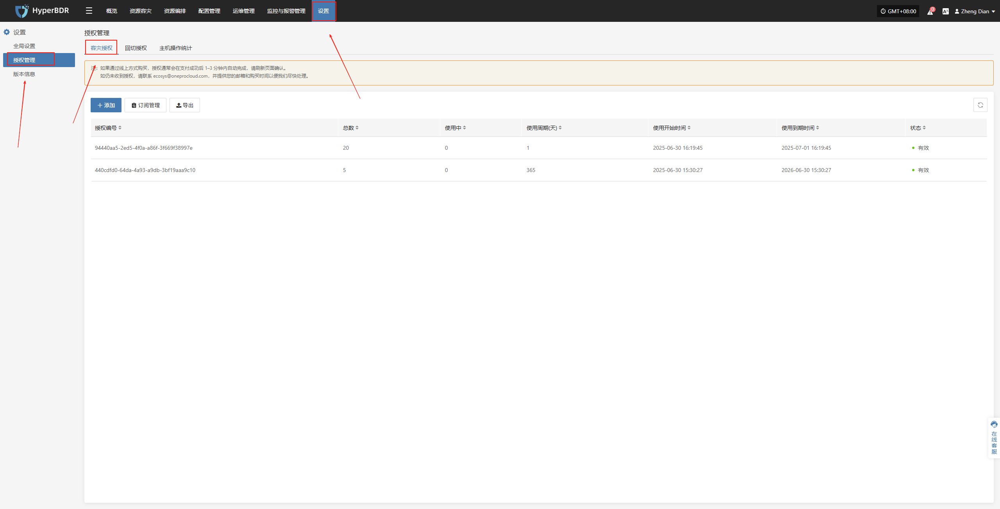

2. 点击页面右上角的“添加”按钮，进入授权信息填写页面。

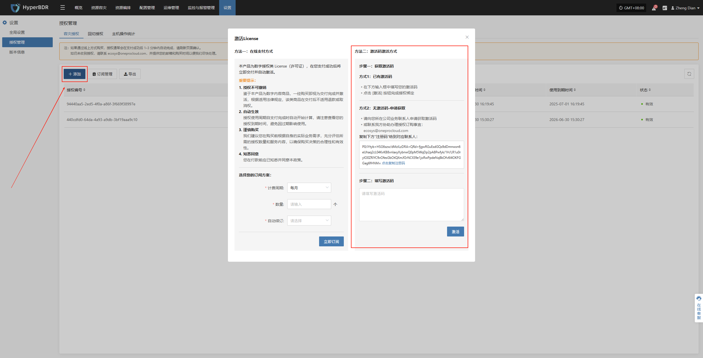

3. 在下方输入框中填写您的激活码，点击 **激活** 按钮完成授权绑定

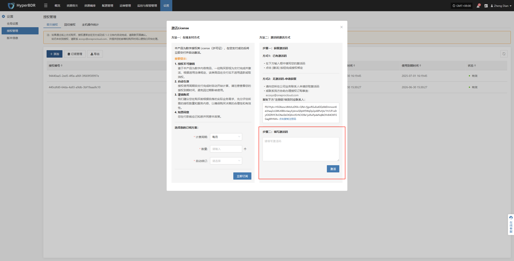

### **无激活码-申请获取**

1. 登录控制台后，依次点击上方导航栏的“设置” > “授权管理” > “容灾授权”，进入授权管理页面。

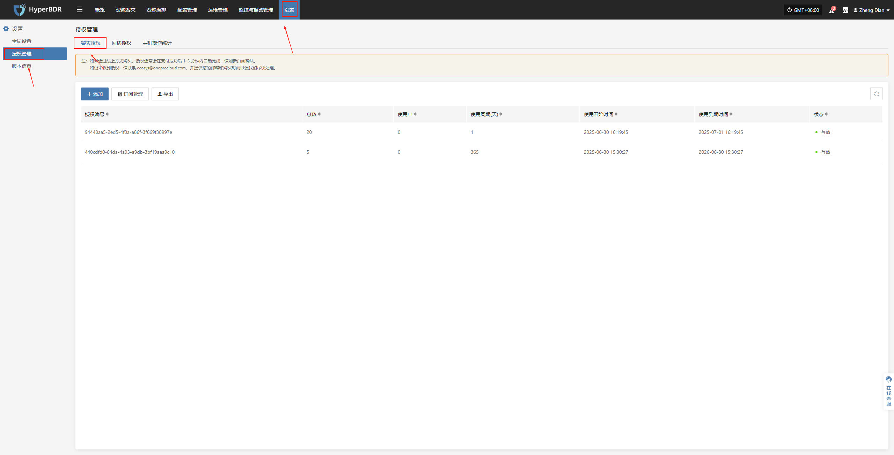

2. 点击页面右上角的“添加”按钮，进入授权信息填写页面。

3. 请向您所在公司业务联系人申请获取激活码或联系我方协助办理授权订购事宜：ecosys@oneprocloud.com

复制下方“注册码”给到对应联系人：

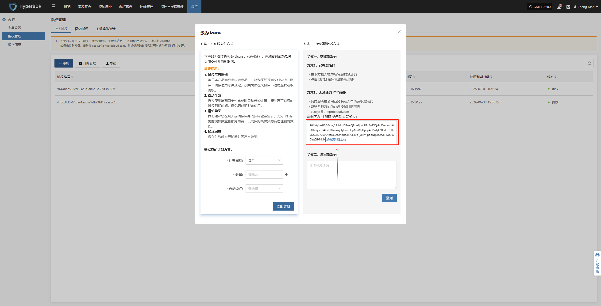

4. 获取激活码后在下方输入框中填写您的激活码，点击 **激活** 按钮完成授权绑定

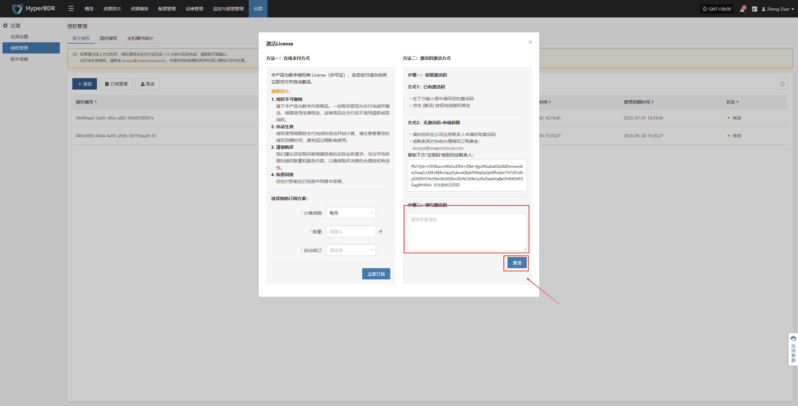

## **回切授权步骤**

### **已有激活码**

1. 登录控制台后，依次点击上方导航栏的“设置” > “授权管理” > “回切授权”，进入授权管理页面。

2. 点击页面右上角的“添加”按钮，进入授权信息填写页面。

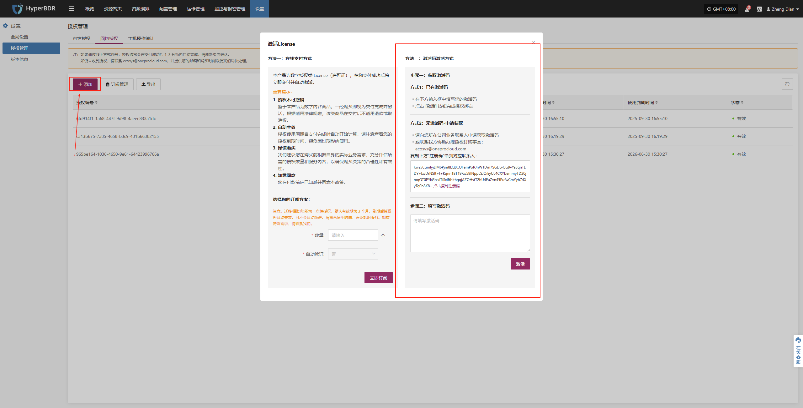

3. 在下方输入框中填写您的激活码，点击 **激活** 按钮完成授权绑定

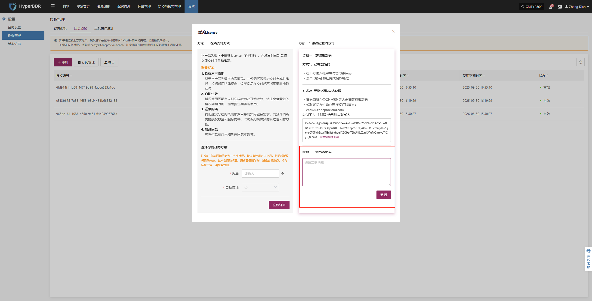

### **无激活码-申请获取**

1. 登录控制台后，依次点击上方导航栏的“设置” > “授权管理” > “回切授权”，进入授权管理页面。

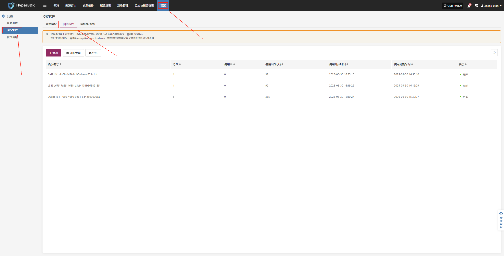

2. 点击页面右上角的“添加”按钮，进入授权信息填写页面。

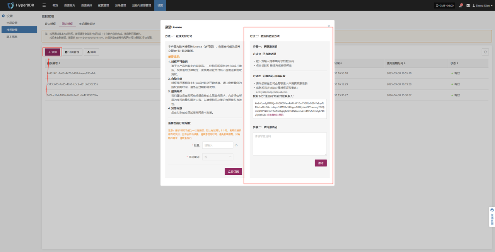

3. 请向您所在公司业务联系人申请获取激活码或联系我方协助办理授权订购事宜：ecosys@oneprocloud.com

复制下方“注册码”给到对应联系人：

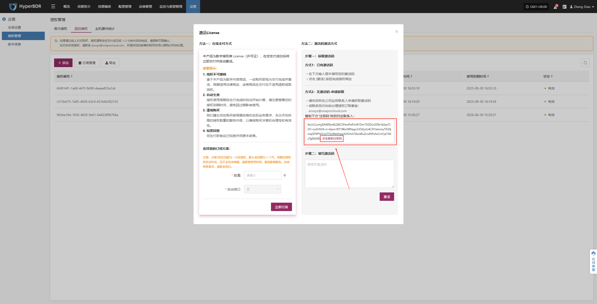

4. 获取激活码后在下方输入框中填写您的激活码，点击 **激活** 按钮完成授权绑定

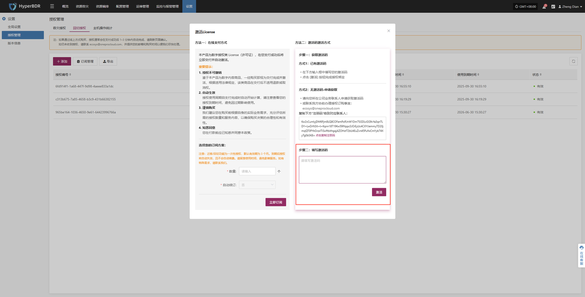

