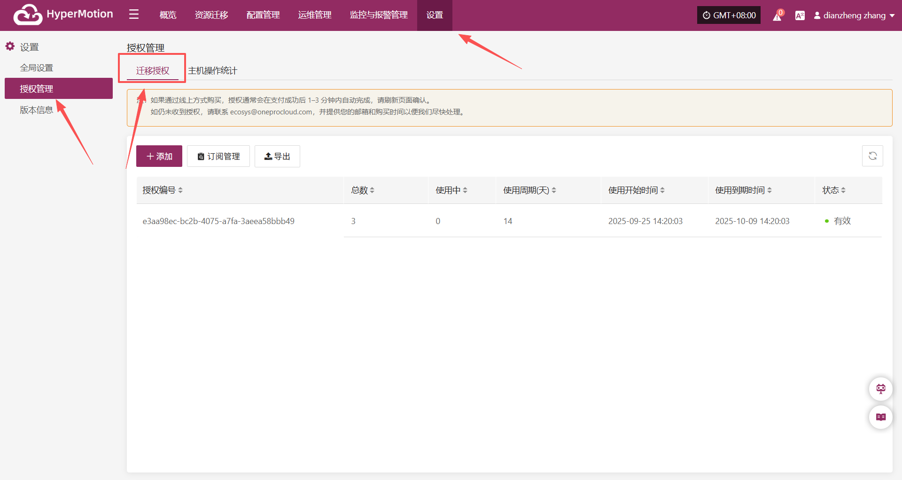
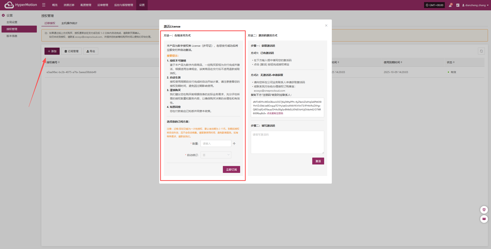
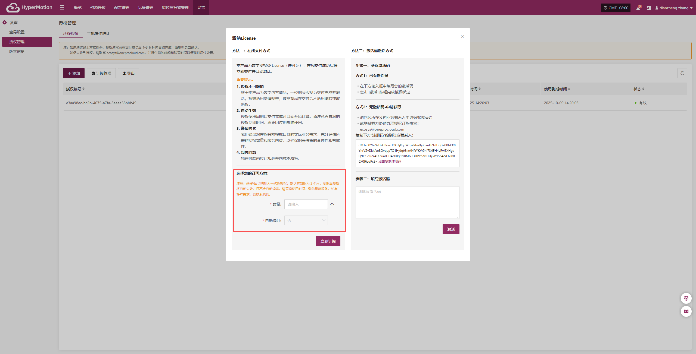
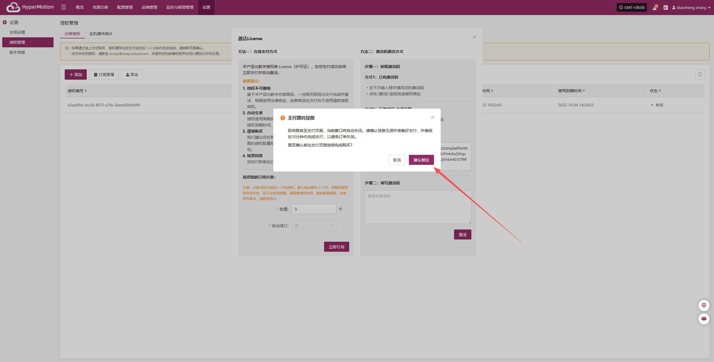
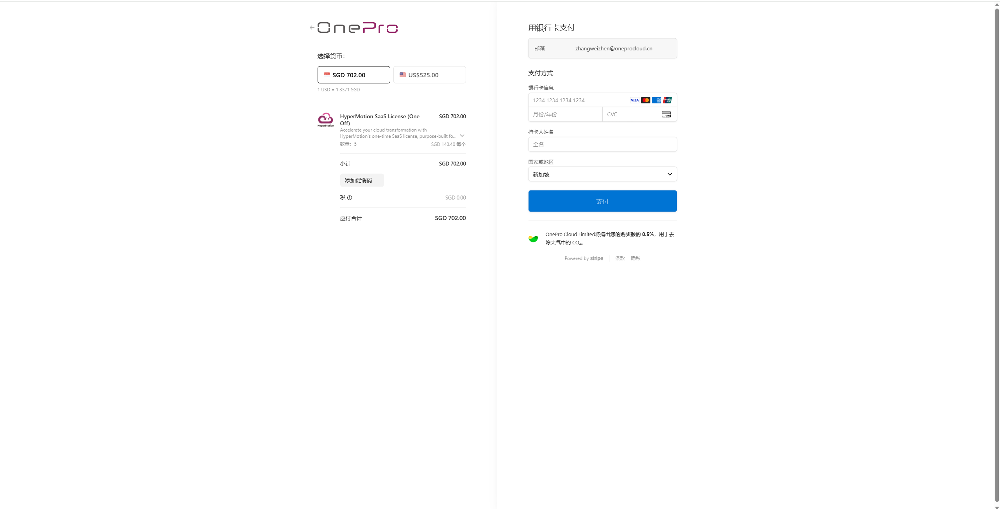

# **在线购买激活**

## **容灾授权步骤**

1. 登录控制台后，依次点击上方导航栏的“设置” > “授权管理” > “迁移授权”，进入授权管理页面。

2. 点击页面右上角的“添加”按钮，进入授权信息填写页面。

3. 根据实际需求选择**授权数量**，迁移场景无法自主选择是否**自动续订**。确认无误后，点击“立即订阅”。

> **重要提示：**
>
> **1. 授权不可撤销**
>
> 鉴于本产品为数字内容商品，一经购买即视为交付完成并激活，根据适用法律规定，该类商品在交付后不适用退款或取消权。
>
> **2. 自动生效**
>
> 授权使用周期自支付完成时自动开始计算，请注意查看您的授权到期时间，避免因过期影响使用。
>
> **3. 谨慎购买**
>
> 我们建议您在购买前根据自身的实际业务需求，充分评估所需的授权数量和服务内容，以确保购买决策的合理性和有效性。
>
> **4. 知悉同意**
>
> 您在付款前应已知悉并同意本政策。

4. 点&#x51FB;**“立即订阅”**&#x63D0;交订阅请求后，系统会弹出确认提示，确认是否跳转至第三方支付平台。用户点&#x51FB;**“确认前往”**&#x540E;，系统将在新窗口中打开支付页面，完成付款后即视为订阅成功。

5. 用户在跳转的支付页面中填写有效的支付鉴权信息，点&#x51FB;**“订阅”**&#x4EE5;确认付款。系统将处理支付请求，完成支付后，所选订阅授权将立即生效。

6. 授权订阅完成后，系统将自动跳转回控制台首页，用户即可正常访问并使用所订阅的功能与服务。

