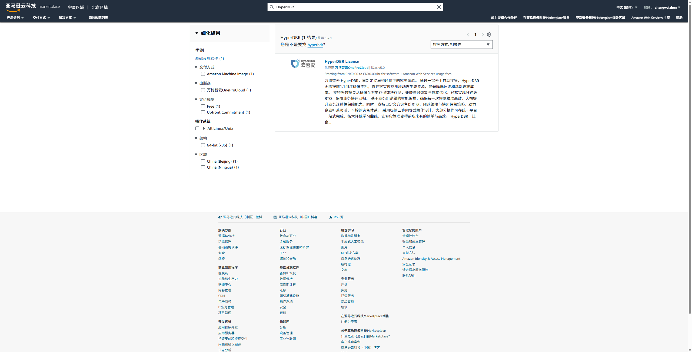

# **(AWS中国云市场)迁移/容灾产品订阅指南**

## 订阅产品

* 访问：[AWS Marketplace 中国站](https://awsmarketplace.amazonaws.cn/marketplace)

  * 在搜索框中输入产品名称 **HyperBDR** 并点击搜索。

  

  * 在搜索结果中选择目标产品，进入产品详情页。

  * 点击 **Continue to Subscribe（继续订阅）**

  

* 配置合同并阅读产品定价、条款信息。

  * 选择 EC2 实例类型，确定许可证数量，点击 **添加（Add）** 完成合同配置。

  

  * 阅读完毕后，可点击 **Continue to Configuration（继续配置）** 。

## 配置产品

* 选择交付选项、产品版本和部署区域，点击 **Continue to Launch（继续启动）**

  

***

## 启动产品实例

根据配置启动 EC2 实例：

### 方法一：从 AWS Marketplace 网站启动

* 选择操作方式为“从网站启动”

* 配置以下选项：

  * 实例类型

  * VPC 设置

  * 子网设置

  * 安全组设置（可在下列选择，基于供应商设置新建）

  * 密钥对设置（SSH 登录所需）

> 注意：所有配置项应依据实际部署环境进行选择

点击 **Launch（启动）** 即可完成实例部署。

### 方法二：从 EC2 控制台启动

* 选择操作方式为“EC2启动”

* 配置以下选项：

  * 实例类型

  * 密钥对

  * 网络配置

  * 存储配置

> 注意：所有配置项应依据实际部署环境进行选择

点击 **Launch（启动实例）** 即可完成实例部署。

***

## 安装 HyperBDR

> 若无公网 IP，需绑定弹性 IP 或使用专线网络访问

* 浏览器登录访问：`http://<Public-IP>:15000`

* 点击 **Download** 下载安装包

* 下载完成后：

  * 设置 Service IP 或自定义公网地址

  * 设置安装密码（不设置则默认密码为：`P@ssw0rd`）

  * 点击 **Install** 开始安装

## 登录产品平台

* 安装完成后可使用如下方式访问平台：

  * `https://<IP>:10443` 访问容灾平台（HyperBDR）

  * `https://<IP>:20443` 访问迁移平台（HyperMotion）

* 使用默认账户和密码登录
  * admin/P@ssw0rd

***

## 使用产品

登录平台后可进行如下操作：

* 添加资源、绑定存储

* 管理任务及查看状态

可结合产品用户文档进行操作。参考地址：[HyperBDR容灾手册](../dr/)、[HyperMotion迁移手册](../migration/)、[生产站点容灾预设](../poc/aws-pre-settings.html)、[容灾站点预设](../poc/aws-target-pre-settings.html)

可根据需要绑定额外的存储、配置安全组等增强使用体验。

***

## 附加说明

* 若使用 AWS IAM 用户，请确保拥有以下权限：

  * 订阅 Marketplace 产品权限

  * 启动/配置 EC2 权限

  * 管理 VPC、子网、密钥对等资源权限

* 若涉及 License 激活，请参考官方文档：[HyperBDR 激活方式](../poc/hyperbdr-vmware-pre-settings.html#%E7%94%B3%E8%AF%B7hyperbdr%E6%8E%88%E6%9D%83)

***

