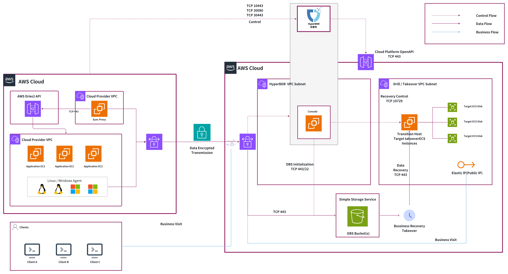

# AWS跨区域容灾

## 1. 项目背景

随着 **CloudEndure 正式退出中国市场**，原有依赖其实现业务灾备和快速恢复的用户，需要寻找一套稳定、可持续的替代方案。用户关注的核心需求包括：

* **一键式业务恢复**，保障灾备连续性；

* **跨云与跨地域支持**，满足多云及区域级风险隔离；

* **长期存储与网络传输成本可控**；

* **降低厂商锁定风险**，提升架构灵活性。

在这一背景下，用户选择 **HyperBDR**，作为 CloudEndure 的平替方案，既完全覆盖原有一键恢复能力，又在多云适配、成本优化和架构统一性方面具备额外优势。

## 2. CloudEndure vs HyperBDR

**对象存储优势**：HyperBDR 支持对象存储，可显著降低长期存储成本。与传统块存储相比，对象存储按实际数据量和增量计费，更具成本效益。

**部署模式灵活**：HyperBDR 支持**有代理**和**无代理**两种模式：

* **无代理模式**：适用于高负载或特殊操作系统（如特定 Linux 核心），降低系统负载和维护成本。

* **有代理模式**：适用于负载轻、环境常规的场景，减少云平台接口调用成本。

**跨区域和跨云恢复**：支持异构环境业务恢复，降低单一厂商依赖风险。

**网络优化**：通过去重与压缩技术减少跨区域数据传输量（压缩率视数据类型而定），优化传输成本。

| **特性**          | **CloudEndure**     | **HyperBDR**                                                    |
| --------------- | ------------------- | --------------------------------------------------------------- |
| **一键式业务恢复**     | 支持                  | 完全支持（与 CloudEndure 同等级）                                         |
| **架构模式与复制方式**   | 基于代理（Agent）+ 块级差量复制 | 支持代理与无代理双模式 + 块级差量复制，可根据场景选择                                    |
| **源端无代理支持**     | 不支持                 | 支持多平台源端无代理模式（ VMware、AWS、Oracle Cloud、OpenStack 等多种架构），灵活适配多种架构 |
| **多云/跨地域**      | 局限于 AWS 内           | 支持 AWS 多种云平台，可实现与 AWS 平台内同等级的一键式业务恢复                            |
| **存储成本**        | 依赖块存储，成本较高          | 同时支持块存储和对象存储，对象存储长期存储成本节约70%以上                                  |
| **网络传输优化（DTO）** | 主机内压缩，对主机性能影响较大     | Agentless同步网关压缩 + 源端压缩 + 去重，有效降低 DTO 成本，同时对源端主机性能影响小            |
| **厂商锁定风险**      | 高                   | 低，可跨云恢复                                                         |

## 3. 整体方案

### 容灾方案

**控制台部署**：目标区域部署一台 **8 核 16 GB** 主机运行 HyperBDR 控制台。

**数据同步**：第一阶段通过 **Windows/Linux Agent** 采集数据，北京与宁夏区域通过 **专线互联**，保障传输稳定。

**存储优化**：宁夏区域备份数据直接存储在 **标准对象存储（S3 Standard）** 中，降低长期备份成本。

**网络配置**：灾备系统采用与源端采用二层打通，实现业务切换透明。

### 云容灾资源使用清单

| **组件角色**  | **组件名称**                       | **规格**                             | **部署位置** | **核心功能**  | **说明**                                         |
| --------- | ------------------------------ | ---------------------------------- | -------- | --------- | ---------------------------------------------- |
| **控制平面**  | HyperBDR 控制平台                  | EC2 c6i.2xlarge（8C16G）+ 500 GB EBS | 灾备侧 / 云端 | 集中管理与控制   | 提供统一策略配置、任务调度及灾备接管能力，不直接参与大规模数据传输              |
| **Agent** | HyperBDR Windows / Linux Agent | N/A                                | 源端主机内部   | 数据采集与同步   | 安装在源端操作系统中，用于代理方式的数据采集和同步                      |
| **数据存储**  | 对象存储（Amazon S3）                | S3 标准存储                            | 云端       | 数据存储      | 存储受保护数据及恢复数据，具备高可靠性与弹性扩展能力&#xA;源端主机分配容量为20.5TB |
| **网络**    | EC2 DTO / 专线                   | N/A                                | 连通两个区域   | 数据复制与业务访问 | 支撑跨区域数据复制及灾备业务访问                               |
| **云主机**   | EC2                            | 源端规格                               | 容灾站点     | 业务系统恢复    | 仅在演练或接管阶段存在，平时不参与数据复制                          |

> 注：费用未包含对象存储 API 调用次数及跨区域网络传输等费用。

## 4. 项目成果

本项目围绕用户在 CloudEndure 服务退出背景下的灾备能力承接需求，构建了一套以对象存储为核心的灾备架构，在**保持业务级恢复能力不降级的前提下，实现了显著的成本优化和架构可持续性提升**，主要成果如下：

### 成本对比（约 20.5 TB 数据规模）

在传统 CloudEndure 或同类方案中，灾备通常依赖长期预置的块存储容量及累积快照数据，存储成本与预置容量强绑定，即使实际数据量未增长，费用仍持续产生。在本方案中采用 **标准对象存储（S3 Standard）**，长期存储成本约 **¥5,257/月**，相比传统 **EBS + Snapshot 的 ¥17,424/月**，可节省 **70% 以上成本**。

| **方案**         | **基础存储**                      | **增量数据**                              | **合计**    |
| -------------- | ----------------------------- | ------------------------------------- | --------- |
| EBS + Snapshot | 20,500 GB × ¥0.5312 ≈ ¥10,890 | 20,500 GB × 5% × 23 × ¥0.277 ≈ ¥6,533 | ¥17,424/月 |
| S3 标准对象存储      | 15,000 GB × ¥0.163 ≈ ¥2,445   | 15,000 GB × 5% × 23 × ¥0.163 ≈ ¥2,812 | ¥5,257/月  |

**成本差异核心**：对象存储按实际数据量与增量计费，块存储需为全量预置容量及快照累积付费。主要的亮点包括：

* 按实际使用量计费，避免块存储长期容量浪费。

* 数据对象化 + 去重、压缩、生命周期策略，降低长期保留成本。

* 增量数据仅按真实变更量计费，避免快照历史引用膨胀。

* 跨区域灾备下，网络传输费用与真实变更量相关，无额外长期叠加成本。

> 在长期运行中，对象存储方案成本优势会进一步放大，同时保持跨区域灾备能力与业务连续性。

### 在对象存储架构上实现等同的业务级灾备与恢复能力

本方案在能力层面完整覆盖 CloudEndure 的核心灾备能力，同样支持从灾备数据中恢复整套业务系统，而不仅限于单文件或数据级恢复。

在灾备演练或真实故障场景下，可完成计算资源重建、磁盘数据恢复及业务应用整体拉起，满足业务连续性与灾难恢复要求。

与传统文件级备份仅支持文件回滚不同，本方案强调业务系统整体可恢复性；与 CloudEndure 相比，方案在保持同等恢复效果的同时，将灾备能力从“重块存储依赖”转化为“对象存储承载”，为成本优化奠定基础。

### 在支持跨区域灾备的同时，实现成本与能力的可控平衡

本方案支持跨区域灾备部署（例如北京 Region 至宁夏 Region），满足区域级风险隔离与合规要求。

需要明确的是，跨区域数据同步不可避免地产生网络传输费用，但在本架构下，传输费用主要与真实变更量相关，而不再叠加长期预置存储与快照堆积带来的持续成本。

整体来看，即使考虑跨区域传输费用，对象存储为核心的灾备方案在**长期运行成本、容量弹性与架构可持续性**方面，仍显著优于以块存储为核心的传统灾备实现方式。

## 5. 参考链接

* Amazon EBS 定价: https://www.amazonaws.cn/ebs/pricing

* Amazon S3 标准存储定价：[https://www.amazonaws.cn/s3/pricing](https://www.amazonaws.cn/s3/pricing?utm_source=chatgpt.com)
