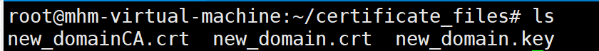

# 域名访问单机版HyperBDR变更手册

## 1. 上传证书文件到HyperBDR服务器

准备好的证书文件上传到HyperBDR服务器目录中

 

## 2. 合并证书文件

> 如果准备好的证书文件为pem格式，则不需要进行此步骤，跳转到操作步骤3

- - 准备好的域名CRT证书和CA的CRT证书，需要合并成PEM格式文件

 

按照域名CRT证书、CA的CRT证书的顺序把两个CRT证书文件合并成PEM

``` shell
# new_domain.crt为示例的域名CRT证书，new_domainCA.crt为示例的CA的CRT证书
cat new_domain.crt new_domainCA.crt > new_domain.pem
chmod 644 new_domain.pem
chmod 644 new_domain.key
```

## 3. 替换证书

备份原证书文件

``` shell
cd /opt/installer/production/venvs/newmuse-venv/project_etc/newmuse
mv oneprocloud.key oneprocloud.key.bak
mv oneprocloud.pem oneprocloud.pem.bak
```

复制并替换key文件和pem文件

``` shell
cp /root/certificate_files/new_domain.key /opt/installer/production/venvs/newmuse-venv/project_etc/newmuse/oneprocloud.key
cp /root/certificate_files/new_domain.pem /opt/installer/production/venvs/newmuse-venv/project_etc/newmuse/oneprocloud.pem
```

## 4. 修改配置文件

修改nginx配置。
默认配置的h**ypermotion.oneprocloud.com**域名替换成证书中所使用的域名。

``` shell
# testdomain.com替换为真实域名
sed -i 's/hypermotion.oneprocloud.com/testdomain.com/g' /opt/installer/production/venvs/newmuse-venv/project_etc/nginx.conf
```

修改docker-compose配置。

``` shell
sed -i 's/10443/443/g' /opt/installer/production/docker-compose-hyperbdr.yml
```

## 5. 重启容器

``` shell
docker restart production_newmuse_1
```

## 6. 通过域名访问HyeprBDR验证
浏览器中域名地址访问HyperBDR控制台。