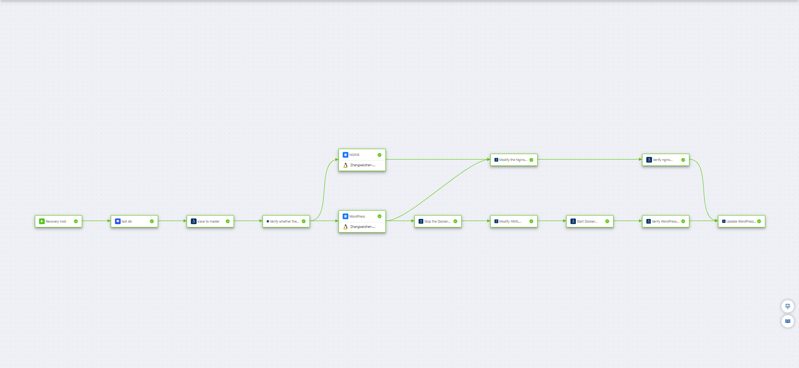
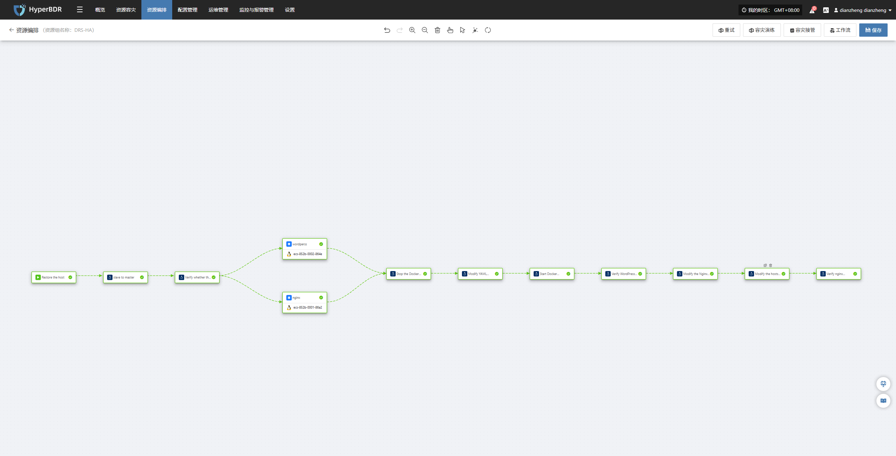

# **HyperBDR编排功能最佳实践**

## **1. 为什么需要编排功能**

随着企业数字化转型和云计算的广泛应用，IT架构正在发生深刻变化。HyperBDR最初作为一款**专注于主机级别容灾**的软件，主要用于保护和恢复部署在主机中的各类应用系统。

然而，随着 IT 架构的演进，尤其是在企业上云之后，基础软件体系正在发生显著变化。一方面，传统单体组件被拆解为多个云原生服务——例如数据库演变为关系型数据库服务（RDS），传统 NAS 文件服务逐渐被对象存储或文件存储取代，中间件也被分解为多种云上中间件服务。另一方面，许多关键业务系统如 Oracle RAC、SAP HANA 等仍以专有架构形式运行，需要与这些云原生能力并行协同，这进一步提升了对整体架构设计与灾备方案的要求。

这种架构的变化使得单一软件难以覆盖所有组件的保护能力，也带来了**新的业务连续性挑战**。在云原生环境下，应用不再是单体系统，而是由多个分布式组件协同运行。一旦发生灾难，单纯的主机恢复已不足以保证业务整体恢复。

因此，HyperBDR在持续强化主机保护能力的同时，逐步将重心扩展到**业务层面的整体可恢复性**。这意味着，HyperBDR需要在主机保护之外，承担起**业务级灾备的编排和协调**角色。

## **2. HyperBDR在云原生灾备中的角色**

面对云原生架构逐渐加剧的复杂性，HyperBDR 重新明确了自身定位——

&#x20;除了继续提供稳健的主机级备份与恢复能力外，它不再试图取代云厂商去实现数据库、对象存储、中间件等各类云原生服务的数据同步功能，而是将重点转向对整体灾备流程的统一控制与编排，确保最终的业务切换结果可预期、可验证、可落地。

换言之，HyperBDR专注于“让业务恢复起来”这一最终目标，而非具体的数据传输过程。底层的数据复制、同步、快照由各云服务或专用工具负责，而HyperBDR则通过编排这些异构组件的恢复逻辑，实现统一的**灾备切换编排与业务恢复控制**。

这种设计思路使HyperBDR成为企业灾备体系中的**调度与编排中枢（Orchestration Center）**，通过与云原生服务、数据库、存储系统及中间件的集成，构建一个跨层次、跨平台的统一灾备控制平面。

## **3. 编排功能的设计理念**

HyperBDR编排功能的核心目标是**自动化、标准化和可视化的灾备切换流程**。
&#x20;它通过“资源与流程解耦”的方式，将灾备资源（主机、数据库、对象存储等）的配置管理，与灾备流程（启动顺序、依赖关系、验证步骤）的逻辑分离。

这种架构带来了两大优势：

* **灵活性** —— 用户无需深入管理每个组件的技术细节，即可自由定义灾备流程。

* **可扩展性** —— HyperBDR能够通过插件或命令执行方式（本地或远程）集成更多外部服务，实现跨云、跨架构的混合编排。

在典型的云原生灾备架构中，应用通常由多种云原生资源组成，包括计算主机、Redis、数据库及对象存储。每类组件依赖各自的数据复制与恢复机制：主机层面通过 HyperBDR 进行持续复制，Redis 与数据库使用云原生的 DMS 数据传输服务，对象存储则通过专用复制工具完成同步。


在正式的容灾演练或故障切换过程中，HyperBDR Orchestrator 通过统一的编排能力将这些异构服务整合为一体化流程。它首先通过预置的远程跳板机执行对云端 DMS 服务的 API 调用，在灾备端提升 Redis 和数据库为可读写实例；随后暂停对象存储的同步以确保数据一致性；最后利用 HyperBDR 的主机恢复能力，批量启动所有计算主机并执行必要的配置调整。通过这一端到端的自动化流程，整个应用栈能够以一致、可控且最小人工干预的方式切换至灾备站点。

## **4. 场景一：VMware到云上业务容灾(MySQL HA)**

### **4.1 客户场景与需求**

这家客户是一家以线上展示为主的企业，公司主页是外界了解他们的第一入口。为了保证官网长期稳定运行，他们在 VMware 环境中部署了 WordPress 及 Nginx 服务，并使用 MySQL 主从机制确保内容更新能够实时同步。

随着业务的发展，客户越来越担心“官网宕机”的风险——无论是因为 VMware 主机故障、存储问题，还是虚拟机本身的意外。官方网站一旦无法访问，不仅造成潜在客户流失，也会直接影响品牌形象。

但在沟通中，客户提出了一个非常现实的问题：
**“我们不是大型互联网公司，预算有限。有没有一种可靠但不至于成本失控的灾备方案？”**

他们的核心诉求因此变得更加具体并带有成本意识：

* **发生故障时网站能在 15 分钟内恢复访问，但灾备架构不能过于昂贵。**

* **MySQL 数据不能丢失，但希望同步机制尽可能简单，不增加太多运维成本。**

* **WordPress、Nginx 这些服务平时就能稳定运行，不要为了灾备额外搭建一堆复杂组件。**

* **备份和灾备资源需要按需投入，而不是长期堆高成本。**

为了防止最坏情况下数据丢失，他们仍会将 WordPress 和 Nginx 的相关文件定期备份到云端，但他们不希望为了“可能发生的意外”去长期维持一套昂贵的双活架构——这是最典型的中小企业成本矛盾。

### **4.2 整体架构**

基于用户“官网不能停”与“灾备成本可控”并重的诉求，我们为其设计了一套**高可用但不过度投入**的主备架构。方案在生产环境运行的同时，通过轻量化机制持续同步关键数据至灾备站点，而不需要搭建昂贵的跨站点双活或大量冗余资源。

遇到 VMware 主机或虚拟机故障时，系统能够在短时间内自动或手动切换到灾备站点，确保官网访问不中断；而平时的灾备资源只保持必要的运行，不造成持续的成本消耗。

架构图展示了生产与灾备之间的数据同步方式、备份策略以及切换流程，让客户清楚知道——
**这不是一套昂贵的“豪华灾备体系”，而是一套以业务连续性和成本平衡为核心的实用方案。**


### **4.3 实施方案**

#### **资源清单**

下列资源清单列出了系统部署所需的硬件、软件及网络环境，确保业务在本地和云端均能正常运行，并支持快速容灾和数据保护。

| 类型        | 名称/规格/数量          | 用途说明                                      |
| --------- | ----------------- | ----------------------------------------- |
| VMware 主机 | 3 台               | 分别部署 MySQL 5.7、WordPress、Nginx，用于生产环境业务运行 |
| 云端主机      | 1 台               | 部署 MySQL 从库，用于云端容灾                        |
| 数据库       | MySQL 5.7         | 与云端MySQL配置主从同步，保障数据一致性                    |
| Web 服务    | WordPress + Nginx | 前端应用和代理服务                                 |
| 备份服务      | HyperBDR SaaS     | WordPress及Nginx主机备份                       |
| 网络        | VPN               | 保证 VMware 与云端之间数据同步安全、稳定                  |
| MySQL主从管理 | mah               | 用于切换MySQL主从库配置                            |

首先，我们使用 HyperBDR 对两台业务主机进行了统一的灾备保护；随后，通过 HyperBDR 的编排能力，将业务恢复过程进行了自动化设计。下图展示的，正是完成编排后的整体流程效果。具体的执行步骤如下：



#### **步骤一：恢复云端主机**

**目的**：

在云端恢复主机自动接替生产环境的工作，把 WordPress 网站从“本地”迁移到“云端”继续运行。


**编排流程**：

* 如果 VMware 上的某台主机出现故障，运维人员只需要点击启动容灾流程。

* 系统会根据 HyperBDR 中预先制定的容灾策略，把对应的云端主机自动恢复，但不开机状态，后续会根据指定顺序进行开机操作。

（技术动作由系统自动完成，用户无需手工干预。）

#### **步骤二：检查云端数据库是否可用**

**目的**：

确认云端 MySQL 备用库正常，确保后续切换不会造成数据风险。
**编排流程：**

* 系统会主动“Ping 一下”云端的 MySQL 从库，看它是否在线。

（对应命令：`ping -c 1 192.168.7.144`）

如果数据库备用库不在线，系统会阻断流程，避免切换风险。

#### **步骤三：切换数据库（把从库提升为主库）**

**目的**：

让云端的 MySQL 正式成为新的主库，让 WordPress 后续的数据读写都指向云端。


**编排流程**：

* 如果检测结果正常，系统会把云端的从库提升为“主库”。

```bash
masterha_master_switch --conf=/etc/mha.cnf --master_state=dead --dead_master_host=192.168.7.141 --new_master_host=192.168.7.144 --orig_master_is_new_slave --interactive=0 --running_updates_limit=10000 --ignore_last_failover --verbose --force
```

* 然后系统会再次检测云端 MySQL 是否完全可用。

```bash
/usr/local/mysql/bin/mysqladmin -uroot -p111111 -h 192.168.7.144 ping --connect-timeout=300
```

#### **步骤四：同步更新 Nginx 和 WordPress 配置（自动执行）**

**目的**：

确保 Web 入口（Nginx）和 WordPress 应用都能正确连接到云端主库，并对外继续提供服&#x52A1;**。**


**编排流程：**

* **Nginx服务器：**

  * 系统会帮你自动修改 Nginx 配置，把旧地址换成云端的新地址。

  * 然后检查 Nginx 配置是否正确，并重新加载，让调整立即生效。

  ```bash
  "cp /etc/nginx/nginx.conf /etc/nginx/nginx.conf.bak && sed -i 's/192\.168\.7\.143/WordPress/{x}host.private_ip/g' /etc/nginx/nginx.conf && nginx -t && systemctl reload nginx"
  ```

  

  * 最后系统会模拟用户访问一次，确认 Nginx 已经能正常对外提供服务。

  ```bash
  curl -sSL --retry 60 --retry-delay 5 --max-time 300 --connect-timeout 10 --fail http://NGINX/{x}host.private_ip
  ```

* **WordPress服务器：**

  * 系统会先把 WordPress 容器停掉（因为有些配置在容器运行时无法修改）。

  ```bash
  /usr/local/bin/docker-compose -f /home/wordpress/wordpress-compose.yaml down
  ```

  * 自动修改 WordPress 的数据库地址；把配置从“原生产端 MySQL”改为“云端主库”。

  ```bash
  "cp /home/wordpress/wordpress-compose.yaml /home/wordpress/wordpress-compose.yaml.bak && sed -i 's#- WORDPRESS_DB_HOST=.*#- WORDPRESS_DB_HOST=192.168.7.144#' /home/wordpress/wordpress-compose.yaml"
  ```

  * 容器重新启动，并由系统自动检测是否启动成功。

  ```bash
  /usr/local/bin/docker-compose -f /home/wordpress/wordpress-compose.yaml up -d
  ```

  ```bash
  curl -sI --retry 60 --retry-delay 5 --max-time 300 --connect-timeout 10 --fail http://WordPress/{x}host.private_ip:18080
  ```

* **更新 WordPress 内部配置（无需重启）**

  * 确保 WordPress 内部网站地址、访问入口、Cookie 设置等全部与云端环境一致。

  * 系统会自动清理旧的站点地址配置，并写入新的云端访问地址。

  * 这些配置立即生效，无需重启 WordPress。

  ```sql
  "sed -i \"/define('WP_HOME'/d; /define('WP_SITEURL'/d; /define('COOKIE_DOMAIN'/d\" /home/wordpress/config/wp-config.php && echo -e \"define('WP_HOME', 'http://NGINX/{x}host.private_ip');\ndefine('WP_SITEURL', 'http://NGINX/{x}host.private_ip');\ndefine('COOKIE_DOMAIN', false);\" >> /home/wordpress/config/wp-config.php"
  ```

#### **步骤五：DNS切换**

**目的**：

确保用户使用原有访问路径访问业务系统。


**编排流程**：

**方式 1：流程编排方式（无需固定预留 IP，成本最低，但依赖任务执行时的网络可达性及 DNS TTL/收敛时延）**
&#x20;通过脚本或自动化流程在切换时动态更新 DNS，按需触发、零额外成本，但依赖执行时的网络与平台时效性。

**方式 2：固定 IP 预设方式（需长期保留 IP，成本更高）**
&#x20;提前在 DNS 中绑定一组稳定的预留 IP，可在切换时立即生效，时效性最好，但需要持续为固定 IP 支付费用。

#### **步骤六：业务验证（最关键的一步）**

**目的**：

确认用户访问网站时已经完全切换至云端，且页面正常、速度稳定、数据一致。

## **5. 场景二：同云跨区域容灾(主机+关系型数据库服务RDS)**

### **5.1 客户场景与需求**

随着官网业务的稳定增长，这家客户对云平台的信任程度也不断提升。原先，他们采取的是“本地生产 + 云端灾备”的模式，仍需要维护 VMware 主机、存储设备和网络环境。

&#x20;但随着本地设备逐渐老化，客户越来越不想再投入额外资源在本地机房上——包括机房租赁、电力、散热、维护人工等都在持续增加成本。

在与我们沟通中，他们提出了新的目标：

**“能不能把业务彻底托管到云上，不再维护任何本地资源？但同时又能做到跨地域的灾备，避免云服务本身出现区域级故障？”**

这正是许多企业在上云几年后会遇到的典型拐点：

* 云上的服务很稳定，但他们也听说过“云厂商某个可用区短暂不可用”的新闻；

* 不想再维护本地，但也不能把所有鸡蛋放在同一个篮子里；

* 仍然要控制成本，不想上“双活架构”这种企业级的大投入方案。

基于这些现实诉求，他们的目标逐渐清晰：

* **业务完全托管到云端，不再维护本地服务器。**

* **数据库希望使用云厂商提供的 RDS，降低运维负担。**

* **仍需跨区域灾备，以防某个可用区出现较大故障。**

* **切换时间最好控制在 15 分钟内，确保官网访问不中断。**

* **整体架构要兼顾成本，不走高昂的双活方案。**

### **5.2 整体架构**

在理解客户的业务方向后，我们为他们设计了一套**完全基于云、成本可控、跨区域容灾能力强**的架构。

业务数据库采用云上的 **RDS**，既获得了成熟的主备机制，也减少了用户在数据库运维上的投入。而为了实现更高等级的跨地域灾备能力，我们引入了 **DRS 灾备服务**——它可以把 RDS 主库的数据实时同步到异地的 RDS 灾备实例。

DRS 会持续解析数据库日志、同步增量数据，使两个区域的数据库始终保持高度一致。在生产区域出现不可用、跨区域网络故障甚至机房级故障时，DRS 可以在数分钟内将灾备实例提升为新的主库，并完成业务指向切换，让整个业务的恢复时间（RTO）保持在 15 分钟以内，数据恢复点（RPO）接近为 0。

同时，通过 HyperBDR，我们对业务主机的跨区域恢复、网站服务的自动化切换以及最终的业务验证做了统一的编排，让整个故障切换流程实现自动化运行，不需要运维人员逐条操作。

最终的跨区域架构如下图所示：

* 生产区域运行业务

* 数据实时同步至灾备区域

* 故障时由 HyperBDR + DRS 配合进行自动化切换

* 网站入口、应用服务、数据库均在 15 分钟内恢复

* 整体成本仍可控，不需要投入昂贵的双活架构

这是一套**以云为中心、具备跨地域能力，同时兼顾成本与可维护性**的实用级容灾方案。


### **5.3 实施方案**

#### **资源清单**

下列资源清单展示了本次场景所使用的全部资源，系统可确保业务在云端稳定运行，并支持快速容灾切换与完善的数据保护能力。

| 区域  | 服务器角色       | 备注说明                           |
| --- | ----------- | ------------------------------ |
| 北京一 | Jump Server | 仅用于远程执行命令，上面存放了华为云API调用文件      |
| 北京一 | Wordpress   | HyperBDR容灾保护源端机器               |
| 北京一 | Nginx       | HyperBDR容灾保护源端机器               |
| 北京一 | RDS         | 资源规格为MySQL5.7.44，结合DRS服务配置为主节点 |
| 北京一 | DRS服务       | 切换是否完成以当前DRS所在区域为为基准判断         |
| 上海一 | RDS         | 资源规格为MySQL5.7.44，结合DRS服务配置为备节点 |

以下流程展示了从生产环境云端接管、配置切换到业务验证的完整操作步骤，确保业务连续性、数据一致性和应用可用性。



在开始使用编排功能之前，需要准备一个 **Jump Server 节点**。Jump Server 是一个**用于执行远程命令的中转节点**，它可以代替人工在目标服务器上操作，实现批量或自动化的远程管理。任何能够访问目标网络并可通过 HyperBDR 服务器远程操作的主机，都可以作为 Jump Server，而不仅限于某几个固定节点。

操作要求如下：

* Jump Server节点服务器需要预装python3、pip3、sshpass等常用运维命令

* 将所需脚本上传到 Jump Server。

  * 主备倒换脚本：[点击下载](https://hyperbdr-system-image-do-not-delete.obs.ap-southeast-3.myhuaweicloud.com/Best_Practices/master.py)

  * 任务状态详情脚本：[点击下载](https://hyperbdr-system-image-do-not-delete.obs.ap-southeast-3.myhuaweicloud.com/Best_Practices/master_status.py)

  > 下载并上传文件完成后，请务必在脚本中将区域和任务 ID 修改为实际值。

* 确保 HyperBDR 服务器能够远程访问该 Jump Server。

* 确保 Jump Server 可以访问目标端网络，以便执行后续命令。

#### **步骤一：恢复云端主机**

**目的**：

在上海一区域主机自动接替生产环境的工作，把 WordPress 和 Nginx服务从“北京一”恢复到“上海一”继续运行。


**编排流程**：

* 当生产环境上区域出现故障，运维人员只需要点击启动容灾流程。

* 系统会根据 HyperBDR 中预先制定的容灾策略，把对应的云端主机自动恢复，但不开机状态，后续会根据指定顺序进行开机操作。。

（技术动作由系统自动完成，用户无需手工干预。）

#### **步骤二：切换数据库（把从库提升为主库）**

**目的**：

使用关系型数据库容灾服务将上海区域变为主库，改变应用写入数据库位置。


**编排流程**：

* 系统会把源备库提升为“新主库”。

```bash
export CLOUD_SDK_AK="你的AK"
export CLOUD_SDK_SK="你的SK"
/usr/bin/python3 /root/master.py
```
脚本完整示例如下：

```bash
# coding: utf-8

import os
from huaweicloudsdkcore.auth.credentials import BasicCredentials
from huaweicloudsdkdrs.v3.region.drs_region import DrsRegion
from huaweicloudsdkcore.exceptions import exceptions
from huaweicloudsdkdrs.v3 import *

if __name__ == "__main__":
    # The AK and SK used for authentication are hard-coded or stored in plaintext, which has great security risks. It is recommended that the AK and SK be stored in ciphertext in configuration files or environment variables and decrypted during use to ensure security.
    # In this example, AK and SK are stored in environment variables for authentication. Before running this example, set environment variables CLOUD_SDK_AK and CLOUD_SDK_SK in the local environment
    ak = os.environ["CLOUD_SDK_AK"]
    sk = os.environ["CLOUD_SDK_SK"]

    credentials = BasicCredentials(ak, sk)

    client = DrsClient.new_builder() \
        .with_credentials(credentials) \
        .with_region(DrsRegion.value_of("Region")) \
        .build()

    try:
        request = BatchSwitchoverRequest()
        listJobsbody = [
            "Job_id"
        ]
        request.body = BatchSwitchoverReq(
            jobs=listJobsbody
        )
        response = client.batch_switchover(request)
        print(response)
    except exceptions.ClientRequestException as e:
        print(e.status_code)
        print(e.request_id)
        print(e.error_code)
        print(e.error_msg)
```


* 系统会进行验证是否切换成功，当切换失败时系统会阻断流程，避免切换风险。

```bash
export CLOUD_SDK_AK="你的AK"
export CLOUD_SDK_SK="你的SK"
python3 /root/master_status.py
```

脚本完整示例如下：

```bash
# coding: utf-8

import os
import time
from huaweicloudsdkcore.auth.credentials import BasicCredentials
from huaweicloudsdkdrs.v3.region.drs_region import DrsRegion
from huaweicloudsdkcore.exceptions import exceptions
from huaweicloudsdkdrs.v3 import *

# =======================================
# Configuration variables (editable)
# =======================================
AK = os.environ.get("CLOUD_SDK_AK")
SK = os.environ.get("CLOUD_SDK_SK")
REGION = "Region"

# Multiple job IDs separated by commas
JOB_IDS = "Job_id"

# Retry configuration
TOTAL_ATTEMPTS = 3          # total queries including the first one
RETRY_INTERVAL = 30         # seconds

# =======================================
# Function to query DRS job status
# =======================================
def query_jobs(client, job_list):
    request = BatchListJobDetailsRequest()
    request.body = BatchQueryJobReqPage(jobs=job_list)
    return client.batch_list_job_details(request)


# =======================================
# Main Program
# =======================================
if __name__ == "__main__":

    if not AK or not SK:
        raise RuntimeError("The environment variables CLOUD_SDK_AK / CLOUD_SDK_SK are not set")

    job_list = [i.strip() for i in JOB_IDS.split(",") if i.strip()]

    credentials = BasicCredentials(AK, SK)

    client = DrsClient.new_builder() \
        .with_credentials(credentials) \
        .with_region(DrsRegion.value_of(REGION)) \
        .build()

    for attempt in range(1, TOTAL_ATTEMPTS + 1):

        try:
            print(f"Querying job status... (Attempt {attempt}/{TOTAL_ATTEMPTS})")

            response = query_jobs(client, job_list)
            resp_dict = response.to_dict()
            job_results = resp_dict.get("results", [])

            down_found = False

            for job in job_results:
                job_id = job.get("id")
                direction = job.get("job_direction")
                status = job.get("status")

                print(f"[Job {job_id}] direction={direction}, status={status}")

                if direction == "down":
                    down_found = True

            if not down_found:
                print("All jobs direction are OK. No retry required.")
                exit(0)

            if attempt < TOTAL_ATTEMPTS:
                print(f"'down' state detected. Retrying in {RETRY_INTERVAL} seconds...\n")
                time.sleep(RETRY_INTERVAL)
            else:
                print("ERROR: Reached max attempts. Job still in 'down' state. Exiting.")
                exit(1)

        except exceptions.ClientRequestException as e:
            print("Exception during request:")
            print("Status Code:", e.status_code)
            print("Request ID:", e.request_id)
            print("Error Code:", e.error_code)
            print("Error Message:", e.error_msg)
            exit(1)
```
#### **步骤三：DNS切换**

**目的**：

确保用户使用原有访问路径访问业务系统。


**编排流程**：

**方式 1：流程编排方式（无需固定预留 IP，成本最低，但依赖任务执行时的网络可达性及 DNS TTL/收敛时延）**
&#x20;通过脚本或自动化流程在切换时动态更新 DNS，按需触发、零额外成本，但依赖执行时的网络与平台时效性。

* 调整Nginx配置使其代理至新地址（如果无法实现侵入式操作，可通过前后脚本功能完成）

```typescript
sshpass -p "password" ssh -o StrictHostKeyChecking=no -o UserKnownHostsFile=/dev/null root@nginx/{x}host.public_ip  "sed -i 's/192\.168\.9\.209/wordperss/{x}host.private_ip/g' /etc/nginx/nginx.conf && nginx -t && systemctl reload nginx"
```

* 修改Hosts主机映射

```bash
sed -i 's/114\.115\.235\.149/nginx/{x}host.public_ip/g' /etc/hosts && ping -c 1 oneprotestwordpress.test
```

* 测试域名访问

```bash
curl -sSL --retry 60 --retry-delay 5 --max-time 5 --connect-timeout 10 --fail http://oneprotestwordpress.test
```

**方式 2：固定 IP 预设方式（需长期保留 IP，成本更高）**
&#x20;提前在 DNS 中绑定一组稳定的预留 IP，可在切换时立即生效，时效性最好，但需要持续为固定 IP 支付费用。

#### **步骤四：业务验证**

**目的**：

确认用户访问网站时已经完全切换至上海一运行，且页面正常、速度稳定、数据一致。

## **6. 总结**

HyperBDR基于流程的资源组编排功能是2025年面向混合云灾备的重要功能。该功能的推出，将有效解决云环境中多种云原生灾备组件的混合编排问题，为云原生应用的灾备恢复提供强有力的自动化支持。通过这一功能，用户可以实现更加高效的灾备恢复流程，减少手动干预和操作错误，从而显著提升恢复效率和系统的可用性。

