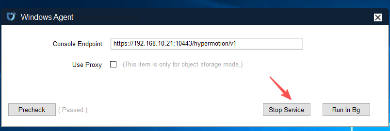
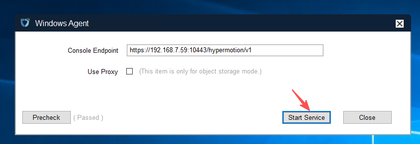
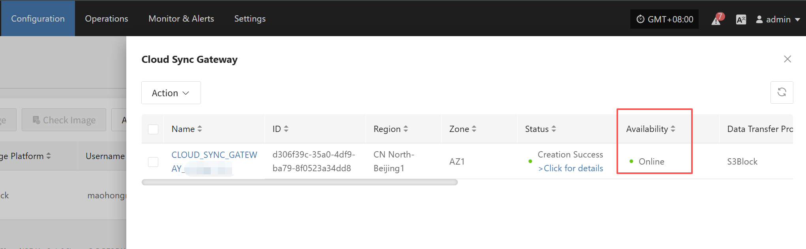

# HyperBDR服务地址变更以及变更后环境配置更新

## 场景说明

本文档适用于完成HyperBDR Console的部署后，希望更改HyperBDR的服务地址。  

如果已经安装部署完成其他HyperBDR组件(Windows Agent、Linux Agent、Sync Proxy和Cloud Sync Gateway), 在变更HyperBDR的服务地址后，需要修改相关组件的配置。

## 操作流程
### HyperBDR Console

> 请确保HyperBDR中没有任何正在进行的任务。

1. 登录到HyperBDR服务端
2. 执行命令变更HyperBDR控制网络IP

``` shell
## <New Console Service IP>为需要更改的HyperBDR控制网络IP。
cd /opt/installer/production/scripts/ && ./hmctl set_endpoint <New Console Service IP>
```

  
  

---

### Windows Agent

如果已经安装了Windows Agent，HyperBDR服务地址变更后需要修改Windows Agent的Console IP地址配置。

> 请在完成HyperBDR 服务地址变更后进行Windows Agent的变更。

1. 登录到Windows Agent所在系统  

2. 打开Windows Agent并停止服务  

  

3.修改Console Endpoint的IP（HyperBDR控制网络IP）并启动服务  

  

4.修改Windows Agent 监控服务配置  

配置文件默认位置: C:\Program Files (x86)\DiskSync-Agent\hyper_exporter\config.ini  

  

IP地址修改为为HyperBDR Console变更之后的新IP并保存文件。  

5.重启Windows Agent 监控服务  

服务名称: hp_exporter_service  

  

6.确保HyperBDR Console中Windows Agent主机是Online状态  

  

---
### Linux Agent  

如果已经安装了Linux Agent，HyperBDR服务地址变更后需要修改Linux Agent的Console IP地址配置。  

> 请在完成HyperBDR 服务地址变更后进行Linux Agent的变更。  

1.登录到Linux Agent所在系统。  

2.修改配置文件并重启服务。  

``` shell
## <Old Console Service IP>为变更之前的HyperBDR控制网络IP，<New Console Service IP>为需要更改的HyperBDR控制网络IP。
sed -i 's/<Old Console Service IP>/<New Console Service IP>/g' /etc/sysconfig/egisplus-agent && systemctl restart egisplus-agent.service
sed -i 's/<Old Console Service IP>/<New Console Service IP>/g' /usr/local/hyper_exporter/config.ini && systemctl restart hyper-exporter-agent.service
```

3.确保HyperBDR Console中Linux Agent主机是Online状态  

  

---
### Sync Proxy

如果已经安装部署了Sync Proxy，HyperBDR服务地址变更后需要修改Sync Proxy的Console IP地址配置。  

> 请在完成HyperBDR 服务地址变更后进行Sync Proxy的变更。  

1.登录到Sync Proxy所在系统。  

2.修改配置文件并重启服务。  

``` shell
<Old Console Service IP>为变更之前的HyperBDR控制网络IP，<New Console Service IP>为需要更改的HyperBDR控制网络IP。
sed -i 's/<Old Console Service IP>/<New Console Service IP>/g' /etc/hamal/hamal.conf && docker restart hamal
sed -i 's/<Old Console Service IP>/<New Console Service IP>/g' /opt/hyper_exporter/config.ini && systemctl restart hyper_exporter.service
```

3.确保HyperBDR Console中Sync Proxy是Online状态  

  

---
### Cloud Sync Gateway

如果已经安装部署了Cloud Sync Gateway，HyperBDR服务地址变更后需要修改Cloud Sync Gateway的Console IP地址配置。  

> 请在完成HyperBDR 服务地址变更后进行Cloud Sync Gateway的变更。  

1.登录到Cloud Sync Gateway所在系统。  

2.修改配置文件并重启服务。  

``` shell
<Old Console Service IP>为变更之前的HyperBDR控制网络IP，<New Console Service IP>为需要更改的HyperBDR控制网络IP。
systemctl stop watchman.service s3block.service && sed -i 's/<Old Console Service IP>/<New Console Service IP>/g' /etc/sgateway/s3block_config.ini && systemctl start watchman.service 
```

3.确保HyperBDR Console中Cloud Sync Gateway是Online状态  

  
