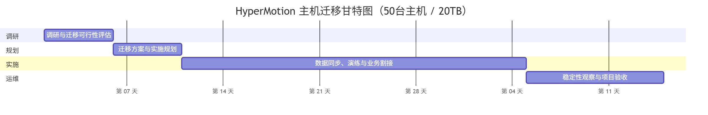
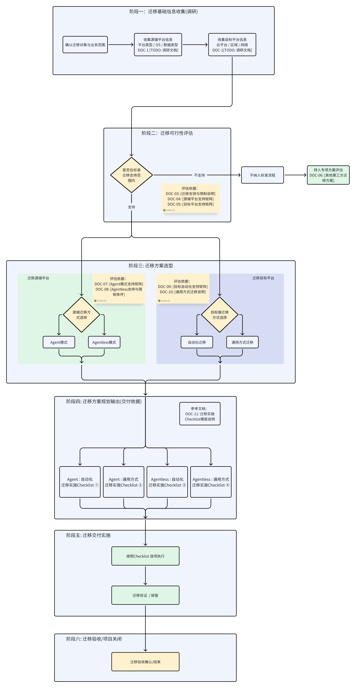
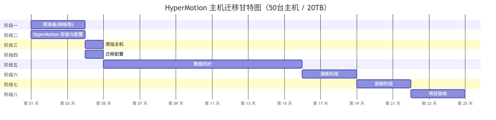

# 迁移项目交付最佳实践
## 1. 文档说明

本文档旨在指导迁移服务提供商（Managed Service Provider，以下简称MSP）在**迁移服务交付场景**下，规范、高效地使用 HyperMotion 产品完成项目实施与交付。
文档重点围绕迁移过程中基于 HyperMotion 产品能力所需关注的关键事项与最佳实践，明确各阶段的工作要点与边界，以降低迁移风险，提升迁移成功率，确保业务连续性与系统稳定运行。

## 2. 交付阶段说明

参考 AWS 迁移方法论（AWS Migration Framework），迁移服务的项目交付通常可划分为 **调研（Assess）**、**规划（Mobilize / Plan）**、**实施（Migrate）** 和 **运维与优化（Operate & Optimize）** 四个阶段。各阶段既相互衔接，又各有侧重，共同保障迁移项目的可控性与成功率。

| 阶段     | 阶段目标          | 主要关注点                                |
| -------- | ---------------- | ---------------------------------------- |
| 调研（Assess） | 确认迁移可行性 | 主机支持性确认：调研源端主机类型（物理机 / 虚拟机）、操作系统及内核版本、虚拟化平台类型，并评估是否在 HyperMotion 支持范围内。 业务关联性分析：识别主机与其他系统、数据库、中间件及共享数据的依赖关系，为后续割接窗口和迁移顺序规划提供依据。 不支持组件迁移方案：对于 HyperMotion 不支持的迁移对象（如文件级数据、关系型数据库RDS、对象存储等），需明确采用开源工具或云平台原生迁移方案进行补充实现，并确保整体迁移流程协调一致。 |
| 规划（Plan） | 制定可执行的迁移方案 | 网络与部署规划：梳理用户业务网络规范，完成 HyperMotion 部署网络规划，确保源端与目标端环境连通性和迁移所需带宽。 迁移计划制定：基于 HyperMotion 强大的 Boot in Cloud 演练功能进行迁移流程验证，最终确定割接窗口期、迁移模式及割接策略。  迁移窗口与风险评估：评估迁移窗口对业务影响，识别潜在风险并制定应对措施，确保迁移可控、安全、高效。 |
| 实施（Migrate） | 安全、可控地完成主机迁移 | 环境预准备：完成源端与目标端的环境准备，包括系统配置、依赖组件就绪及资源验证。 网络与权限配置：配置网络连通性和访问策略，确保生产环境与目标环境的安全、可控访问；同时完成必要的权限配置。  镜像上传与环境部署：将迁移所需镜像上传至目标环境，并完成 HyperMotion 部署及相关配置。  迁移配置与演练：在正式迁移前完成迁移任务配置，并利用 HyperMotion 演练功能进行全流程验证，确保迁移流程正确、可执行。  正式迁移与业务接管：根据演练结果执行正式迁移，完成源端到目标端的业务接管，确保业务连续性和系统稳定性。 |
| 运维（Operate） | 确保迁移后主机稳定运行 | 性能与稳定性监控：通过监控工具检查迁移后主机的性能指标，验证资源是否满足业务需求，并关注系统运行的稳定性。 迁移结果验证：确认迁移数据完整性及业务功能可用性，同时检查云平台资源消耗账单，确保资源使用符合预期。  业务运行确认：对业务系统和相关服务进行全面检查，确保所有应用正常运行。  日常运维与问题处理：建立运维机制，对异常事件及时响应和处理，保障系统持续稳定运行。 |

## 3. 项目流程总览
迁移方案选型流程从基础信息调研开始。
首先判断待迁移对象是否在平台支持的迁移范围内：
- 对于**支持迁移的对象**，进入标准迁移方案选型流程，根据源端接入方式及目标端接管方式，生成对应的迁移实施 Checklist，并进入交付阶段。
- 对于**不支持迁移的对象**（如数据库、特殊应用或非标准系统），不纳入标准迁移流程，需根据实际情况评估其他解决方案或专项迁移方案。

## 4. 调研阶段
| 待办     | 待办事项          | 说明      | 执行方 | 完成情况 |
| -------- | ---------------- | --------- | ----- | ------- |
| 1 | 主机及环境信息收集 | 收集源端主机类型（物理机 / 虚拟机）、操作系统及内核版本、虚拟化平台类型，并评估 HyperMotion 支持性 | 用户/MSP |  |
| 2 | 业务关联性分析 | 分析主机与其他主机、数据库、中间件及共享数据的依赖关系，识别关键业务访问路径 | 用户/MSP |  |
| 3 | 不支持组件迁移方案确认 | 对 HyperMotion 不支持的对象（文件级数据、关系型数据库、对象存储等）确定替代迁移方案 | MSP |  |
| 4 | 迁移方案输出 | 汇总调研结果，输出整体迁移方案，包括迁移方法、顺序及割接窗口建议 | MSP |  |

### 待办1：主机及环境信息收集
**目标**
收集源端主机类型（物理机 / 虚拟机）、操作系统及内核版本、虚拟化平台类型，并评估 HyperMotion 支持性，为后续迁移可行性分析提供依据。确保收集信息完整、准确，以便判断 HyperMotion 是否能够支持目标主机迁移，并识别可能存在的不支持对象。
**参考实施方案**
- 是否可以使用HyperMotion进行迁移？
  - 问题一：迁移对象是否为主机？
    - 是：迁移对象为主机形态（包括物理机、虚拟机、云主机等），可由 HyperMotion 直接支持。
    - 否：迁移对象为非主机形态（如关系型数据库服务、仅涉及 NAS 或对象存储的数据迁移、Oracle RAC 等），需在待办 3：不支持组件迁移方案确认中单独规划相应的迁移方案。
  - 问题二：使用哪种方式迁移？
    不支持Agentless方式的x86主机，理论上都可以使用有代理方式进行迁移。
    - 无代理方式支持范围
      - VMware: https://docs.oneprocloud.com/zh/product-overview/limitations/vmware-agentless.html
      - OpenStack(Ceph): https://docs.oneprocloud.com/zh/product-overview/limitations/openstack-ceph-agentless.html
      - 华为FusionCompute: https://docs.oneprocloud.com/zh/product-overview/limitations/huawei-fusioncompute-agentless.html
      - AWS: https://docs.oneprocloud.com/zh/product-overview/presales/deep-in-aws-agentless-mode.html
      - 华为云：https://docs.oneprocloud.com/zh/product-overview/limitations/huawei-cloud-agentless.html
      - Oracle Cloud: https://docs.oneprocloud.com/zh/product-overview/limitations/oracle-cloud-agentless.html
      - Huawei Cloud Stack(HCS 8.0.2 + OceanStor Dorado 8000 V6): https://docs.oneprocloud.com/zh/product-overview/limitations/huawei-hcs-agentless.html
  - 问题三：操作系统支持范围？
    - Agent方式支持范围：[Source OS Support Matrix-v3](https://oneprocloud.feishu.cn/sheets/VRqksSPEPhRTPStp3kVcItXNnyh?sheet=Y9fpqO)
    - Agentless方式支持范围：[Source OS Support Matrix-v3]((https://oneprocloud.feishu.cn/sheets/VRqksSPEPhRTPStp3kVcItXNnyh?sheet=0MJNYC))
- 如何进行人工调研？
  - 源端主机快速调研：https://docs.oneprocloud.com/zh/product-overview/presales/hyperbdr-agent-investigation.html
  - 源端VMware主机快速调研：https://docs.oneprocloud.com/zh/product-overview/presales/hyperbdr-vmware-investigation.html
- 如何进行自动化方式调研？
  可以使用生产平台的导出列表方式或采用开源自动化调研工具；
  - 自动化主机采集工具：https://docs.oneprocloud.com/zh/product-overview/presales/auto-host-info-collector.html
- 如何填写调研表格？
  - 调研模板下载：https://hyperbdr-system-image-do-not-delete.obs.ap-southeast-3.myhuaweicloud.com/Host%28Windows%20or%20Linux%29%20Quick%20Investigation%20information%20template.xlsx
### 待办2： 业务关联性分析
**目标**
识别源端主机在业务系统中的依赖关系，为迁移顺序规划和割接窗口确定提供依据，确保迁移过程中业务连续性和系统稳定性。
**参考实施方案**
- 业务系统关系调研包含哪些内容？
  - 主机与主机之间的依赖关系（如集群、主备、上下游调用）；
  - 主机与数据库、中间件及关键服务的关联关系；
  - 主机访问的共享文件、对象存储或其他数据源依赖情况；
- 网络调研主要包含哪些内容？
  - 业务访问路径及关键网络拓扑节点；
  - 业务网络规划最佳实践：https://docs.oneprocloud.com/zh/userguide/technical-practices/network-planning.html
  - HyperMotion网络部署规划：https://docs.oneprocloud.com/zh/product-overview/presales/dr-network-planning-recommendations.html
### 待办3：不支持组件迁移方案确认
**目标**
对于 HyperMotion 不支持的迁移对象（如文件级数据、关系型数据库、对象存储等），明确采用替代迁移方案，保证整体迁移完整性。
**参考实施方案**
这里提供了一些常见云原生服务的迁移方法仅供参考：
- 文件级数据迁移工具（rclone）：https://rclone.org
- 容器 / Kubernetes 迁移工具（Velero）：https://velero.io
- MySQL 数据库迁移工具（mysqldump）：https://dev.mysql.com/doc/refman/8.0/en/mysqldump.html
- PostgreSQL 数据库迁移工具（pg_dump）：https://www.postgresql.org/docs/current/app-pgdump.html
- 云对象存储迁移工具（AWS S3 CLI）：https://aws.amazon.com/cli/
- 云对象存储迁移工具（Azure AzCopy）：https://learn.microsoft.com/en-us/azure/storage/common/storage-use-azcopy
### 待办4：迁移方案输出
**目标**
基于前期调研结果，汇总并输出完整的主机迁移方案，为实施阶段提供明确指导，确保迁移可控、顺利进行。
**参考实施方案**
迁移方案是整个迁移项目的核心依据，必须确保完整、准确。
1. 迁移方法与支持性说明
  - 列出每台主机是否可使用 HyperMotion 迁移
  - 对 HyperMotion 不支持的组件，明确替代迁移方案及工具
2. 业务关联性与迁移顺序
  - 标明主机间依赖关系、关键业务路径
  - 确定迁移顺序和割接窗口建议
3. 迁移窗口与风险评估
  - 根据业务访问特点和系统关联性规划迁移时间窗口
  - 识别潜在风险并提出应对措施
4. 环境与网络规划
  - 源端与目标端环境准备情况
  - 网络连通性及访问策略配置

**可以执行迁移场景交付检查表**  
[实际可交付场景检查表](#附录-实际可交付场景检查表)

## 5. 规划阶段

| 待办     | 待办事项          | 说明      | 执行方 | 完成情况 |
| -------- | ---------------- | --------- | ----- | ------- |
| 1 | 用户业务网络规划及HyperMotion部署网络规划 | 环境预准备：梳理用户业务网络规范，确认网络连通性和带宽需求，为后续 HyperMotion 部署和迁移提供基础。 网络与权限配置：根据用户网络规划，完成 HyperMotion 部署网络配置，确保生产环境与目标环境安全、可控访问，并完成必要权限设置。 | 用户/MSP |  |
| 2 | 迁移演练规划 | 迁移配置与演练：基于 Boot in Cloud 功能进行迁移演练，验证迁移流程可行性，确保迁移步骤正确、可执行。 | 用户/MSP |  |
| 3 | 迁移割接规划 | 迁移顺序与风险评估：根据业务关联性和系统依赖关系确定迁移顺序和割接窗口，评估潜在风险并制定应对措施。 | 用户/MSP |  |

### 待办1：用户业务网络规划及HyperMotion部署网络规划
**目标**
为 HyperMotion 部署和后续迁移提供稳定、可控的基础网络环境，在满足迁移割接窗口期要求的同时，尽可能保障用户业务 IP 地址保持不变，从而降低迁移后的网络调整成本与业务风险，确保网络连通性与访问安全。
**参考实施方案**
本步骤基于前期用户业务网络调研的结论，选择适合的用户业务网络的访问方式以及HyperMotion部署的规划。
- 业务网络规划最佳实践：https://docs.oneprocloud.com/zh/userguide/technical-practices/network-planning.html
- HyperMotion网络部署规划：https://docs.oneprocloud.com/zh/product-overview/presales/dr-network-planning-recommendations.html

### 待办2：迁移演练规划
**目标**
以**业务系统为维度进行分批规划**迁移演练方案，明确每个业务系统的演练范围、演练方式及验证目标，为后续 HyperMotion 部署完成后的实际演练提供清晰、可执行的计划依据。  
本阶段聚焦于**方案设计与计划输出**，不涉及具体演练操作的执行。
**参考实施方案**
本步骤基于前期业务关联性分析与网络规划结果，对各业务系统进行分组，规划迁移演练的先后顺序和演练策略，并明确哪些系统可通过 HyperMotion 的 **Boot in Cloud** 能力进行验证。  
相关结论需统一更新至迁移方案文档中，作为后续实施阶段的输入。

### 待办3：迁移割接规划
**目标**
按照**业务系统分批迁移**的原则，规划整体迁移割接思路，明确各业务系统的迁移批次、优先级及建议割接窗口期，为正式迁移阶段提供统一的割接策略和风险控制框架。  
本阶段侧重于**割接计划与策略设计**，不涉及实际割接执行。
**参考实施方案**
本步骤基于业务系统依赖关系、迁移演练规划以及业务重要性评估结果，形成分批迁移与割接的整体规划，包括割接顺序建议、潜在风险点及回退策略设计，并将最终结论纳入迁移方案中。

### 待办4：迁移割接回退
**目标**
在迁移规划阶段，针对可能出现的迁移割接失败或业务不可接受风险，提前设计迁移割接回退方案，明确回退触发条件、回退方式及操作边界，确保在正式割接过程中出现异常时，能够在可控时间窗口内将业务快速恢复至源端运行状态，最大限度降低业务中断风险和业务影响范围。
**参考实施方案**
在迁移规划阶段，应结合业务重要性及割接风险评估结果，确定是否需要制定迁移割接回退方案，并明确适用的业务系统或迁移批次。回退方案需提前定义回退触发条件及可执行回退的时间窗口，明确回退实施方式，包括业务访问路径切回、源端恢复策略及目标端资源处理原则，并约定回退过程中数据差异的处理规则。同时，应明确回退决策人及决策流程，确保割接过程中出现异常时能够快速、可控地执行回退操作。
## 6. 实施阶段

### 阶段一：网络、生产环境、目标平台基础环境准备阶段

| 待办     | 待办事项          | 说明      | 执行方 | 完成情况 |
| -------- | ---------------- | --------- | ----- | ------- |
| 1 | 目标平台网络创建 | 根据前期规划，在目标平台创建网络 | MSP / 云平台 |  |
| 2 | 网络准备与连通性开通 | 建立生产环境与目标环境之间的网络连通。 选择合适的网络方式：公网、VPN 或专线。 确认网络带宽满足迁移需求，包括全量和增量数据传输 | MSP / 云平台 / 用户 |  |
| 3 | 生产平台预设置 | Agent模式：获取主机管理员的用户名和密码。 Agentless模式：配置拥有必要权限的用户名和密码用于数据同步。 | MSP / 用户 |  |
| 4 | 生产平台镜像上传 | 需要准备Ubuntu 24.04镜像，如果没有请从该位置下载： https://docs.oneprocloud.com/userguide/installation/quick-installation.html#_6-image-upload | MSP / 用户 |  |
| 5 | 目标平台预配置 | 配置AccessKey和Secret Key，在目标云平台创建具备必要权限的 API 密钥。 | MSP / 云平台 |  |
| 6 | 目标平台镜像上传 | 根据不同的场景上传不同的镜像列表： https://docs.oneprocloud.com/userguide/installation/quick-installation.html#_6-image-upload | MSP / 云平台 |  |

- 块存储网络部署需求：https://docs.oneprocloud.com/zh/product-overview/presales/dr-network-planning-recommendations.html#%E5%9D%97%E5%AD%98%E5%82%A8%E9%83%A8%E7%BD%B2%E8%A7%A3%E5%86%B3%E6%96%B9%E6%A1%88
- 对象存储网络部署需求：https://docs.oneprocloud.com/zh/product-overview/presales/dr-network-planning-recommendations.html#%E5%AF%B9%E8%B1%A1%E5%AD%98%E5%82%A8%E9%83%A8%E7%BD%B2%E6%96%B9%E6%A1%88

### 阶段二：HyperMotion 安装与配置

| 待办     | 待办事项          | 说明      | 执行方 | 完成情况 |
| -------- | ---------------- | --------- | ----- | ------- |
| 1 | HyperMotion 控制台部署 | 在目标云平台按照官方推荐规格创建用于部署 HyperMotion 控制台的主机。 在指定 VPC 内完成 HyperMotion 控制台部署。 验证控制台主机与源端及其他迁移组件的网络连通性。 | MSP |  |
| 2 | 产品激活 | 完成授权申请，并在 HyperMotion 控制台中激活产品。 | MSP / OneProCloud |  |
| 3 | 源端同步代理配置(仅无代理模式) | 在 VMware、OpenStack 或 AWS 等 Agentless 场景下部署 Sync Proxy，确保Sync Proxy在控制台正常运行 | MSP / 用户 |  |
| 4 | 源端无代理平台鉴权设置 | 配置源平台鉴权信息（如 VMware、OpenStack、AWS），用于自动同步可迁移主机列表。 完成鉴权后，由系统自动获取支持无代理迁移的主机清单。 | MSP / 用户 |  |
| 5 | 目标平台配置 | 块存储模式： https://docs.oneprocloud.com/userguide/dr/configuration/dr-site.html 对象存储模式： https://docs.oneprocloud.com/userguide/dr/configuration/storage-configuration.html https://docs.oneprocloud.com/userguide/dr/configuration/dr-site-configuration.html | MSP / 云平台 |  |

### 阶段三：添加主机

| 待办     | 待办事项          | 说明      | 执行方 | 完成情况 |
| -------- | ---------------- | --------- | ----- | ------- |
| 1 | 无代理方式源端主机注册 | 在从同步获取的主机列表中选择符合条件的主机，并将其注册至 HyperMotion 控制台，纳入迁移管理范围。 | MSP / 用户 |  |
| 2 | 代理模式源端注册 | 完在源端主机安装 Linux / Windows Agent。 完成 Agent 安装并成功注册至 HyperMotion 控制台。 | MSP / 用户 |  |

### 阶段四：迁移配置

| 待办     | 待办事项          | 说明      | 执行方 | 完成情况 |
| -------- | ---------------- | --------- | ----- | ------- |
| 1 | 迁移预配置 | 在 HyperMotion 控制台中为已注册主机配置迁移参数，包括存储模式选择、计算/存储/网络资源预配置，并指定迁移策略，为演练和正式割接做准备。 | MSP |  |

### 阶段五：数据同步

| 待办     | 待办事项          | 说明      | 执行方 | 完成情况 |
| -------- | ---------------- | --------- | ----- | ------- |
| 1 | 首次全量同步触发 | 通过手动或策略方式触发首次全量同步任务，开始源端数据向目标端的初始复制。 | MSP |  |
| 2 | 增量同步（可选） | 根据迁移计划需要，触发一次或多次增量同步，用于缩短最终割接窗口期。 | MSP |  |

### 阶段六：演练阶段

| 待办     | 待办事项          | 说明      | 执行方 | 完成情况 |
| -------- | ---------------- | --------- | ----- | ------- |
| 1 | 演练 | 在HyperMotion控制台中，对完成同步的主机进行一键式启动验证。 | MSP / 客户 |  |
| 2 | 演练主机验证 | 验证主机的启动状态，确保主机能够正常引导到操作系统的登录页面。 | MSP |  |
| 3 | 演练主机业务验证 | 对恢复后的业务系统进行验证，确保其正常运行。 如有需要，调整相关配置、服务、数据库等，确保业务系统的正常运行。 | 客户 |  |
| 4 | 清理验证主机 | 验证完成后，在HyperMotion控制台清理验证主机，以节省费用。 | MSP |  |

在系统迁移或割接之前，如果缺乏前期演练，可能面临严重的业务和数据风险。迁移演练能够在仿真环境中提前发现和应对潜在问题，确保业务平稳迁移和数据安全，并从业务侧进行真实的业务连续性和数据完整性验证，充分发挥仿真环境的优势。
具体来说，迁移演练能够降低以下风险：
- 数据完整性与业务可用性风险  
  未经过演练，数据同步可能出现丢失或不一致，业务系统在目标平台可能无法正常启动或运行，从而直接影响生产系统和用户访问。演练可以从技术和业务两方面验证数据准确性和系统可用性，提前发现问题。
- 潜在问题暴露风险  
  主机启动失败、数据等潜在问题如果在正式割接期间才出现，即使迁移产品交付同事也可能无法在短时间内定位和解决问题，增加割接失败的可能性。
- 割接失败与回退风险  
  缺乏演练可能导致割接中出现不可控问题，无法及时处理，从而触发回退，延长业务中断时间，并增加运维复杂度。
- 业务连续性风险  
  核心业务流程在迁移后可能出现异常，影响业务连续性和用户体验，甚至损害公司声誉。演练可以通过仿真环境从业务流程角度进行验证，确保关键业务在迁移后仍能正常运行。  

结论：
 前期迁移演练是降低割接风险、保障业务连续性和数据完整性的必备措施。通过仿真环境进行真实演练，团队能够提前发现问题、优化方案，并从业务端验证连续性和数据完整性，从而最大限度地降低迁移失败的风险。

### 阶段七：割接阶段

| 待办     | 待办事项          | 说明      | 执行方 | 完成情况 |
| -------- | ---------------- | --------- | ----- | ------- |
| 1 | 参与人员确认 | 确认参与者及其角色： 1. 迁移服务提供商：执行迁移工具操作。 2. 应用程序操作员：处理停机时间和配置更改。 3. 应用程序用户：验证业务服务。 4. 应用程序供应商：根据需要提供支持。 | MSP / 客户 |  |
| 2 | 明确割接窗口 | 根据业务需求（考虑业务影响和现场条件）确认切换时间窗口。 | 客户 |  |
| 3 | 发布业务割接停业务通知 | 确认业务割接涉及人员范围，编写通知内容，并在审核确认后发布割接通告。 | 客户 |  |
| 4 | 停业务 | 将本次割接的业务系统内部运行的应用程序服务停掉，保持源端系统的没有新的数据写入。 | 客户 |  |
| 5 | 增量数据同步 | 可以通过手动方式在控制台触发增量同步，也可以通过同步策略自动触发增量同步（最后一次业务割接，建议是人工进行数据同步，将停业务后的最后一次增量数据同步至目标侧） 接管系统停机后，进行最后一次增量同步，可以通过增加同步频率，缩短最后一次的同步数据量 | MSP |  |
| 6 | 启动割接主机 | 在HyperMotion控制台中发起迁移割接动作。 | MSP |  |
| 7 | 割接主机验证 | 验证迁移目标主机的启动状态，确保主机能够正常引导到操作系统的登录页面。 | 客户 |  |
| 8 | 割接后业务调整运行（可选） | 根据之前演练中发现的问题，对业务系统进行必要的配置调整，例如更新 DNS 设置、修改访问路由等，以确保系统在迁移后能够稳定运行。 | 客户 |  |

## 阶段八：迁移割接回退阶段（可选）

| 待办     | 待办事项          | 说明      | 执行方 | 完成情况 |
| -------- | ---------------- | --------- | ----- | ------- |
| 1 | 对照迁移方案，确认已满足回退触发条件 | 触发条件是否与方案一致 | 客户 |  |
| 2 | 正式确认启动回退流程 | 是否形成明确回退决策。 | MSP / 客户 |  |
| 3 | 停止或冻结目标端对外业务访问 | 是否避免源端与目标端并发对外 | MSP |  |
| 4 | 执行业务访问路径切回 | 用户访问是否已切回源端 | MSP |  |
| 5 | 确认源端主机与业务系统运行状态 | 主机、服务是否正常启动 | MSP |  |
| 6 | 执行业务功能验证 | 核心业务功能是否可用 | MSP / 客户 |  |
| 7 | 处理目标端资源（关闭 / 保留用于问题分析） | 是否避免数据冲突 | MSP |  |
| 8 | 记录回退原因与问题现象 | 是否形成问题记录 | MSP |  |
| 9 | 组织问题复盘与方案优化讨论 | 是否形成后续改进结论 | MSP |  |
| 10 | 确认后续处理策略（重新演练 / 调整方案 / 延期迁移） | 是否明确下一步计划 | MSP / 客户 |  |

**阶段说明**
本阶段用于在正式迁移割接过程中或割接完成后的观察窗口期内，当出现严重异常且无法在可接受时间内恢复时，按照规划阶段已确认的迁移割接回退方案执行回退操作。  
本阶段为可选阶段，仅在满足回退触发条件并经正式决策后执行。

## 7. 运维阶段

| 待办     | 待办事项          | 说明      | 执行方 | 完成情况 |
| -------- | ---------------- | --------- | ----- | ------- |
| 1 | 迁移稳定性观察 | 在迁移完成后，监控业务系统和主机运行状态，验证系统稳定性和性能指标是否符合预期，及时记录和处理异常情况 | MSP / 客户 |  |
| 2 | 迁移完成验收 | 完成迁移交付后，确认所有业务系统和依赖组件正常运行，正式转入日常运维阶段，并归档迁移结果和相关文档 | MSP / 客户 |  |

## 附录：实际可交付场景检查表
您可以根据实际项目调研信息选择对应的迁移场景checklist，并按照checklist章节步骤进行逐条执行已完成项目PoC和交付完成流程。

| 迁移源端     | 迁移目标          | checklist      | 说明 |
| -------- | ---------------- | --------- | ----- |
| Agent | 自动化 |  |  |
| Agentless | 自动化 |  |  |
| Agent | 通用方式 |  |  |
| Agentless | 通用方式 |  |  |
