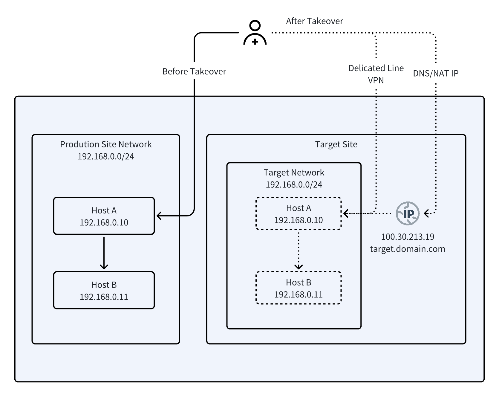
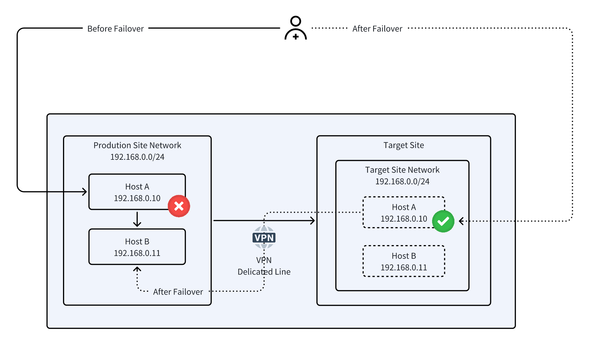
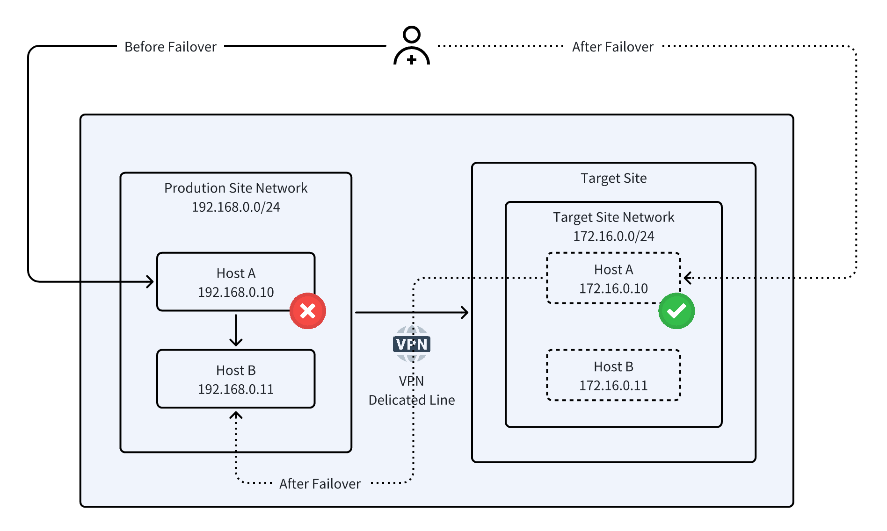
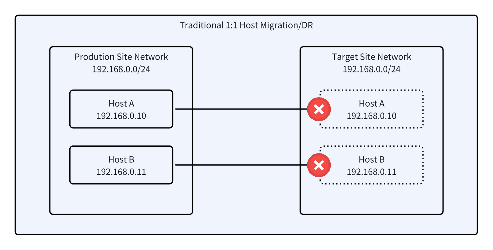
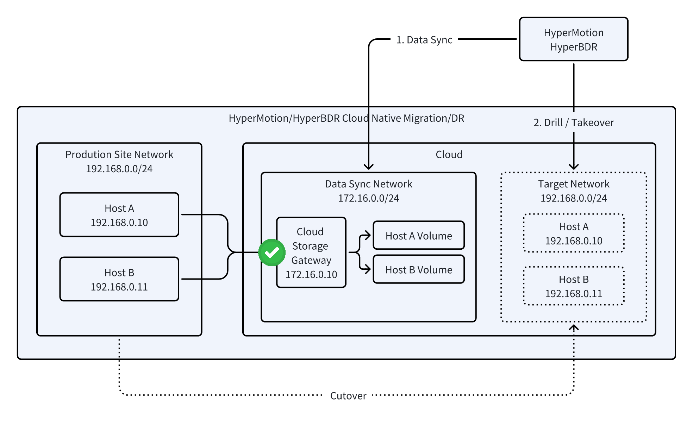

# 主机迁移与容灾的网络规划最佳实践

## 主机迁移与容灾网络规划概述

::: warning

在开始本实践之前，推荐先阅读 [云容灾网络规划概述](../../product-overview/presales/dr-network-planning-recommendations.md)，以便更好地理解整体设计思路。

:::

无论是**主机迁移**还是**容灾建设**，网络规划始终是最核心的环节。网络架构的设计不仅决定了项目实施的复杂度，还直接影响业务连续性、演练验证以及割接或接管的可行性。

迁移和容灾场景在网络规划上具有高度的共性：

* **核心目标一致**：都需要保证业务不中断，用户访问路径尽可能简化，内部系统互通不受影响。
* **关键关注点相同**：用户访问、内部互联、IP 策略、业务连续性、演练验证、安全合规，都是规划中必须优先考虑的要素。

但两者也存在一定差异：

* **迁移**侧重于“割接”，需要在目标环境完成网络架构后进行平滑切换，强调**一次性替换与长期运行**。
* **容灾**则侧重于“演练与接管”，要求在生产与云上环境并行的情况下，能够在需要时**快速切换**，并在事后**平滑回切**。

因此，将迁移和容灾的网络规划放在一起描述，既能突出二者的共性方法论，也能清晰呈现不同场景下的实施重点，为企业提供一体化的网络设计最佳实践。

## 1. 网络规划最佳实践

### 场景概述

本表统一描述主机迁移与容灾场景下的业务网络规划方案。虽然迁移和容灾在触发条件和目标略有不同（迁移侧重业务系统从源端到云端或异地机房的搬迁；容灾侧重在灾备环境下的快速接管），但两者在网络规划的核心要求、IP 策略、内部互通、用户访问路径调整、演练验证和安全合规方面高度一致。因此，使用统一的表格展示三类典型场景，便于管理、对比和实施。

| **场景编号** | **典型场景**      | **场景描述**                                                                    | **业务互访网络**            | **接管后的主机是否需要访问生产端主机** | **用户访问业务网络**                                                                        | **网络实现难度** | **说明**                                                                                                 |
| -------- | ------------- | --------------------------------------------------------------------------- | --------------------- | --------------------- | ----------------------------------------------------------------------------------- | ---------- | ------------------------------------------------------------------------------------------------------ |
| 场景一      | 整体上云&#xA;整体接管 | 1. 业务系统内部互访关系不变，保留原 IP；&#xA;2\. 用户访问业务系统路径发生改变，通过 DNS/NAT/专线/VPN 切换到云上或灾备平台 | 与生产端保持相同 CIDR，并保留原 IP | 否                     | 1. NAT方式：访问IP变更&#xA;2\. 域名变更方式：修改DNS映射，有收敛时间&#xA;3\. 专线/VPN：用户通过新的网络访问原有业务系统，访问IP不变 | 低          | 网络改造难度低&#xA;方案优势：最大限度保留原有架构，迁移或接管风险低，业务连续性强，实施简单。                                                      |
| 场景二      | 部分上云&#xA;部分接管 | 1. 内部网络与生产保持一致，保留原 IP；&#xA;2\. 用户访问路径不变                                     | 与生产端保持相同 CIDR，并保留原 IP | 是                     | 不变                                                                                  | 高          | 网络改造复杂，需要二层打通（VXLAN等）&#xA;方案优势：业务访问路径保持不变，兼容性高，迁移或接管后的主机与未迁移主机可直接互访。                                   |
| 场景三      | 部分上云&#xA;部分接管 | 1. 内部网络改造，CIDR 变更，IP 重新分配；&#xA;2\. 用户访问路径可能发生改变                             | 变更 CIDR，重新分配 IP       | 是                     | 用户业务访问路径可能发生改变                                                                      | 中          | 网络灵活性高，可适应复杂或冲突的地址环境；&#xA;项目管理难度：涉及多部门协作，但是可借助仿真环境验证，降低前期调研难度&#xA;方案优势：通过仿真环境和自动化脚本降低风险，满足长期架构升级和合规要求。 |

### 场景一：整体上云/整体接管（内部IP保留）

#### **适用场景**

* 本地数据中心内部迁移或容灾接管（传统环境到私有云）。
* 本地数据中心迁移或接管到公有云。
* 同云/跨云迁移或异地灾备接管。

#### **场景概述**

* 无论是迁移还是容灾接管，目标主机可保持内部网络地址与原环境一致，实现应用平滑迁移或快速接管，最小化改动。
* 外部用户访问路径可通过 DNS、NAT 或专线/VPN 灵活切换，保证业务连续性和访问无感知。

#### **核心逻辑**

1. **内部地址不变**：迁移后的主机保持与生产端相同 CIDR，并保留原 IP，确保内部互访和依赖系统兼容性。
2. **外部访问路径调整**：用户访问通过灵活切换手段完成，具体方式可选 DNS、NAT 或专线/VPN。
3. **网络实施难度低**：不涉及大规模网络改造，仅需对访问路径进行配置。
4. **业务连续性可控**：提前规划和演练访问切换策略，可快速完成迁移或接管，降低业务中断风险。

#### **网络技术方案**

* **专线或 VPN 切换（推荐）**：直接连接目标平台，源 IP 保留，业务访问不受影响。
* **DNS 切换**：更新域名解析，将访问指向目标主机，需考虑 DNS 收敛时间。
* **NAT 地址映射**：将外部访问地址映射到目标主机内部 IP，实现访问平滑切换。

#### **HyperMotion/HyperBDR 配置和使用**

##### **演练阶段（迁移或容灾演练）**

* **隔离环境**：在目标平台使用与生产环境相同的网段规划，保持内部 IP 与源端一致，但完全隔离源端网络，避免冲突。
* **保留 IP 验证**：启用“保留原有 IP”功能，通过外部 NAT 为业务部门提供访问通道，方便验证业务功能。
* **验证与清理**：业务验证完成后，可直接清理目标验证主机，保留网络配置，等待正式割接或接管窗口。

##### 正式切换阶段

* **选择目标网络**：使用规划好的目标网络，并启用“保留原有 IP 地址”功能。
* **停止业务与增量同步（迁移场景）**：在割接窗口期间短暂停止业务运行，完成最后一次增量同步并关闭源端主机。
* **启动目标主机**：选择最近时间点的快照，在目标平台启动迁移主机，保持原有 IP 配置不变。
* **网络切换**：按照规划修改用户访问路径（DNS、NAT 或专线/VPN），完成正式网络割接。

#### 网络架构

### 场景二：部分上云（二层打通）

#### **适用场景**

* 本地数据中心内部迁移或容灾接管（传统环境到私有云）。
* 本地数据中心迁移或接管到公有云。
* 同云/跨云迁移或异地灾备接管。

#### **场景概述**

* 目标主机在迁移或接管后保持与源端相同 CIDR，并保留原 IP，确保内部系统互访和依赖兼容。
* 用户访问路径保持不变，业务连续性高，可直接访问云端业务系统。

#### **核心逻辑**

* **内部地址保持一致**：迁移或接管后的主机与生产端使用相同 CIDR，内部依赖系统互访不受影响。
* **外部访问路径稳定**：用户访问路径无需调整，业务访问体验一致。
* **网络实施复杂度高**：涉及二层网络打通或 VXLAN 配置，需要在源端环境支持。
* **业务连续性高**：迁移或接管后，主机可与未迁移/未接管主机直接互访，系统兼容性最佳。

**网络技术方案**

* **VXLAN 隧道**：跨机房/跨云二层延伸。
* **L2 VPN / MPLS VPLS**：通过广域网实现远程二层互通。
* **SDN 二层延伸**：动态加入 VLAN，实现目标端加入源端二层广播域。
* **物理交换机 VLAN Trunk**：同运营商或数据中心环境，低延迟二层打通。
* **公有云专有服务**：如 AWS Transit VPC、Azure L2 VPN、华为云ESW服务。

#### **HyperMotion/HyperBDR配置和使用**

##### **演练阶段（迁移或容灾演练）**

* **隔离验证**：在目标平台使用与源端一致的网段规划，主机内部 IP 保留，但网络完全隔离，避免与生产环境冲突。
* **访问验证**：启用保留 IP 功能，通过专线/VPN或内部路由验证业务互通性。
* **验证与清理**：演练完成后，可清理验证主机，保留网络配置以便正式迁移或接管。

##### 正式切换阶段

* **选择目标网络**：使用规划好的目标网络，并启用“保留原有 IP 地址”。
* **停止业务与增量同步（迁移场景）**：在割接窗口期间短暂停止迁移主机业务，完成增量同步。
* **启动目标主机**：选择最近时间点的快照，启动目标主机，保持原有 IP 配置不变。
* **网络确认**：确保目标主机与源端未迁移主机互通，用户访问路径无需调整。

#### 网络架构

### 场景三：部分上云（网络改造）

#### **适用场景**

* 适用于部分上云或部分容灾接管场景，目标网络与源端环境存在冲突或需重新规划。
* 云上或异地数据中心采用全新网段，无法沿用原 IP。
* 用户访问路径需调整或优化（原直连方式不可用，可通过 DNS、NAT、负载均衡或专线/VPN 切换）。
* 跨地域或跨云迁移/接管，内部 IP 地址冲突，需要重新规划。
* 系统兼容性与安全要求高，需要重新设计网络和地址体系。
* 网络实施条件受限，短时间无法完成复杂网络改造，通过 IP 变更可快速上线。

#### **场景概述**

* 迁移或接管后的主机需修改内部 CIDR 并重新分配 IP。
* 用户访问路径可能发生改变，需要调整访问方式以适配新网络。
* 通过仿真环境验证和 HyperMotion/HyperBDR 自动化能力，可确保迁移或接管安全，业务连续性可控。

#### **核心逻辑**

* **仿真验证消除风险**：在目标平台建立隔离仿真环境，验证业务逻辑、数据完整性及系统连通性，提前发现潜在问题。
* **方案灵活性**：根据实际情况调整网络规划与 IP 分配，减少前期调研复杂度。
* **跨方协作**：迁移或接管依赖应用服务商、业务部门及网络/安全团队的紧密配合。
* **自动化支持**：利用 HyperMotion/HyperBDR 前/后脚本自动修改主机配置，实现割接或接管一步到位，降低人工操作风险。

#### **网络技术方案**

* **IP 变更与 CIDR 调整**：目标网络使用新的地址规划。
* **访问路径调整**：用户访问可能通过 DNS、NAT、负载均衡或专线/VPN切换到新主机。
* **仿真环境验证**：在隔离环境中测试业务功能和网络连通性，确认方案可行。

#### **HyperMotion/HyperBDR 使用实践**

##### **演练阶段（迁移或容灾演练）**

* **隔离验证**：在目标平台创建隔离网络，配置新 IP，仿真生产环境条件，避免与源端冲突。
* **访问验证**：通过 DNS、NAT、负载均衡或专线/VPN 验证业务互通性与访问路径，记录相关配置变更，更新前/后脚本。
* **验证与清理**：演练完成后，可清理验证主机，保留网络配置以便正式割接或接管。

##### **正式切换阶段**

* **选择目标网络**：使用规划好的目标网络，并完成新 IP 配置。
* **停止业务与增量同步（迁移场景）**：在割接窗口短暂停止源端业务，完成最后一次增量同步。
* **启动目标主机**：选择最近的快照，启动目标主机，自动完成 IP 变更及网络切换。
* **网络确认**：验证目标主机与源端未迁移主机及用户访问路径互通，确保业务连续性。

#### 网络架构

## 2. HyperMotion/HyperBDR保持原有IP功能原理解析

### 需求和痛点

在主机迁移或容灾接管过程中，保持原有 IP 地址不变是保障业务平滑迁移的关键措施，价值主要体现在：

* **无感知访问：**&#x5E94;用与客户端继续通过原 IP 访问，避免 IP 变更导致访问失败或中断。
* **兼容历史配置**：减少因硬编码 IP 或依赖 IP 的系统（如老旧应用、脚本）带来的修改工作量。
* **降低网络调整复杂度**：安全组、防火墙和 ACL 等策略无需重新配置，减少运维风险。
* **简化运维衔接**：监控、日志、CMDB 等与 IP 绑定的运维工具可直接沿用，避免额外同步。
* **平滑迁移与快速接管**：支持跨机房、跨云迁移或灾备接管，实现快速切换，缩短业务恢复时间。

### 保留IP地址技术实现要点

在满足上述网络的需求条件下，要确保目标主机能够继续使用源端 IP 地址，需要满足以下前提条件：

1. **块级别整机迁移**

   * 必须基于底层块存储进行全盘复制，确保系统盘、数据盘完整还原。
   * 操作系统内部的网络配置（如静态 IP、路由、DNS 等）需随盘完整迁移，避免割接后网络参数缺失。

2. **同步方式与切换策略**

   * **同步方式**：目标主机在同步过程中保持非启动状态，仅接收数据，避免源端与目标端同时运行造成 IP 冲突。
   * **切换策略**：目标主机在灾备演练或接管时可快速启用原 IP 地址，实现业务无缝接管。

**传统迁移/容灾方案**

* 数据传输采用 1:1 方式，在同步或接管过程中，目标主机需要使用临时 IP 地址，原有 IP 仅在切换完成后恢复。
* 演练和正式切换过程复杂，操作难度高，容易引入网络冲突或业务中断风险。

**HyperMotion/HyperBDR 数据迁移与接管方式**

* **同步机制**：通过云同步网关接收数据，网关 IP 可灵活选择任意网段，目标主机在接收数据阶段保持非启动状态，避免源端与目标端同时运行造成冲突。
* **IP 保留**：在启动阶段，目标网络与源端保持一致，迁移或接管主机可直接沿用原有 IP，无需额外 IP 配置。
* **业务安全**：演练或接管过程对源端业务无影响，可验证业务连续性与系统互通性。
* **简化切换**：通过提前规划和仿真验证，迁移或容灾切换过程高效、可控，降低操作风险。

- 支持迁移与容灾演练功能

* **演练能力**：必须支持迁移或容灾演练，用户可在不影响生产业务的情况下验证目标主机可用性及 IP 保留效果。
* **风险控制**：确保正式割接或接管前完成验证，降低迁移或容灾切换风险。

## 总结

HyperMotion 与 HyperBDR 是以 **云原生设计理念**打造的主机迁移与容灾解决方案，天然适配云环境与多样化网络架构，能够轻松满足跨机房、跨云及异地灾备的复杂需求。

* **轻松保留原有 IP**：支持迁移或接管时主机沿用源端 IP，无需修改访问路径或内部依赖，用户访问和系统互通完全无感知。
* **业务连续性高**：支持隔离演练验证和正式切换，风险可控，确保迁移或接管过程中业务不中断。
* **自动化与可控性**：通过 HyperMotion/HyperBDR 前/后脚本实现主机配置自动化调整，简化割接或接管操作，降低人工操作风险。
* **兼容与灵活**：适配不同网络架构、跨 VPC/跨区域迁移，既能实现原 IP 保留，也能在网络改造场景中安全完成 IP 变更。\
* **运维成本低**：安全组、防火墙、ACL、监控、日志、CMDB 等工具可直接沿用，无需重复配置，显著降低运维负担。

相比传统以 **存储为核心的迁移/灾备软件**：

* 同步与切换操作复杂，通常需临时 IP 配置，演练难度大，操作易出错；
* 云上适配能力不足，跨机房、跨云迁移或灾备接管效率低；
* 对运维人员技能依赖高，学习成本陡峭。

在云上环境中，HyperMotion/HyperBDR 的迁移与容灾方案是 **目前同类产品中最优的**，实现了“快速、平滑、无感知”的迁移与接管体验，是企业云上业务连续性与灾备建设的最佳选择。
