# OpenStack 参考文档

## 前置准备

- 同步完成的过渡主机：HyperUbuntu

- 下载的过渡主机镜像：Livecd\-HyperDoor\.qcow2

## OpenStack 演练概览

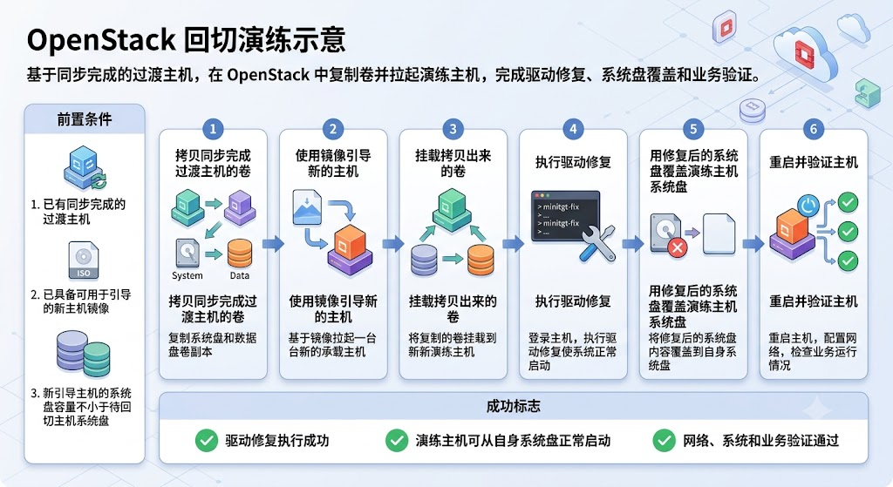

## 将镜像上传到 OpenStack

登录 OpenStack，依次点击进入 Project、Compute、Images，然后点击 Create Image 按钮。

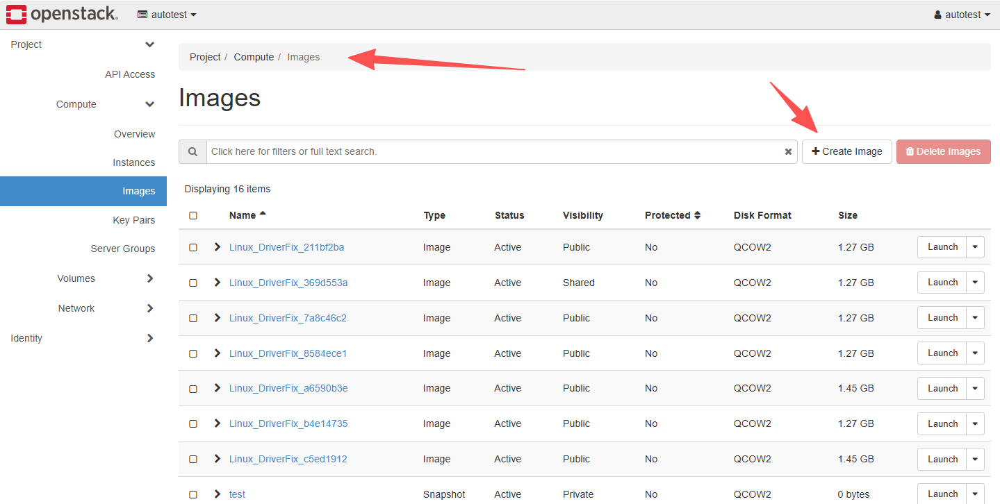

进入创建镜像弹框页后，填入下面的信息：

Image Name：Livecd\-HyperDoor
Image Source：选择下载的镜像文件
Format：选择 QCOW2

然后点击 Create Image 按钮，完成镜像上传。

## 拷贝同步完成过渡主机的卷

找到 HyperUbuntu 主机，点击 Create Snapshot 按钮。

在打开弹框的 Snapshot Name 中输入 HyperUbuntuDrill，然后点击 Create Snapshot 按钮。

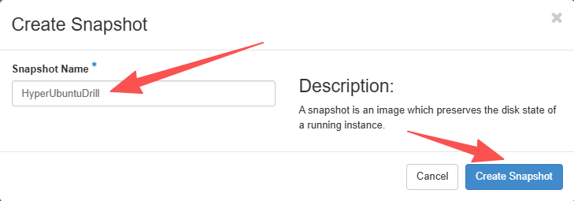

此时进入 Project、Volumes、Volume Snapshots 可以查看当前主机所有的卷的快照列表：

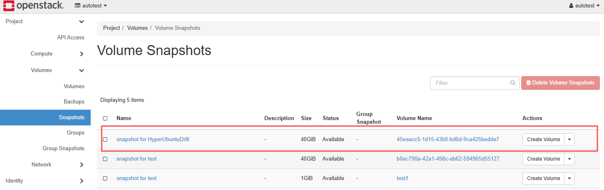

将所有名称为 snapshot for HyperUbuntuDrill 的快照创建为卷备用：

## 使用镜像引导新的主机

进入 Project、Compute、Images，找到 Livecd\-HyperDoor 镜像，点击 Launch 按钮。

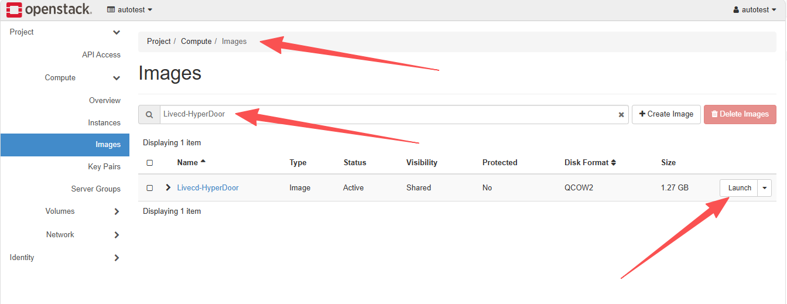

输入新的实例名称，选择实例规格，以及相同的网络信息。

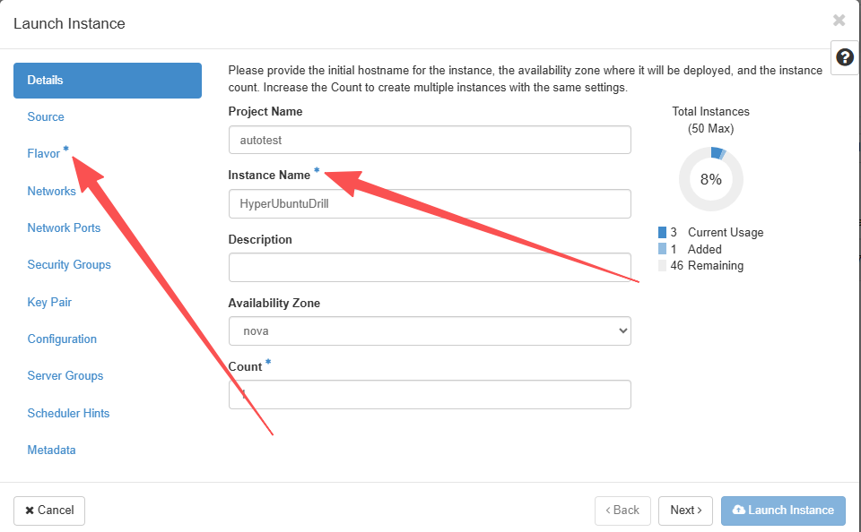

输入 Volume Size 的大小，这里一定要大于 HyperUbuntu 源端的系统盘。

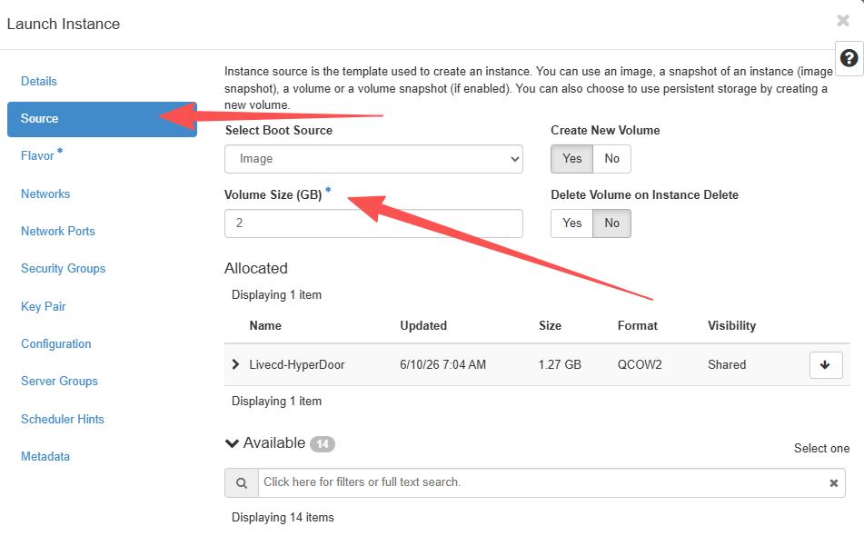

点击 Launch Instance 完成实例创建。

## 将拷贝的卷挂载到新引导的主机中

进入 Project、Volumes、Volumes，找到快照创建的卷，根据原主机顺序将卷挂载到 HyperUbuntuDrill 实例中。

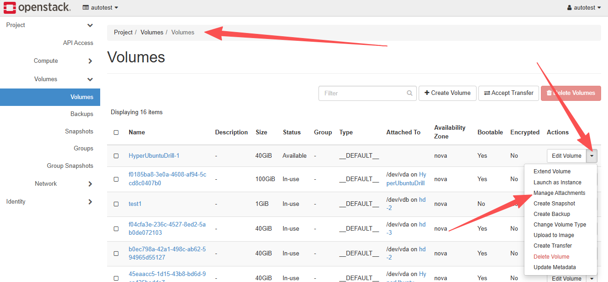

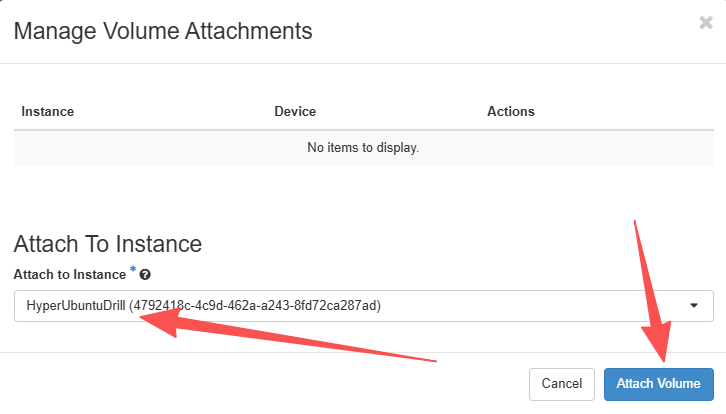

## 在演练主机上执行驱动修复

通过控制台或者 SSH 登录刚刚完成引导的 HyperUbuntuDrill 主机，执行 minitgt\-fix 完成驱动修复；

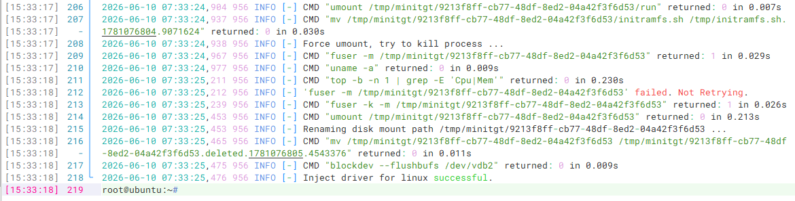

最终输出 `Inject driver for linux successful.`表示驱动修复成功。

## 使用修复的卷启动新的实例

删除 HyperUbuntuDrill 主机，然后设置修复完成的系统卷可启动。

找到系统卷，然后点击 Edit Volume，勾选 Bootable。

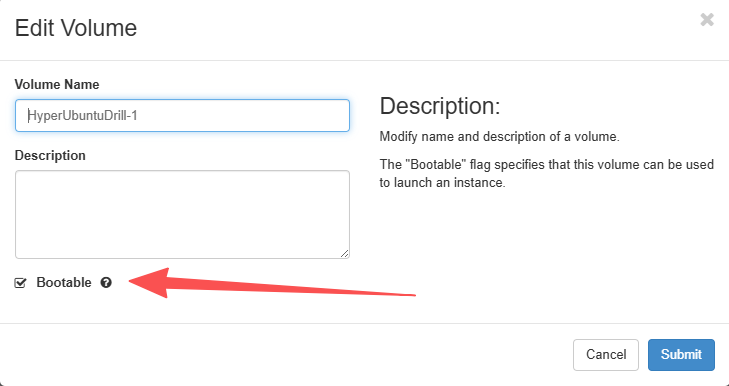

使用系统卷启动一台新主机，并且将其它数据卷挂载到新主机中。

启动的新主机 Source 中，Select Boot Source 设置为 Volume，Allocated 选择系统盘，如有其它数据卷可以一并挂载。

