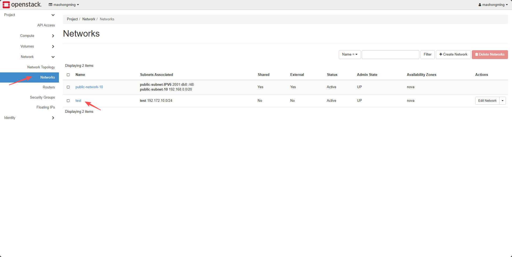
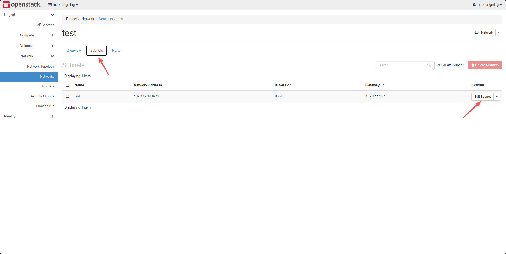
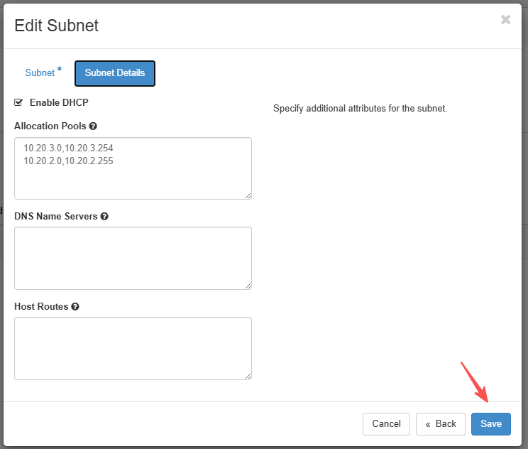

# 配置OpenStack平台子网 DHCP 地址池防止 IP 冲突导致启动主机失败 最佳实践

---

## 1. 概述

在使用 **HyperBDR / HyperMotion** 将源端主机恢复到 **OpenStack** 平台时，HyperBDR/HyperMotion 会在 OpenStack 平台自动创建一台**过渡主机**（英文：**Transition Host**；Drill/Recovery 实例），用于拉取备份数据、完成块增量同步以及最终启动恢复目标主机。该过渡主机的网络地址由 OpenStack 平台对应子网的 **DHCP 服务** 统一分配。

当客户线下源端生产网络与 OpenStack 的业务网络**已通过二层打通**（例如通过 VXLAN、OVS GRE/VLAN、Underlay 路由互通、运营商专线等方式）时，由 OpenStack DHCP 分配的过渡主机 IP **有可能与线下源端生产网络中已有主机的 IP 产生冲突**。IP 冲突将直接导致：

- 过渡主机网络不通，导致主机Drill/Takeover任务失败；
- 可能影响生产网络中的真实主机，造成业务中断。

**目前HyperBDR/HyperMotion不支持过渡主机自定义 IP（自定义 fixed_ip）**，可通过**主动调整 OpenStack 子网 DHCP 地址池（allocation pool）**的方式，将 DHCP 可分配的 IP 范围**排除掉生产网络已使用的 IP 段**，从而从根本上避免 IP 冲突。

本文档将详细介绍上述场景的**最佳实践**：

- 场景背景与风险分析；
- OpenStack 平台子网 DHCP 地址池配置方法（Dashboard 控制台方式）；
- 实施后的验证步骤；
- 关键注意事项。

---

## 2. 适用场景

| 场景 | 是否适用 |
|-----|---------|
| HyperBDR/HyperMotion 恢复主机到 OpenStack 平台，源端生产网与 OpenStack 业务网二层打通 | ✅ 强烈建议实施 |
| HyperBDR/HyperMotion 恢复主机到 OpenStack 平台，源端生产网与 OpenStack 业务网三层互通 | ⚠️ 建议评估 |
| HyperBDR/HyperMotion 恢复主机到 OpenStack 平台，源端生产网与 OpenStack 业务网完全隔离 | ❌ 无需实施 |

---

## 3. 风险与影响

| 风险项 | 说明 | 影响等级 |
|-------|------|---------|
| 过渡主机（Transition Host）获取到与生产主机相同的 IP | 引起 ARP/ND 漂移、流量黑洞 | 🔴 高 |
| HyperBDR/HyperMotion无法访问过渡主机（Transition Host）的服务端口 | 导致Drill/Takeover任务失败 | 🔴 极高 |

---

## 4. 解决方案

通过在 OpenStack 子网中**重新规划并锁定 DHCP 地址池（allocation pool）**，确保分配给过渡主机的 IP 落在**生产网络已占用 IP 之外的安全段**。

### 4.1 方案原理

OpenStack Neutron 默认会基于子网的 CIDR 创建 `allocation_pool`，DHCP 从该地址池中按顺序分配 IP 给虚拟机。Neutron 不会感知物理生产网络中已经存在的 IP，因此需要管理员**显式排除**：

- 生产网络中的真实主机 IP；
- 生产网络中的网关、路由器接口、虚拟 IP（VIP）；
- 保留给其它系统使用的网段。

### 4.2 推荐实施流程

```
1. 梳理源端生产网已使用 IP（交换机 ARP 表、IPAM、CMDB）
        ↓
2. 在 OpenStack 侧规划与生产网错开的 DHCP 分配段
        ↓
3. 在 OpenStack 子网上调整 allocation_pool
        ↓
4. 验证：创建一台临时测试虚机，检查获取到的 IP
        ↓
5. 在 HyperBDR/HyperMotion 平台执行一次Drill/Takeover验证
```

---

## 5. 操作步骤

### 5.1 前置准备

1. 梳理源端生产环境中已使用的 IP 段。
2. 与网络/业务团队确认：
   - 生产网关 IP；
   - 业务 VIP / 负载均衡 VIP；
   - 已规划的预留 IP 段；

### 5.2 操作步骤：通过 OpenStack Dashboard（Horizon）配置

#### 步骤 1：登录 Horizon

使用管理员账号登录 OpenStack Dashboard。


#### 步骤 2：进入子网列表

依次点击：**项目 → 网络 → 网络**，找到 HyperBDR 恢复任务对应的网络，点击该网络下挂载的**子网名称**。



#### 步骤 3：编辑子网

在子网详情页中，点击右上角的 **「编辑子网」** 按钮。



#### 步骤 4：调整分配地址池（Allocation Pools）

在 **「分配地址池」** 配置项中：

- **删除**默认的全段地址池；
- **新增**两段"安全"地址池：
  - 一段靠近子网起始位置；
  - 一段靠近子网末尾位置（推荐过渡主机 / Transition Host 使用末尾段，便于运维定位）。



示例：假设 HyperBDR 恢复子网为 `10.20.0.0/22`，生产网已用 IP 集中在 `10.20.0.0 – 10.20.1.255`：

- 可用安全段 1：`10.20.2.0 – 10.20.2.255`
- 可用安全段 2：`10.20.3.0 – 10.20.3.254`（保留 `.255` 作为网关）
- **DHCP 分配池**：`10.20.2.0,10.20.2.255` 与 `10.20.3.0,10.20.3.254`

#### 步骤 5：保存并等待 DHCP 重新下发

点击「保存」后，Neutron 会自动通知 `neutron-dhcp-agent`（dnsmasq）重新加载配置。


---

## 6. 验证

### 6.1 OpenStack 侧验证

1. 在该子网下创建一台**临时测试虚机**（任意镜像、任意规格），观察其获取到的 IP 是否落在新的安全段内。
2. 在虚机内部执行 `ip addr` 与 `ip route`，确认：
   - 获得 IP 属于新分配池；
   - 默认网关仍为子网 `gateway_ip`；
   - 可正常 ping 通网关。

### 6.2 端到端验证

1. 登录 HyperBDR / HyperMotion 控制台。
2. 选择任意一台源端主机，容灾演练Drill。
4. 启动演练，观察：
  - 过渡主机（Transition Host）创建成功；
  - 过渡主机 IP 落在新分配池内；
  - Drill任务执行成功。

---

## 7. 注意事项

| # | 注意事项 |
|---|---------|
| 1 | 修改子网分配池是**在线操作**，不会影响已运行虚机，但**新建虚机**才会从新池中获取 IP。 |
| 2 | 必须保留子网 `gateway_ip` 所在的 IP **不在分配池中**，避免 Neutron 拒绝创建。 |
| 3 | 如果客户网络使用 VRRP / Keepalived 等 VIP 方案，请务必**显式排除** VIP 所在 IP。 |
| 4 | 修改分配池后，建议重启 DHCP agent 或在控制节点执行 `neutron-dhcp-agent` 重新加载，避免 dnsmasq 缓存。 |
| 5 | 同一子网下如果同时使用 IPv6，建议同步调整 IPv6 的 `allocation_pools`。 |
| 6 | 推荐将源端生产网已使用 IP 录入 IPAM 平台，并在变更时同步刷新 OpenStack 侧分配池。 |

---

## 8. 附录

### 8.1 关键术语

| 术语 | 含义 |
|-----|------|
| Allocation Pool | OpenStack Neutron 子网中允许 DHCP 分配给虚拟机的 IP 地址段 |
| Transition Host / 过渡主机 | HyperBDR/HyperMotion 拉起目标主机的中转实例 |

### 8.2 参考链接

- OpenStack Neutron 官方文档：<https://docs.openstack.org/neutron/latest/>
- HyperBDR 官方文档：<https://docs.oneprocloud.com/>

---
