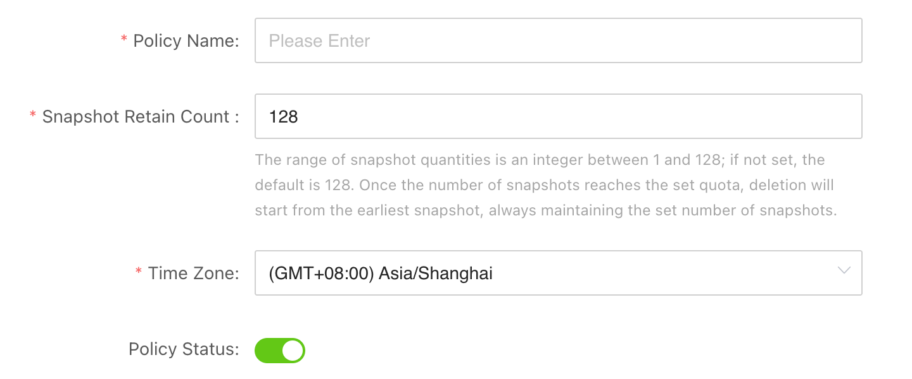
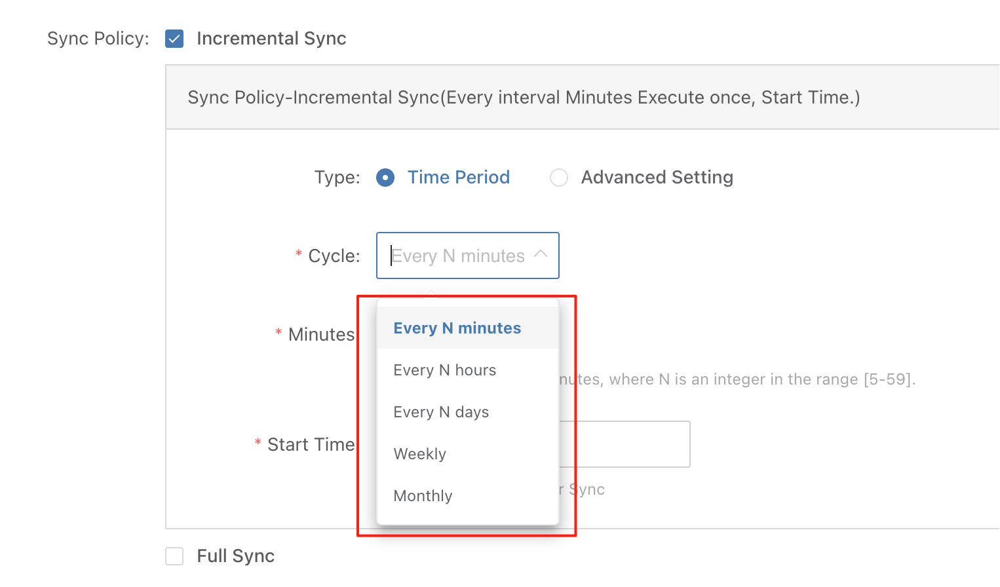
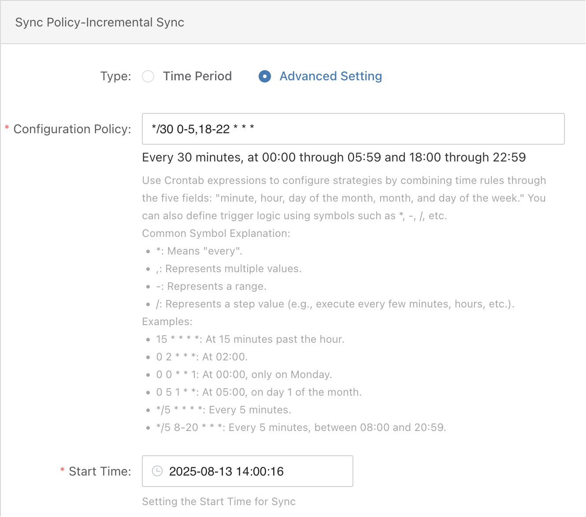
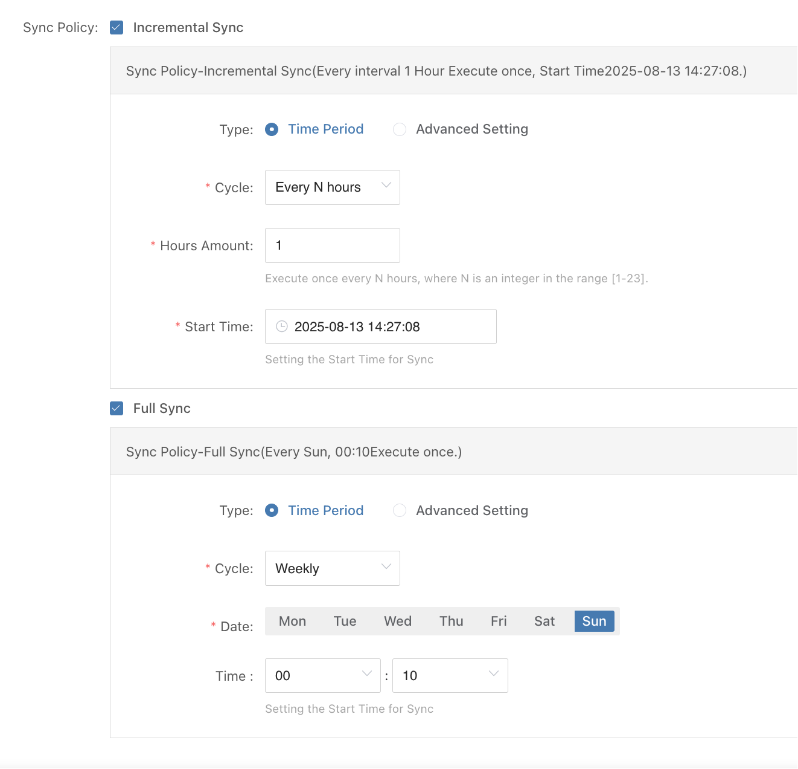
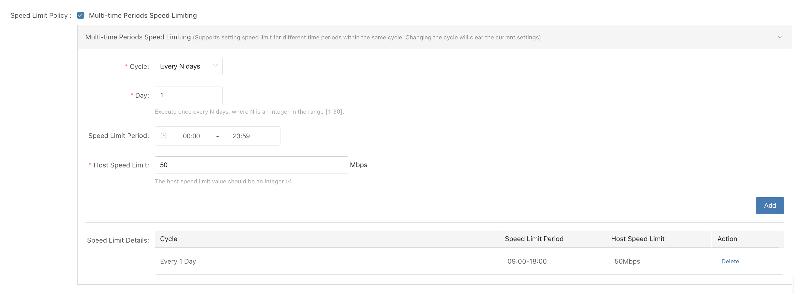
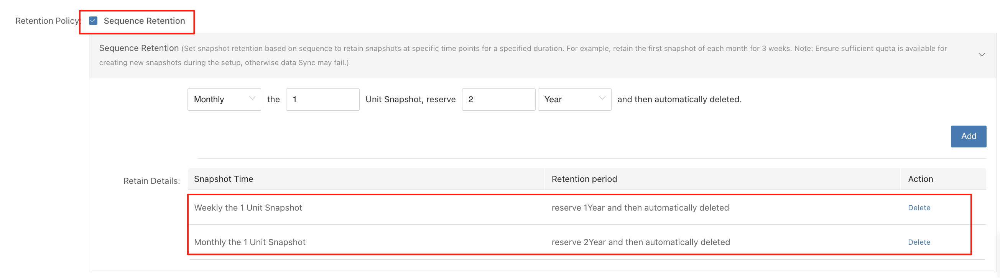
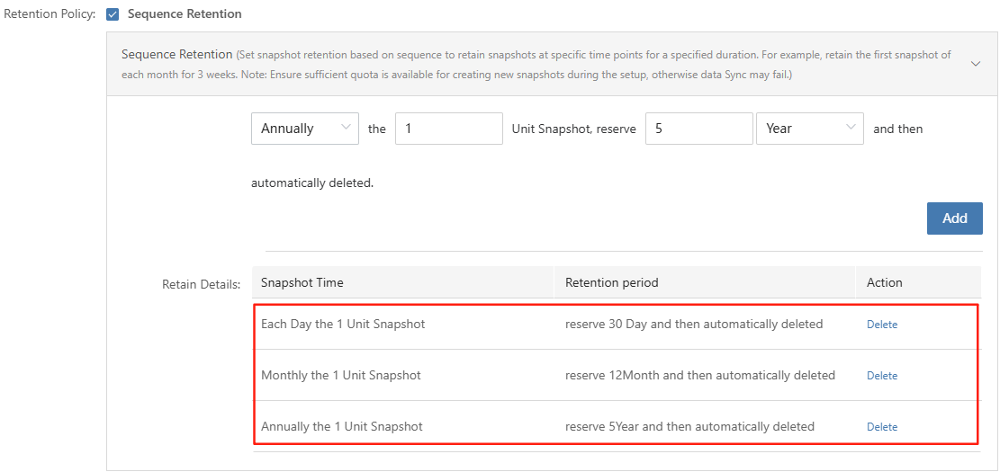

# **策略管理**

## **背景与原理介绍**

在现代分布式存储与容灾架构中，数据的及时同步与快照管理是保障业务连续性的关键环节。HyperBDR 作为一款支持块存储和对象存储双模式的高效数据同步与备份方案，其策略管理机制设计旨在平衡灵活性与稳定性，满足多场景多主机的容灾需求。



### **策略的多主机绑定与存储模式适配**

HyperBDR 允许用户为多个主机绑定同一策略，统一管理数据同步与快照操作。无论是在块存储模式还是对象存储模式下，该策略均能有效运作，保证跨主机环境的一致性和简化运维复杂度。

### **快照数量限制及自动管理**

为防止存储空间无限制增长，HyperBDR 策略对快照数量设置了上限：**最大支持 128 个快照**。

* 当快照数量达到上限时，系统会自动删除最旧的快照以释放空间。

* 若配置了快照保留策略，系统在删除时会跳过符合保留时间点的快照，优先删除非保留快照，确保关键快照的安全性和长期保存。

* **对于块存储模式下的快照，HyperBDR 依赖于云平台原生的块存储快照能力。**
  &#x20;这意味着，策略中保留的 128 个快照实际上也映射到云平台对应块存储资源上的快照数量，云平台将默认保留这 128 个快照，确保策略与底层存储服务的一致性。

### **执行时区**

策略的执行时间与绑定主机的时区挂钩，这意味着在跨时区环境下，每台主机的策略触发时间会基于其本地时间精准控制。

* **默认情况下，系统会使用浏览器使用者所在环境的默认时区作为策略的时区。**

* 同时，用户也可以根据需要，手动选择并指定策略的时区，满足跨区域或特殊时区的调度需求。

### **同步触发机制**

&#x20;为了避免任务堆积和同步冲突，HyperBDR 采用了严格的任务串行执行机制：

* 同一台主机若上一周期的同步任务尚未完成，系统将不会触发下一周期的同步任务。

* 只有当前任务完成且达到下一触发时间点，新的同步任务才会被启动。

这要求用户根据实际业务的数据规模、源端性能和网络带宽合理设置同步周期，避免过短的周期带来资源瓶颈和性能下降。

### **功能概览**

HyperBDR 策略当前主要支持以下功能：

* **周期性增量同步**：定期同步发生变化的数据，减少数据传输量。

* **周期性全量同步**：定期执行全量数据同步，保证数据完整一致。

* **限速设置**：控制同步过程中的带宽使用，避免影响业务网络。

* **保留策略配置**：设置关键快照的保留周期，满足合规和恢复需求。

## **同步策略配置场景**

为了帮助用户高效、合理地配置 HyperBDR 策略，以下按照从简单到复杂的场景模式，逐步介绍常见策略设置方式及建议：

### **固定间隔周期同步设置**

**使用场景：**&#x9002;用于对恢复点目标（RPO）有明确要求，且源端性能、数据增量和网络带宽能够满足所设同步频率的业务环境。

**配置建议**

* 选择固定周期同步模式，支持以分钟（最短5分钟）、小时、天、星期或每月固定时间为单位设置同步间隔。

* 根据业务的RPO需求，合理设置同步间隔，常见为以分钟或小时为单位的周期性同步。

* 优先配置周期性增量同步，降低网络负载和同步时长。

* 结合业务实际情况，合理调整同步频率，避免任务堆积导致同步延迟。



### **间隔时间窗口内同步**

使用场景：业务需要每30分钟执行一次数据同步，但为了避免影响核心业务高峰期，仅允许同步任务在每天的凌晨0点至6点，以及晚上18点至23点这两个时间段内运行。

配置建议：

采用 Crontab 模式设置同步任务时间，分两段时间窗口配置同步触发：

* 凌晨 0:00 到 6:00，每30分钟执行一次同步；

* 晚上 18:00 到 23:00，每30分钟执行一次同步。

```plain&#x20;text
*/30 0-5,18-22 * * *
```

解释：

* `*/30` ：每30分钟执行一次

* `0-5,18-22` ：小时字段表示凌晨0点到5点（含），以及18点到22点（含）这两个时间段

* 其他字段 `* * *` 表示每天、每月、每周任意时间



### **增量和全量交替进行**

**使用场景：**&#x4E1A;务需要每小时同步一次，但要求在每周末的最后一天执行一次全量同步。该方式适用于对数据完整性要求较高，并倾向采用传统灾备中周期性全量备份功能的用户。

**配置建议**

* **分别配置策略**：为增量任务和全量任务分别设定独立的执行策略。例如，本示例中增量任务的开始时间为每小时的 27 分 08 秒（分钟和秒来源于我们的统一起始时间）。

* **关注全量耗时**：全量任务通常耗时较长，应将其开始时间设置早于增量任务，以避免时间冲突导致全量同步无法触发。在本示例中，全量任务设置为每周日 0 点 10 分执行，恰好在增量任务之前，从而确保全量优先执行，且当日增量任务不再触发。

> **注意**：如果前一天 23:17 触发的增量任务执行时间过长且尚未结束，将导致次日 0:10 的全量任务无法触发。
>
> **建议**：先观察各主机同步任务的实际耗时及结束时间，并在策略中尽量将全量快照的触发时间安排在增量任务结束之后，以避免任务冲突。



#### 最佳实践：分钟级增量、月度全量与周期性演练

在容灾方案中，增量同步可以做到 **分钟级别**，从而在灾难恢复时实现极低的RPO。但仅依赖增量仍存在潜在风险：增量链条过长、链路故障导致差异丢失、存储碎片累积等，都会影响最终的数据一致性和可恢复性。

因此，业界最佳实践是：

* **分钟级增量** → 确保持续的数据同步，满足生产业务的高可用性需求。
* **月度全量** → 作为长期基线，定期校准数据，避免增量链过长带来的风险。
* **周期性容灾演练** → 通过定期演练验证容灾系统的有效性，不仅检验全量与增量的正确性，还能发现潜在配置、流程或操作层面的隐患。

  * **核心优势**：产品独有的 **一键式 Boot in Cloud** 功能，无需对目标端进行任何预操作即可完成容灾演练。这意味着演练可以在真实环境中高频、低成本地执行，从而真正保障数据完整性和容灾可靠性。

这种组合策略的优势在于：

1. **一致性保障**：月度全量消除长期增量累积的潜在误差。
2. **风险兜底**：即使某些增量损坏，也能依靠全量基线恢复。
3. **合规与审计**：月度全量点满足监管对“完整基线数据”的要求。
4. **实战验证**：一键式演练确保容灾方案在真实场景中可用，数据保护不仅停留在“设计正确”，更落实到“执行可靠”。

通过 **分钟级增量 + 月度全量 + 一键式周期演练** 的策略，企业能够在 **可靠性、合规性和业务连续性** 之间实现最佳平衡，确保容灾点在长期运行中的可用性与可信性。

## **限速设定配置场景**

在进行快照同步时，系统会占用一定的网络带宽。如果不加以限制，可能在业务高峰期影响线上服务性能。
**限速策略为单台主机级别**：一旦策略生效，所有与该策略关联的主机都会按照设定的限速值进行带宽控制。

通过配置限速，可以为快照同步任务设置带宽上限，在满足数据同步需求的同时，避免对核心业务造成过大影响。

### **配置建议**

* **低峰期高速度**：在业务低峰期（如凌晨时段）允许较高的同步速率，以加快任务完成速度。

* **高峰期低速度**：在业务高峰期（如白天工作时段）降低同步速率，减少对线上业务的干扰。

* **配合时间窗口策略**：仅在指定时段执行快照同步，并在此期间应用限速设置，实现性能与效率的平衡。

### **注意事项**

* 在 **Agent 场景** 中，限速值设置过低可能导致本地缓存数据占满，从而无法继续增量同步。

* 建议结合合理的同步周期设置，在限速的同时确保同步频率足够高，以避免缓存数据过大。

### **示例场景：忙时限速，闲时不限速**

* 激活限速策略，设定限速时间段为 **每天 09:00–18:00**。

* 在此时间段内，每台主机的最大同步速率不会超过 **50 Mbps**。

* 其他时段不限速，以充分利用闲时带宽，加快同步进度。



## **快照保留策略配置场景**

在用户未设置快照保留策略的情况下，当快照总数达到上限时，系统会自动删除最早创建的快照。

&#x20;在某些行业中，由于监管要求，需要对特定时间点的快照进行长期保留。此时，可通过配置快照保留策略，实现对这些特殊快照的长期保存。

&#x20;需要注意的是，被固定保留的快照会占用快照总数量配额，因此应确保固定保留的快照数量小于快照总数量上限，以保留足够的空间支持快照的正常滚动更新。

### **场景1：128个快照，每周第一个快照保留1年，每月第一个快照保留 1 份，保存 2 年**

#### **配置方法**



#### **计算方法**

在总快照配额为 **128 个**的情况下，每周和每月首个快照时间点不重合，以下是详细的计算方法：

**分层保留策略**

* **每周快照（Weekly）**：每周保留 1 份，保存 1 年（约 52～53 份）。
* **每月快照（Monthly）**：每月保留 1 份，保存 2 年（共 24 份）。

**配额占用分析**

* 周快照：52～53 份
* 月快照：24 份
* **固定保留总数：** 76～77 份
* **剩余可用配额：** 约 51～52 份，用于日常滚动或临时快照。

### **场景2：76个快照，兼顾短周期快速恢复与长期合规留存，策略配置：**

* **每小时生成 1 个快照**，保留 24 小时（即每日生成 24 个快照，满足 1 小时的 RPO 要求）

* **每日保留 1 个快照**，保留周期为 30 天（每日备份保留 30 天）

* **每月保留 1 个快照**，保留周期为 12 个月（每月备份保留 12 个月）

* **每年保留 1 个快照**，保留周期为 5 年（每年备份保留 5 年）

#### **配置方法**



#### **计算方法**

在总快照配额为 **76 个**的情况下，以下是详细的计算方法：

**分层保留策略**

* **每日快照（Each Day）：** 每日保留 1 份，保存 30 天（约 30 份）
* **每月快照（Monthly）：** 每月保留 1 份，保存 12 月（共 12 份）
* **每年快照（Annually）：** 每年保留 1 份，保存 5 年（共 5 份）
> 每小时快照占用总配额里的24个，滚动更新，无需设置

**配额占用分析**

* 小时快照：24 份
* 日快照：30 份
* 月快照：12 份
* 年快照：5份
* 重合快照：2 份（小时快照与当日快照 1 份，首月快照与年快照 1 份）
* **固定保留总数：** 69 份（71份 - 2份）
* **剩余可用配额：** 约 7 份，用于日常滚动或临时快照

## **附录**

### **Crontab 表达式详细说明**

Crontab 表达式由 **5 个字段**组成：

```plain&#x20;text
分钟(0-59)   小时(0-23)   日期(1-31)   月份(1-12)   星期(0-7, 0和7均表示星期日)
```
通过这 5 个字段的组合，可以灵活设置任务执行的时间规则。

#### **常用符号说明**

| 符号 | 含义       | 示例                             |
|------|------------|----------------------------------|
| *    | 任意值（每） | `* * * * *` → 每分钟执行一次       |
| ,    | 多个值     | `0 9,18 * * *` → 每天 09:00 和 18:00 执行 |
| -    | 范围       | `0 8-20 * * *` → 每天 08:00 至 20:00 整点执行 |
| /    | 步进（间隔） | `*/5 * * * *` → 每隔 5 分钟执行一次   |

#### **示例说明**

| 表达式             | 说明                                                      |
|-------------------|-----------------------------------------------------------|
| 15 * * * *         | 每小时的第 15 分钟执行（例如 08:15、09:15）             |
| 0 2 * * *          | 每天 02:00 执行                                         |
| 0 0 * * 1          | 每周一 00:00 执行                                       |
| 0 5 1 * *          | 每月 1 日 05:00 执行                                     |
| */5 * * * *        | 每隔 5 分钟执行一次                                      |
| */5 8-20 * * *     | 每隔 5 分钟执行一次，仅在 08:00 至 20:59 之间           |
| */31 8-20 * * *    | 每隔 31 分钟执行一次，分钟会错位滚动（详见下方说明）     |
| 0 0 1 1 *          | 每年 1 月 1 日 00:00 执行                               |
| 0 0-6/2 * * *      | 从 00:00 开始每隔 2 小时执行一次，直到 06:00（即 00:00、02:00、04:00、06:00） |

#### **特殊间隔示例：`*/31 * * * *`**

**解释**：

* **分钟**：`*/31` 表示分钟字段取模 31，结果为 `0` 和 `31`，即每小时的第 0 分钟和第 31 分钟执行。

* 其它字段（小时、日期、月份、星期）不限制。

**实际执行时间**：

```plain&#x20;text
00:00、00:31
01:00、01:31
...
08:00、08:31  
09:00、09:31  
10:00、10:31  
...  
20:00、20:31
```

**注意事项**：

* 这种写法**不是严格的“每隔 31 分钟”**，而是在每个指定小时的第 0 分钟和第 31 分钟触发。


