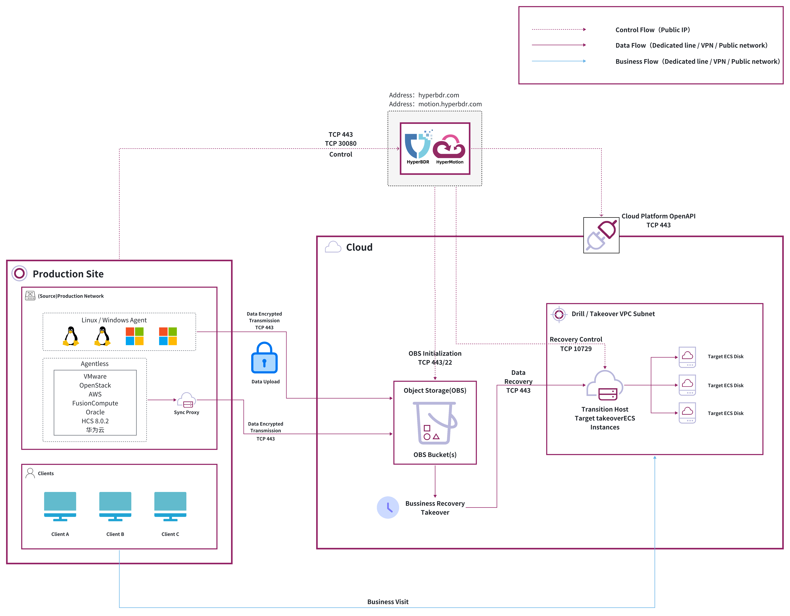
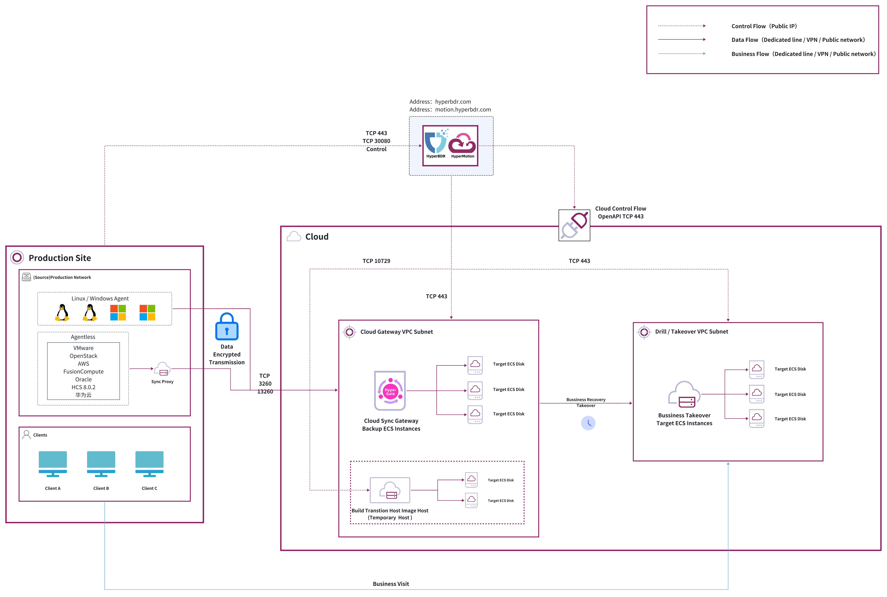
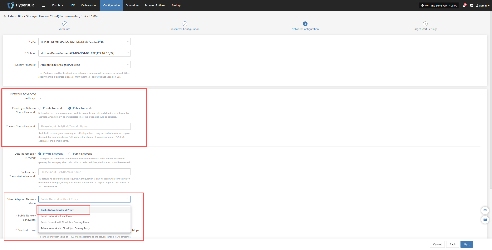

# SaaS模式网络通讯最佳实践

## SSaaS 模式容灾/迁移下的网络通信概述

在现代企业业务中，系统的高可用性和数据安全至关重要。我们的容灾 SaaS 产品通过云端提供统一的业务连续性和数据保护能力，使企业在本地或云端环境发生故障时，能够快速恢复关键业务系统。

HyperBDR/HyperMotion是由OnePro运营的运行在互联网的SaaS服务，需要与用户本地环境保持实时的云端通信。因此，生产侧必须具备公网访问能力，或通过合规的代理、VPN、专线等网络方式实现可访问性，以确保所有灾备流程顺畅进行。合理规划网络通信架构，是确保容灾系统可靠、高效运行的核心。本文档总结了在 SaaS 容灾模式下的网络通信最佳实践，包括访问控制、端口与协议管理以及安全隔离等方面，帮助企业在云端和本地环境之间实现安全、稳定的数据同步和业务接管。

* 优势：

  * **无需本地部署**：减少硬件资源投入，只要具备公网即可接入灾备服务，部署门槛低。

  * **快速更新和维护**：SaaS 平台可实时推送功能补丁，保证系统及时更新和安全维护。

  * **异地灾备能力**：通过互联网可实现跨区域灾备，减少网络设备和运维成本。

* 劣势：

  * **网络依赖性强：**&#x63A7;制流完全依赖公网，网络不稳定或带宽不足可能导致服务响应延迟。

  * **合规要求：**&#x67D0;些行业对跨公网传输敏感数据有严格限制，需要私有化部署。

## 对象存储方案

### 开放端口列表

#### 代理

代理包含 Windows 代理和 Linux 代理两种方式。

| 编号 | 来源               | 目标               | 方向     | 端口          | 类型      | 备注                                                                                                   |
| -- | ---------------- | ---------------- | ------ | ----------- | ------- | ---------------------------------------------------------------------------------------------------- |
| 1  | Agent            | HyperBDR Console | TCP 单向 | 443 / 30080 | 控制流(公网) | Agent 需要具备访问互联网的网络条件，只需开放Agent对外访问HyperBDR/HyperMotion即可。                                            |
| 2  | Agent            | 对象存储服务           | TCP 单向 | 443         | 数据流     | 你可以根据场景选择不同的网络方式，可以通过 VPN 或专线实现内网级安全传输，也可以直接使用公网进行数据通信。                                              |
| 3  | HyperBDR Console | 对象存储服务           | TCP 单向 | 443         | 控制流(公网) | —                                                                                                    |
| 4  | HyperBDR Console | Transition Host  | TCP 单向 | 10729       | 控制流(公网) | 该主机是临时在云平台拉起的一台主机，用作后续驱动修复创建镜像使用，使用完毕后会自动关闭，在使用过程中由HyperBDR/HyperMotion自动创建，过程中安全组会自动创建端口，无需额外配置。    |
| 5  | HyperBDR Console | 云 API            | TCP 单向 | 443         | 控制流(公网) | —                                                                                                    |
| 6  | Transition Host  | 对象存储服务           | TCP 单向 | 443         | 数据流     | 该主机是临时在云平台拉起的一台主机，用作后续驱动修复创建镜像使用，使用完毕后会自动关闭并删除，在使用过程中由HyperBDR/HyperMotion自动创建，过程中安全组会自动创建端口，无需额外配置。 |

#### 无代理

此处仅以VMware Agentless为例，其他云平台信息可点击查看：[Network Planning Overview](https://docs.oneprocloud.com/product-overview/presales/dr-network-planning-recommendations.html#deployment-solution-for-object-storage)

| 编号 | 来源               | 目标               | 方向     | 端口          | 类型      | 备注                                                                                      |
| -- | ---------------- | ---------------- | ------ | ----------- | ------- | --------------------------------------------------------------------------------------- |
| 1  | Sync Proxy       | vCenter          | TCP 单向 | 443         | 控制流(公网) | —                                                                                       |
| 2  | Sync Proxy       | ESXi             | TCP 单向 | 902         | 数据流     | 适用于所有由 vCenter 管理的 ESXi 主机（端口 902）。                                                     |
| 3  | Sync Proxy       | HyperBDR Console | TCP 单向 | 443 / 30080 | 控制流(公网) | Sync Proxy作为数据传输代理，需要具备访问互联网的网络条件，只需开放Agent对外访问HyperBDR/HyperMotion即可。                  |
| 4  | Sync Proxy       | 对象存储服务           | TCP 单向 | 443         | 数据流     | 你可以根据场景选择不同的网络方式，可以通过 VPN 或专线实现内网级安全传输，也可以直接使用公网进行数据通信。                                 |
| 5  | HyperBDR Console | 对象存储服务           | TCP 单向 | 443         | 控制流(公网) | —                                                                                       |
| 6  | HyperBDR Console | Transition Host  | TCP 单向 | 10729       | 控制流(公网) | 该主机是临时主机用作后续驱动修复创建镜像使用，使用完毕后会自动关闭，在使用过程中由HyperBDR/HyperMotion自动创建，过程中安全组会自动创建端口，无需额外配置。 |
| 7  | HyperBDR Console | 云 API            | TCP 单向 | 443         | 控制流(公网) | —                                                                                       |
| 8  | Transition Host  | 对象存储服务           | TCP 单向 | 443         | 数据流     | 该主机是临时主机用作后续驱动修复创建镜像使用，使用完毕后会自动关闭，在使用过程中由HyperBDR/HyperMotion自动创建，过程中安全组会自动创建端口，无需额外配置。 |

### 部署架构

#### SaaS

## 块存储方案

### 开放端口列表

#### 代理

代理包含 Windows 代理和 Linux 代理两种方式。

| 编号 | 来源                 | 目标                 | 方向     | 端口                 | 类型      | 备注                                                                                               |
| -- | ------------------ | ------------------ | ------ | ------------------ | ------- | ------------------------------------------------------------------------------------------------ |
| 1  | Agent              | HyperBDR Console   | TCP 单向 | 443 / 30080        | 控制流(公网) | Agent 需要具备访问互联网的网络条件，只需开放Agent对外访问HyperBDR/HyperMotion即可。                                        |
| 2  | Agent              | Cloud Sync Gateway | TCP 单向 | 13260              | 数据流     | 你可以根据场景选择不同的网络方式，可以通过 VPN 或专线实现内网级安全传输，也可以直接使用公网进行数据通信。                                          |
| 3  | HyperBDR Console   | Cloud Sync Gateway | TCP 单向 | 22 / 10729 / 16100 | 控制流(公网) | —                                                                                                |
| 4  | Cloud Sync Gateway | HyperBDR Console   | TCP 单向 | 443 / 30080        | 控制流(公网) | 该主机是临时主机用作后续驱动修复创建镜像使用，使用完毕后会自动关闭，在使用过程中由HyperBDR/HyperMotion自动创建，过程中安全组会自动创建端口，仅需修改其内10443为443。 |
| 5  | HyperBDR Console   | 云 API              | TCP 单向 | 443                | 控制流(公网) | —                                                                                                |

#### 无代理

此处仅以VMware Agentless为例，其他云平台信息可点击查看：[Network Planning Overview](https://docs.oneprocloud.com/product-overview/presales/dr-network-planning-recommendations.html#deployment-solution-for-block-storage)

| 编号 | 来源                 | 目标                 | 方向     | 端口                 | 类型      | 备注                                                                     |
| -- | ------------------ | ------------------ | ------ | ------------------ | ------- | ---------------------------------------------------------------------- |
| 1  | Sync Proxy         | vCenter            | TCP 单向 | 443                | 控制流(公网) | —                                                                      |
| 2  | Sync Proxy         | ESXi               | TCP 单向 | 902                | 数据流     | 所有由 vCenter 管理的 ESXi 均需开放 902 端口。                                      |
| 3  | Sync Proxy         | HyperBDR Console   | TCP 单向 | 443 / 30080        | 控制流(公网) | Sync Proxy作为数据传输代理，需要具备访问互联网的网络条件，只需开放对外访问HyperBDR/HyperMotion即可。      |
| 4  | Sync Proxy         | Cloud Sync Gateway | TCP 单向 | 13260              | 数据流     | 你可以根据场景选择不同的网络方式，可以通过 VPN 或专线实现内网级安全传输，也可以直接使用公网进行数据通信。                |
| 5  | HyperBDR Console   | Cloud Sync Gateway | TCP 单向 | 22 / 10729 / 16100 | 控制流(公网) | 该主机是作为同步过程中源主机到云存储的数据传输网关，由HyperBDR/HyperMotion自动创建，端口由安全组自动配置，无需手动设置。 |
| 6  | Cloud Sync Gateway | HyperBDR Console   | TCP 单向 | 443 / 30080        | 控制流(公网) | —                                                                      |
| 7  | HyperBDR Console   | 云 API              | TCP 单向 | 443                | 控制流(公网) | —                                                                      |
| 8  | HyperBDR Console   | Transition Host    | TCP 单向 | 10729              | 控制流(公网) | 若未在HyperBDR/HyperMotion页面中进行特殊配置，则需要为相关服务开放公网访问权限。                     |

### 部署架构

#### SaaS

### 注意事项
> 在 **块存储模式**下，Transition Host 阶段可通过页面 **Network Configuration → Driver Adaption Network Mode** 配置控制流使用公网或内网进行传输。
>
> 然而在 **SaaS 模式** 中，为确保控制通道稳定、可达性高且不依赖用户侧复杂网络环境，**仅建议将 Driver Adaption Network Mode 固定选择为：Public Network without Proxy**
>
> 同时，**Cloud Sync Gateway** 的 **Control Network** 字段也需按下图所示配置，确保控制流统一通过公网访问 SaaS 服务。
>
> 对于 **Data Transmission Network**，企业可根据自身网络部署情况灵活选择：
>
> * 若已有 **VPN / 专线** 并打通内网，可选择使用Private Network
>
> * 若无专线，也可以直接使用Public Network

