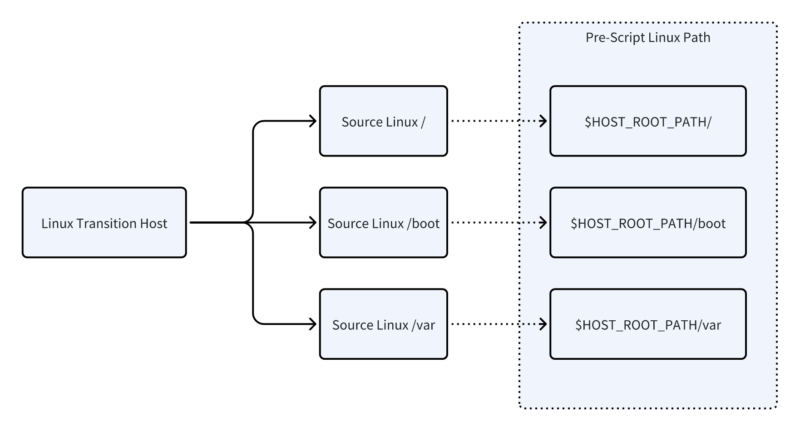
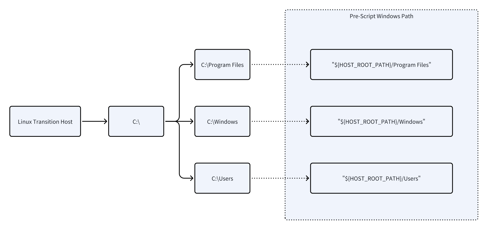

# **主机启动前脚本和后脚本使用**

## **版本提示**

建议升级到v6.7.0及以上版本。

## **为什么需要前脚本和后脚本**

在容灾恢复场景中，不同业务系统的运行环境和配置往往存在差异。为了在恢复过程中**最大限度地兼顾通用性与灵活性**，并尽快恢复业务，HyperMotion / HyperBDR 在主机启动的功能中提供了高级设置，允许用户配置**前脚本**和**后脚本**：

* **前脚本**：在主机启动前，通过挂载磁盘进行离线修改，适合处理不依赖系统运行状态的预配置任务，例如批量替换配置文件、调整启动参数、写入初始化文件等，确保系统能够正常完成引导，进入系统的登陆界面。

* **后脚本**：在系统启动完成后执行，可利用完整的操作系统和网络环境，适合执行需要实时交互的初始化任务，例如启动关键服务、注册业务组件、加载数据库初始数据等。

这种前后脚本结合的设计，使得容灾恢复过程既能满足**通用化的快速恢复**，又能保留**针对业务差异化的灵活配置能力**，从而缩短恢复时间（RTO）并降低切换风险。

## **功能及运行原理**

### **1. 前脚本（Pre-script）**

* **运行时机**
  &#x20;驱动适配过程的最后阶段，在主机启动之前执行。

* **运行环境**

  * 在**临时过渡主机**执行，操作系统版本取决于产品版本（如 Ubuntu 20.04 / Ubuntu 24.04，后续可能升级）。

  * 脚本必须为 **Linux Bash** 脚本。

  * **AWS 平台**：

    * Linux 目标主机 → 使用 Linux 过渡主机执行。

    * Windows 目标主机 → 使用 Windows Server 2019 过渡主机执行，脚本需为 `.bat` 文件。

* **工作原理**

  * 通过过渡主机挂载用户与启动有关的磁盘。

  * 用户可直接修改挂载的磁盘文件，尤其是系统盘配置文件。

* **作用范围**

  * 推荐用于修改与启动有关的文件

  * 若需修改其他数据盘数据，建议改用**后脚本（Post-script）**。

* **限制条件**

  * 脚本最大长度：**4096 个字符**。

#### **1.1 Linux主机目录映射关系**

在脚本中，直接使用 **$HOST\_ROOT\_PATH** 即可表示目标系统的根分区路径。



#### **1.2 Windows主机目录映射关系**

在脚本中，直接使用 **%HOST\_ROOT\_PATH%** 即可表示目标系统的启动盘（通常为C盘）。



如果是AWS平台，则需要使用Windows Transition Host进行驱动修复。


### **2. 后脚本（Post-script）**

* **运行时机**
  &#x20;系统启动完成后自动执行。

* **运行环境**

  * Linux 主机 → 使用 **Bash** 脚本。

  * Windows 主机 → 使用 **.bat** 脚本。

* **工作原理**

  * 在系统正常启动后运行，可灵活执行系统相关任务。

  * 典型用途：

    * 启动或停止服务

    * 修改配置文件

    * 添加 Windows 注册表项

    * 插入数据库数据

  * 执行特点：

    * **Linux**：脚本执行一次后会自动删除，不再重复执行。

    * **Windows**：脚本执行一次后不删除，但不会重复执行，方便调试和排查。

* **脚本存放路径及特点**

  * **Linux**：`/root/.post_script` 目录

  * **Windows**：`C:\Program Files\Guestfs\Firstboot.Scripts` 目录

* **限制条件**

  * 脚本最大长度：**4096 个字符**

## **前后脚本最佳使用和调试建议**

### **1. 前脚本（Pre-script）**

* 仅修改**系统盘相关配置文件**，避免对数据盘进行复杂操作。

* 脚本应**简洁可靠**，确保驱动适配过程顺利完成。

* 使用环境变量 **`$HOST_ROOT_PATH`**（Linux）或 **`%HOST_ROOT_PATH%`**（Windows）定位系统根目录，提升脚本的跨平台兼容性。

* 目前前脚本的执行结果暂时无法直接在控制台页面中显示，需要通过日志下载方式获取相关日志并查看执行的结果，不同云平台可能涉及不同的日志文件，可以通过在线下载日志功能或在终端中直接查看。

#### **二代启动引擎结果查看**

```plain&#x20;text
在日志文件 /opt/installer/production/logs/mistral/mistral-server.log中找到关键词：
---Excute user pre scripts---

在其下会列出用户填写的前脚本内容，日志样式：
2025-08-14 17:54:53,496 21096 INFO [-] ---Excute user pre scripts---
+ echo before_pre
```

| Platform Name &#xA;(平台名称)              | Chinese Name &#xA;(中文名称)        | Engine Generation &#xA;(所属引擎代) | Supported Storage Types &#xA;(支持存储类型)         |
| -------------------------------------- | ------------------------------- | ------------------------------ | --------------------------------------------- |
| Alibaba Cloud Apsara Stack(v3.16.x)    | 阿里云 专有云(v3.16.x)                | v2                             | Block Storage (块存储)                           |
| Alibaba Cloud Apsara Stack(v3.18.x)    | 阿里云 专有云(v3.18.x)                | v2                             | Block Storage (块存储)                           |
| AWS China(SDK v1.34.93)                | AWS中国(SDK v1.34.93)             | v2                             | Block Storage (块存储)&#xA;Object Storage (对象存储) |
| AWS(SDK v1.34.93)                      | AWS(SDK v1.34.93)               | v2                             | Block Storage (块存储)&#xA;Object Storage (对象存储) |
| ctyun JC                               | 天翼云合营云                          | v2                             | Object Storage (对象存储)                         |
| eSurfingCloud4.0                       | 天翼云4.0                          | v2                             | Block Storage (块存储)                           |
| FiXo Cloud BS                          | FiXo Cloud BS                   | v2                             | Block Storage (块存储)                           |
| FusionCompute(v8.6.x)                  | FusionCompute(v8.6.x)           | v2                             | Object Storage (对象存储)                         |
| Google Cloud(SDK v1.19.0)              | Google Cloud(SDK v1.19.0)       | v2                             | Block Storage (块存储)                           |
| GridCloud                              | 绿能云                             | v2                             | Block Storage (块存储)                           |
| Huawei Cloud Stack Online(v23.3)       | 华为云 HCS Online(v23.3)           | v2                             | Block Storage (块存储)&#xA;Object Storage (对象存储) |
| Huawei Cloud(Recommended, SDK v3.1.86) | 华为云(推荐使用，SDK v3.1.86)           | v2                             | Block Storage (块存储)&#xA;Object Storage (对象存储) |
| Microsoft Azure(SDK v30.3)             | Microsoft Azure(SDK v30.3)      | v2                             | Block Storage (块存储)                           |
| Open Telekom Cloud(SDK v3.1.86)        | Open Telekom Cloud(SDK v3.1.86) | v2                             | Block Storage (块存储)&#xA;Object Storage (对象存储) |
| Oracle Cloud(SDK v2.126.3)             | 甲骨文云(SDK v2.126.3)              | v2                             | Block Storage (块存储)                           |
| SMTX OS(v6.x.x)                        | SMTX OS(v6.x.x)                 | v2                             | Block Storage (块存储)                           |
| Tencent Cloud                          | 腾讯云                             | v2                             | Object Storage (对象存储)                         |
| Tencent Cloud Enterprise               | 腾讯云 专有云企业版                      | v2                             | Block Storage (块存储)&#xA;Object Storage (对象存储) |
| UCloudStack                            | UCloudStack                     | v2                             | Block Storage (块存储)                           |
| Volcengine                             | 火山引擎                            | v2                             | Object Storage (对象存储)                         |
| XHERE(NeutonOS\_3.x)                   | XHERE(NeutonOS\_3.x)            | v2                             | Block Storage (块存储)&#xA;Object Storage (对象存储) |

#### **一代启动引擎结果查看**

```plain&#x20;text
在日志文件 /opt/installer/production/logs/unicloud/unicloud-engine.log 中找到关键词：
---Excute user pre scripts---

在其下会列出用户填写的前脚本内容，日志样式：
2025-08-14 17:54:53,496 21096 INFO [-] ---Excute user pre scripts---
+ echo before_pre
```

| **Platform Name&#x20;**&#xA;**(平台名称)**   | **Chinese Name&#x20;**&#xA;**(中文名称)** | **Engine Generation&#x20;**&#xA;**(所属引擎代)** | **Supported Storage Types&#x20;**&#xA;**(支持存储类型)** |
| ---------------------------------------- | ------------------------------------- | ------------------------------------------- | -------------------------------------------------- |
| Alibaba Cloud                            | 阿里云                                   | v1                                          | Block Storage (块存储)&#xA;Object Storage (对象存储)      |
| Alibaba Cloud Apsara Stack(v3.16.x)      | 阿里云 专有云(v3.16.x)                      | v1                                          | Object Storage (对象存储)                              |
| Alibaba Cloud Apsara Stack(v3.18.x)      | 阿里云 专有云(v3.18.x)                      | v1                                          | Object Storage (对象存储)                              |
| ecloud                                   | 移动云                                   | v1                                          | Block Storage (块存储)&#xA;Object Storage (对象存储)      |
| ecloud JC                                | 移动和云                                  | v1                                          | Block Storage (块存储)                                |
| GDS                                      | GDS万国数据本地云                            | v1                                          | Object Storage (对象存储)                              |
| Huawei Cloud Stack(HCS)(v8.2.x / v8.3.x) | 华为云Stack(HCS)(v8.2.x / v8.3.x)        | v1                                          | Block Storage (块存储)                                |
| Jinshan Cloud                            | 金山云                                   | v1                                          | Block Storage (块存储)                                |
| OpenStackCommunity(Juno+)                | OpenStack社区版本(Juno+)                  | v1                                          | Block Storage (块存储)&#xA;Object Storage (对象存储)      |
| QingCloud                                | 青云                                    | v1                                          | Block Storage (块存储)                                |
| Tencent Cloud                            | 腾讯云                                   | v1                                          | Block Storage (块存储)                                |
| Tencent Cloud TStack Enterprise          | 腾讯云 TStack企业版                         | v1                                          | Block Storage (块存储)                                |
| Tencent Cloud TStack Ultimate            | 腾讯云 TStack旗舰版                         | v1                                          | Block Storage (块存储)                                |
| TM CAE                                   | TM CAE                                | v1                                          | Block Storage (块存储)&#xA;Object Storage (对象存储)      |
| VMware                                   | VMware                                | v1                                          | Object Storage (对象存储)                              |
| ZStack(v4.x.x)                           | ZStack(v4.x.x)                        | v1                                          | Block Storage (块存储)                                |

### **2. 后脚本（Post-script）**

* 适用于**系统启动后**需要运行的任务，例如：

  * 启动或停止服务

  * 初始化数据库

  * 修改运行中系统的配置

* 充分利用系统已启动的正常运行环境，执行**依赖系统状态**的操作。

* 确保脚本**幂等性**（重复执行无副作用），避免出现异常。

* 对涉及**网卡、服务等依赖启动顺序**的修改，建议：

  * 在脚本中加入**等待逻辑**（检测服务/网卡启动后再执行），减少错误。

  * 调试时可先在目标平台完成验证，再将稳定版本的脚本添加到后脚本配置中。

**如何排查其准备执行：**

* 排查后脚本执行情况（2代引擎）

```plain&#x20;text
在日志文件 /opt/installer/production/logs/mistral/mistral-server.log 中有如下关键词：
---Install post scripts service---
```

云平台与存储类型支持列表同前脚本，此处不再赘述


* 排查后脚本执行情况（1代引擎）

```plain&#x20;text
在日志文件 /opt/installer/production/logs/unicloud/unicloud-engine.log 中有如下关键词：
---Install post scripts service---
```

云平台与存储类型支持列表同前脚本，此处不再赘述

#### **查看执行结果**

* 建议在后脚本中将标准输入和标注错误输出到文件中，便于观察执行的结果

## **常见使用场景示例**

### **1. 前脚本**

#### **场景：允许Root用户SSH登录，屏蔽SELINUX**

```bash
# 修改 SSH 配置
sed -i 's/^#PermitRootLogin.*/PermitRootLogin yes/' $HOST_ROOT_PATH/etc/ssh/sshd_config
# 修改 SELinux 配置
sed -i 's/^SELINUX=.*/SELINUX=disabled/' $HOST_ROOT_PATH/etc/selinux/config
```

#### **场景：Oracle 6由于内核启动参数原因导致KVM虚拟化中无法启动，需要在引导文件中去掉crashkernel=auto，并完成重构grub.cfg**

```bash
set -e
# 1. 修改grub配置文件，删除字段
GRUB_FILE="$HOST_ROOT_PATH/etc/default/grub"
if [ -f "$GRUB_FILE" ]; then
    echo "[INFO] 修改 $GRUB_FILE ..."
    sed -i 's/\s*crashkernel=auto//g' "$GRUB_FILE"
else
    echo "[ERROR] 找不到 $GRUB_FILE"
    exit 1
fi

# 2. 绑定必要的系统目录给 chroot
for dir in dev proc sys run; do
    mount --bind /$dir $HOST_ROOT_PATH/$dir
done

# 3. 判断是 BIOS 还是 UEFI
if [ -d "$HOST_ROOT_PATH/boot/efi/EFI" ]; then
    echo "[INFO] 检测到 UEFI 引导..."
    chroot "$HOST_ROOT_PATH" /usr/sbin/grub2-mkconfig -o /boot/efi/EFI/redhat/grub.cfg
else
    echo "[INFO] 检测到 BIOS 引导..."
    chroot "$HOST_ROOT_PATH" /usr/sbin/grub2-mkconfig -o /boot/grub2/grub.cfg
fi

# 4. 卸载绑定的目录
for dir in sys proc dev run; do
    umount $HOST_ROOT_PATH/$dir
done

echo "[INFO] 修改完成。"
```

#### **场景：在Windows中添加新的文件**

```plain&#x20;text
:: 在系统盘根目录创建 readme.txt
echo This system has been pre-configured. >> %HOST_ROOT_PATH%\readme.txt
```

#### **场景：在Linux中安装新的内核并设置该内核启动**

将原运行Azure内核的谷歌云Agent（由Azure平台迁移至谷歌云）迁移到AWS的Ubuntu 20.04，由于Azure内核缺少AWS所需的ENA增强网卡驱动，需要改为安装通用内核以启动主机。

```bash
ROOT=$HOST_ROOT_PATH

mount --bind /dev $ROOT/dev
mount --bind /sys $ROOT/sys
mount --bind /proc $ROOT/proc
mount --bind /run $ROOT/run

cat <<EOF > /tmp/change-kernel.sh
DEFGRUB=/etc/default/grub
KERNEL=5.15.0-139-generic

apt update
apt install -y linux-image-\$KERNEL

sed -i 's/GRUB_TIMEOUT_STYLE=hidden/GRUB_TIMEOUT_STYLE=menu/g' \$DEFGRUB
sed -i 's/GRUB_TIMEOUT=0/GRUB_TIMEOUT=10/g' \$DEFGRUB
sed -i "s/GRUB_DEFAULT=0/GRUB_DEFAULT=\"Advanced options for Ubuntu>Ubuntu, with Linux \$KERNEL\"/g" \$DEFGRUB

update-grub

exit
EOF

cp /tmp/change-kernel.sh $ROOT/tmp/change-kernel.sh
chroot $ROOT /bin/bash -x /tmp/change-kernel.sh

umount $ROOT/dev $ROOT/sys $ROOT/proc $ROOT/run
```

#### 场景：Windows系统演练/接管前移除异常驱动程序

源端为VMware虚拟机，Windows 2016 操作系统，由于客户源端Windows 2016 在系统内部安装异常驱动导致在目标华为云启动时出现蓝屏异常，无法正常启动，需要在前脚本中将异常驱动进行删除。

```plain&#x20;text
reged -L -e ${HOST_ROOT_PATH}/Windows/System32/config/SYSTEM << EOF 
 cd \DriverDatabase\DeviceIds\PCI 
 rdel VEN_1AF4&DEV_1001 
 rdel VEN_1AF4&DEV_1042 
 rdel VEN_1AF4&DEV_1001&SUBSYS_00021AF4&REV_00 
 rdel VEN_1AF4&DEV_1042&SUBSYS_11001AF4&REV_01 
 rdel VEN_1AF4&DEV_1004 
 rdel VEN_1AF4&DEV_1048 
 rdel VEN_1AF4&DEV_1004&SUBSYS_00081AF4&REV_00 
 rdel VEN_1AF4&DEV_1048&SUBSYS_11001AF4&REV_01 
 q 
 EOF
```

### **2. 后脚本**

#### **场景：Linux - 启动服务并初始化数据库**

```bash
#!/bin/bash
# 等待网络就绪
until ping -c 1 8.8.8.8 &> /dev/null; do
    echo "等待网络启动..."
    sleep 3
done

# 启动 Nginx 服务
systemctl start nginx

# 初始化 MySQL 数据（假设 root 无密码）
mysql -uroot -e "CREATE DATABASE IF NOT EXISTS myapp; \
    CREATE USER 'myuser'@'%' IDENTIFIED BY 'mypassword'; \
    GRANT ALL PRIVILEGES ON myapp.* TO 'myuser'@'%'; \
    FLUSH PRIVILEGES;"

```

#### **场景：Windows - 延迟启动服务并添加注册表项**

```bash
@echo off
:: 等待 30 秒确保系统服务已启动
timeout /t 30 /nobreak

:: 启动 IIS 服务
net start W3SVC

:: 添加注册表项示例
reg add "HKLM\SOFTWARE\MyApp" /v InstallDate /t REG_SZ /d "%date%" /f
```

#### **场景：Windows - 自定义配置启动主机的DNS**

场景：迁移到华为云的Windows2016启动后配置自定义DNS。

```bash
@echo off
setlocal enabledelayedexpansion
for /f "tokens=2 delims==" %%a in ('wmic nic where "NetEnabled=True" get NetConnectionID /value^|findstr .') do (
    set "ADAPTER_NAME=%%a"
    goto :configdns
)
timeout /t 600 /nobreak>nul
echo No active network adapter detected
exit /b
:configdns
netsh interface ip set dns name="%ADAPTER_NAME%" static 100.120.0.15 primary validate=no
netsh interface ip add dns name="%ADAPTER_NAME%" addr=172.24.206.130 index=2 validate=no
netsh interface ip add dns name="%ADAPTER_NAME%" addr=172.24.206.131 index=3 validate=no
```

#### **场景：Windows - 自定义配置启动主机的静态IP和DNS**

场景：VMware

迁移到HCS的Windows2022启动后配置自定义DNS。

```bash
@echo off
setlocal enabledelayedexpansion

:retry
for /f "tokens=2 delims==" %%a in ('wmic nic where "NetEnabled=True" get InterfaceIndex /value^|findstr .') do (
    set "INTERFACE_INDEX=%%a"
    set "INTERFACE_INDEX=!INTERFACE_INDEX:~0,-1!"
    netsh interface set interface name=!INTERFACE_INDEX! admin=enable
    goto :configdns
)
timeout /t 5 /nobreak >nul
goto retry

:configdns
netsh interface ip set address name=!INTERFACE_INDEX! source=static addr=10.1.178.113 mask=255.255.255.0 gateway=10.1.178.254
netsh interface ip set dns name=!INTERFACE_INDEX! static 10.1.206.37 primary validate=no
netsh interface ip add dns name=!INTERFACE_INDEX! addr=10.1.224.66 index=2 validate=no
exit /b
```