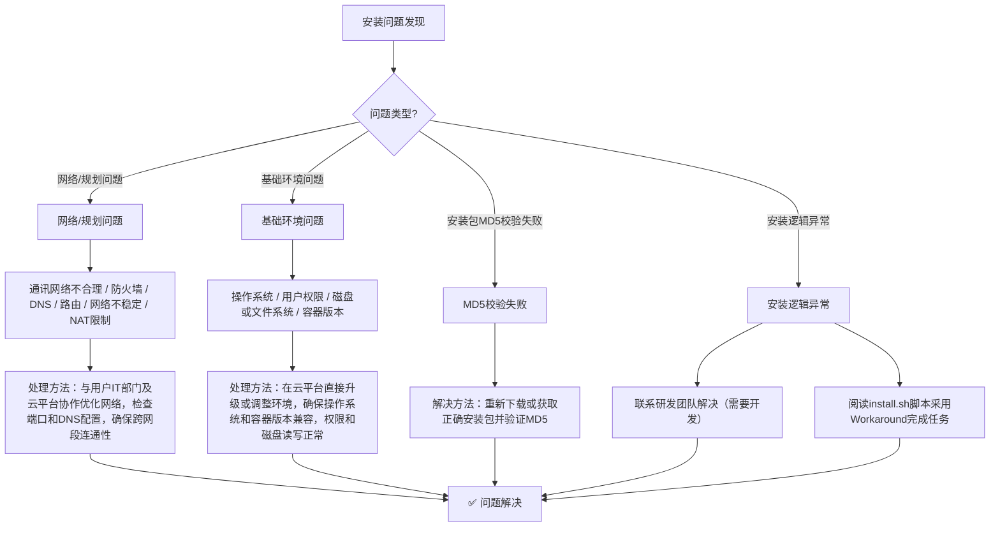
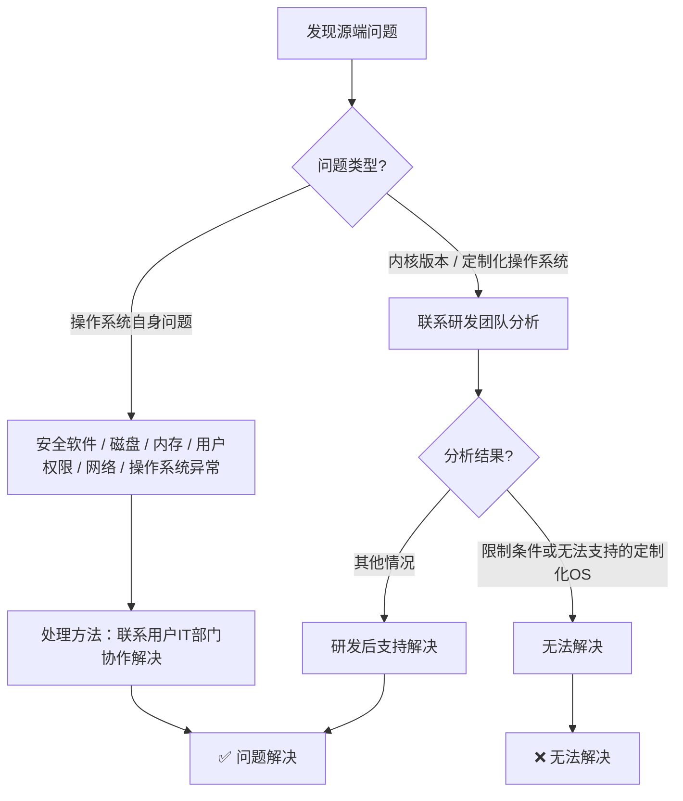
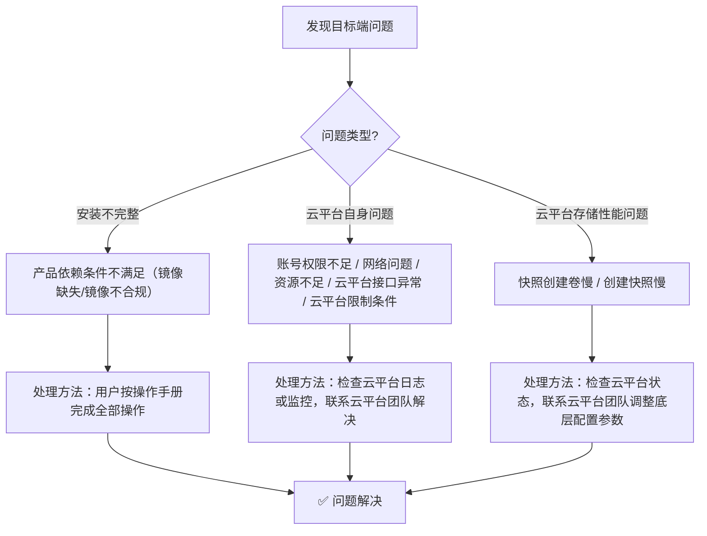
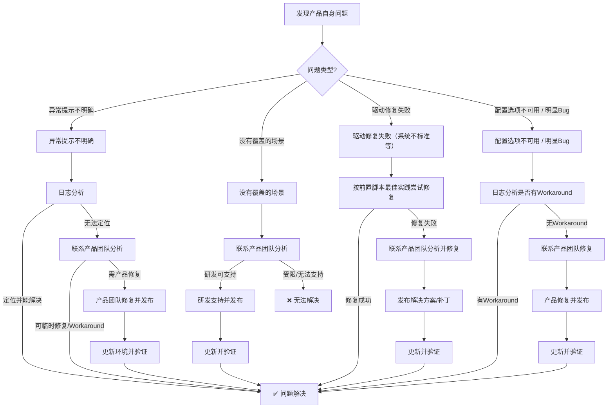
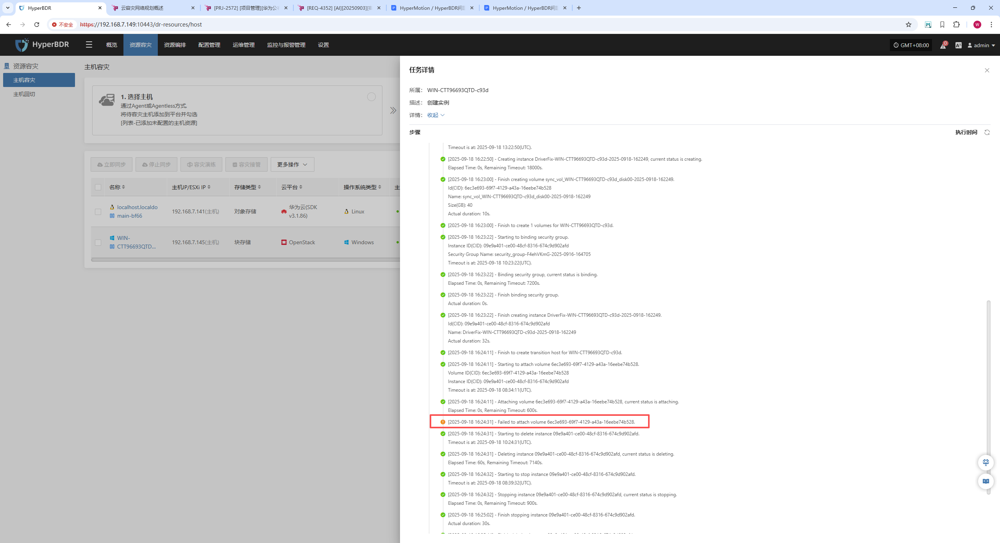
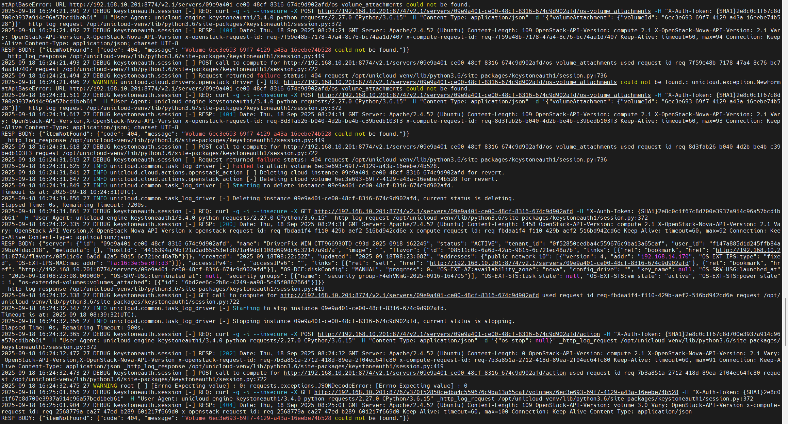
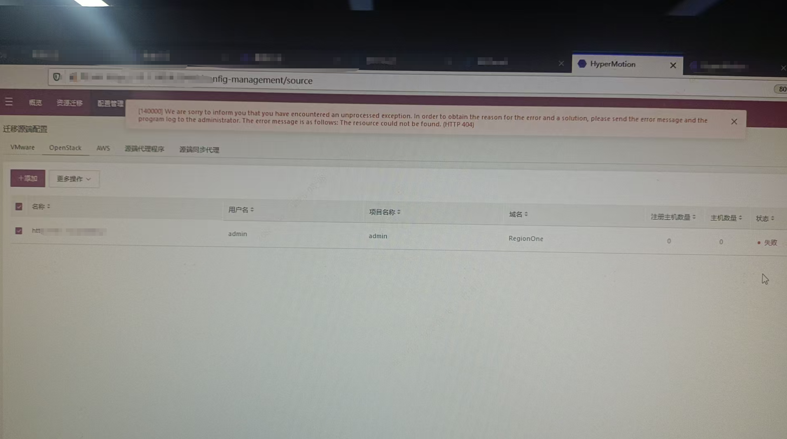
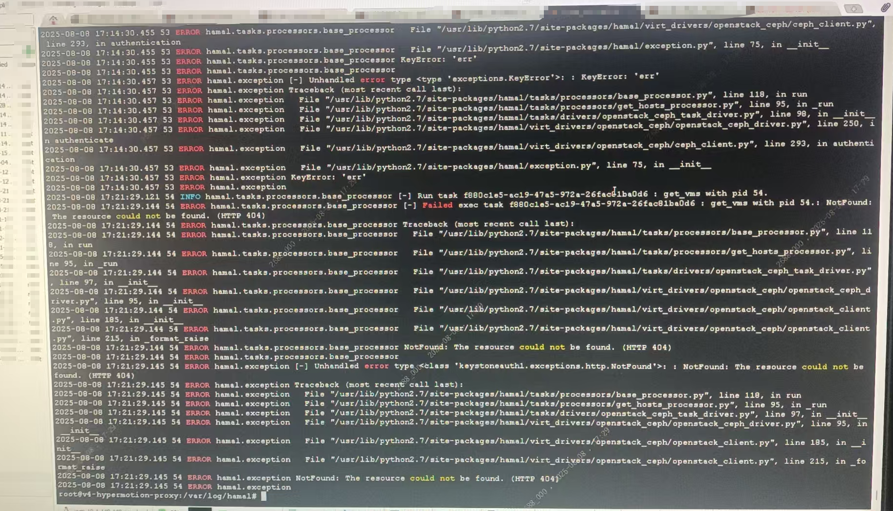

# 问题排查最佳实践

## 1. 概述

本文档面向具有一定系统运维经验的产品运维人员，旨在提供一套基于产品日志分析常见问题的最佳实践方法。通过对日志的深入分析，运维人员能够在生产环境中快速定位并解决异常问题，缩短故障处理时间，提升系统稳定性和业务连续性。

在实际运维过程中，问题的发生主要涉及以下阶段：

* **源端问题**
  &#x20;源端问题通常与源环境配置或运行状态有关，常见场景包括：鉴权地址不正确、鉴权凭证填写有误、源端网络不通或受限等。通过对日志进行分析，运维人员可以快速识别异常根因，并在源端环境中进行相应调整，从而恢复正常运行。

* **目标端问题**
  &#x20;目标端问题主要涉及目标云平台或接口的运行状态，常见异常包括：鉴权信息配置错误、网络规划不合理、目标平台资源配额不足等。日志分析可帮助运维人员在第一时间发现这些环境问题，经过调整与验证后，相关迁移或容灾任务可顺利继续执行。

* **产品自身问题**
  &#x20;这类问题通常与产品服务本身的运行状态或特定场景下的功能缺陷相关。常见处理方式包括：通过日志定位后尝试重启相关服务，或在确认是产品缺陷的情况下，及时将问题反馈至研发团队，以便尽快修复。

通过系统化的日志分析流程，运维人员能够在多维度上快速识别并处理异常问题：既能区分是环境因素导致，还是产品本身存在问题，也能为进一步的优化、迭代提供数据支撑。最终，日志分析不仅是排障手段，更是保障系统稳定运行的重要工具。

## 2. 系统架构说明

[点击查看](../om-guide/system-architecture/system-architecture.md)

### 模块与日志对应关系

| 分类        | 模块名称                | 内部模块名称         | 模块说明                                                     |
| --------- | ------------------- | -------------- | -------------------------------------------------------- |
| 生产站点客户端程序 | Linux Agent         | egisplus-agent | Linux Agent客户端模块，源端主机的全生命周期管理                            |
|           | Windows Agent       | Windows Agent  | Windows Agent客户端模块，源端主机的全生命周期的管理                         |
|           | Sync Proxy          | hamal          | Agentless客户端模块，负责在近端和虚拟化层、存储层进行通讯，对源端虚拟化平台、云平台等进行全生命周期管理 |
| 目标平台客户端程序 | 第三代云同步网关            | s3block        | 第三代云同步网关管理程序，用户态协议将数据直接写入目标端的块存储中                        |
|           | 驱动修复                | minitgt        | 驱动修复核心程序，用于对各种不同版本的操作系统进行驱动注入、前后脚本执行等                    |
| 生产站点管理服务  | 客户端注册管理             | proxy          | 用户生产站点节点的注册和管理                                           |
|           |                     | oneway         | 用于生产站点节点的任务管理                                            |
| 目标平台编排管理  | 存储控制器               | storplus       | 软件定义存储控制器抽象层，用于将云平台块存储、对象存储虚拟为存储                         |
|           | 对象存储网关管理(第二代存储网关管理) | atomy-obstor   | 对象存储管理端                                                  |
|           | 云平台编排               | unicloud       | 主机启动的流程控制                                                |
|           | 云平台工作流编排服务          | atomy-unicloud | 基于工作流引擎的实现的v2/v3版本的编排驱动层                                 |
|           | 工作流编排服务             | mistral        | 基于模板的工作流引擎                                               |
| 整体控制层     | 迁移/容灾调度层            | porter         | 用于迁移/容灾/回切任务的任务流程生命周期管理                                  |
|           | 资源组编排               | ant            | 资源组编排服务                                                  |
|           | 策略触发                | crab           | 策略管理模块，用于定时任务触发器                                         |
|           | 运维管理                | owl            | 用于监控、告警、报表、升级、日志采集等运维任务管理                                |
| UI        | 用户平台                | newmuse        | 用户自服务界面                                                  |
|           | 管理员平台               | supervisor     | 管理平台                                                     |

### 日志获取

| **Category** | **Module Name** | **Internal Module Name** | **Description** |
|---------------|----------------|---------------------------|-----------------|
| **Production Site Client** | Linux Agent | egisplus-agent | Linux Agent client module, responsible for full lifecycle management of source hosts. |
|  | Windows Agent | Windows Agent | Windows Agent client module, responsible for full lifecycle management of source hosts. |
|  | Sync Proxy | hamal | Agentless client module. Handles communication with nearby virtualization and storage layers, and manages the full lifecycle of source virtualization platforms and cloud platforms. |
| **Target Platform** | 3rd Gen Cloud Sync Gateway | s3block | 3rd generation cloud sync gateway program. Uses user-mode protocol to write data directly into target block storage. |
|  | Driver Repair | minitgt | Core driver repair program. Used for driver injection and pre/post script execution across different OS versions. |
| **Production Site Management Services** | Client Registration Management | proxy | Handles registration and management of production site nodes. |
|  | Task Management | oneway | Manages tasks for production site nodes. |
| **Target Platform Orchestration Management** | Storage Controller | storplus | Software-defined storage controller abstraction layer. Virtualizes cloud block storage and object storage as unified storage. |
|  | Object Storage Gateway Management (2nd Gen) | atomy-obstor | Object storage management service. |
|  | Cloud Platform Orchestration | unicloud | Controls the process of host startup. |
|  | Cloud Workflow Orchestration Service | atomy-unicloud | Workflow-based orchestration driver layer (v2/v3). |
|  | Workflow Orchestration Service | mistral | Template-based workflow engine. |
| **Overall Control Layer** | Migration/DR Scheduling | porter | Manages lifecycle of migration, disaster recovery, and failback tasks. |
|  | Resource Group Orchestration | ant | Resource group orchestration service. |
|  | Policy Trigger | crab | Policy management module, used as a scheduler for timed tasks. |
| **Operations Management** | O&M Management | owl | Provides monitoring, alerts, reporting, upgrades, and log collection for operations management. |
| **UI** | User Platform | newmuse | Self-service user interface. |
|  | Admin Platform | supervisor | Management platform for administrators. |


## 3. 如何发现异常信息

### 安装过程异常信息

安装过程中出现的异常信息通常会直接显示在 SSH 终端上。通常会以明显的红色 **ERROR** 提示，让运维人员可以第一时间注意到问题。

### 同步/启动及其他异常信息

控制台中会有较明显的错误提示信息，用户可以点击查看详情，了解具体异常情况。

### 告警通知中的异常信息

系统会根据用户的订阅策略，通过邮件发送失败后的错误日志提示。运维人员可以随后登录控制台检查相关异常，进行进一步处理。

## 4. 问题处理路径

### 安装阶段



### 使用阶段

#### 源端



#### 目标端



#### 产品自身



## 5. 程序执行阶段排查日志对应关系表

> **备注**：在阶段出现问题时，可优先查看表格中标记为 **(High Priority)** 的日志。

| 场景阶段                         | 服务组件                  | 组件所属          | 日志所属                           | 日志路径                                                                            | 备注                                                                                                                   |
| ---------------------------- | --------------------- | ------------- | ------------------------------ | ------------------------------------------------------------------------------- | -------------------------------------------------------------------------------------------------------------------- |
| 安装与注册阶段(Linux/Windows Agent) | Windows Agent(Client) | Windows Agent | Windows Agent(High Priority)   | 安装日志：C:\Program Files(x86)\DiskSync-Agent\log\PreInstallation-\<YYYY-MM-DD>.log |                                                                                                                      |
|                              |                       |               |                                | 程序日志：C:\Program Files(x86)\DiskSync-Agent\log\DSAgent-\<YYYY-MM-DD>.log         |                                                                                                                      |
|                              | Linux Agent(Client)   | Linux Agent   | Linux Agent(High Priority)     | 安装日志：Terminal Output Message                                                    |                                                                                                                      |
|                              |                       |               |                                | 程序日志：/var/log/egisplus-agent/linux\_agent.log                                   |                                                                                                                      |
|                              | Sync Proxy(Client)    | Sync Proxy    | Sync Proxy(High Priority)      | 安装日志：Terminal Output Message                                                    |                                                                                                                      |
|                              |                       |               |                                | 程序日志：/var/log/hamal/hamal-period.log                                            |                                                                                                                      |
|                              | Proxy(Console)        | Console       | proxy-api                      | 程序日志：/opt/installer/production/logs/proxy/proxy-api.log                         |                                                                                                                      |
|                              | Porter(Console)       |               | Porter-api                     | 程序日志：/opt/installer/production/logs/porter/porter-api.log                       |                                                                                                                      |
| 网关/临时过渡主机镜像创建阶段(块存储)         | storplus(Console)     | Console       | storplus-api                   | 程序日志：/opt/installer/production/logs/storplus/storplus-api.log                   |                                                                                                                      |
|                              |                       |               | storplus-migration             | 程序日志：/opt/installer/production/logs/storplus/storplus-migration.log             |                                                                                                                      |
|                              | unicloud(Console)     |               | unicloud-api                   | 程序日志：/opt/installer/production/logs/unicloud/unicloud-api.log                   |                                                                                                                      |
|                              |                       |               | unicloud-engine(High Priority) | 程序日志：/opt/installer/production/logs/unicloud/unicloud-engine.log                |                                                                                                                      |
|                              | mistral(Console)      |               | mistral-server(High Priority)  | 程序日志：/opt/installer/production/logs/mistral/mistral-server.log                  |                                                                                                                      |
|                              | atomy(Console)        |               | atomy-unicloud                 | 程序日志：/opt/installer/production/logs/atomy/atomy-unicloud.log                    |                                                                                                                      |
| 网关/临时过渡主机镜像创建阶段(对象存储)        | storplus(Console)     | Console       | storplus-api                   | 程序日志：/opt/installer/production/logs/storplus/storplus-api.log                   |                                                                                                                      |
|                              | unicloud(Console)     |               | unicloud-api                   | 程序日志：/opt/installer/production/logs/unicloud/unicloud-api.log                   |                                                                                                                      |
|                              |                       |               | unicloud-engine(High Priority) | 程序日志：/opt/installer/production/logs/unicloud/unicloud-engine.log                |                                                                                                                      |
|                              | atomy(Console)        |               | atomy-unicloud                 | 程序日志：/opt/installer/production/logs/atomy/atomy-unicloud.log                    |                                                                                                                      |
|                              | mistral(Console)      |               | mistral-server(High Priority)  | 程序日志：/opt/installer/production/logs/mistral/mistral-server.log                  |                                                                                                                      |
| 网关/临时过渡主机镜像创建阶段(通用方式)        | storplus(Console)     | Console       | storplus-api                   | 程序日志：/opt/installer/production/logs/storplus/storplus-api.log                   |                                                                                                                      |
|                              |                       |               | storplus-engine(High Priority) | 程序日志：/opt/installer/production/logs/storplus/storplus-engine.log                |                                                                                                                      |
| 数据同步阶段(块存储)                  | Porter(Console)       | Console       | porter-migration               | 程序日志：/opt/installer/production/logs/porter/porter-migration.log                 |                                                                                                                      |
|                              | storplus(Console)     |               | storplus-engine                | 程序日志：/opt/installer/production/logs/storplus/storplus-engine.log                |                                                                                                                      |
|                              | unicloud(Console)     |               | unicloud-engine                | 程序日志：/opt/installer/production/logs/unicloud/unicloud-engine.log                |                                                                                                                      |
|                              | atomy(Console)        |               | atomy-s3block                  | 程序日志：/opt/installer/production/logs/atomy/atomy-s3block.log                     |                                                                                                                      |
|                              | Proxy(Console)        |               | proxy-engine(High Priority)    | 程序日志：/opt/installer/production/logs/proxy/proxy-engine.log                      |                                                                                                                      |
|                              |                       |               | proxy-api                      | 程序日志：/opt/installer/production/logs/proxy/proxy-api.log                         |                                                                                                                      |
|                              | Sync Proxy(Client)    | Sync Proxy    | vm-{host name}(High Priority)  | 程序日志：/var/log/hamal/vm-{host name}.log                                          |                                                                                                                      |
|                              | Linux Agent(Client)   | Linux Agent   | Linux Agent(High Priority)     | 程序日志：/var/log/egisplus-agent/linux\_agent.log                                   |                                                                                                                      |
|                              | Windows Agent(Client) | Windows Agent | Windows Agent(High Priority)   | 程序日志：C:\Program Files(x86)\DiskSync-Agent\log\DSAgent-\<YYYY-MM-DD>.log         |                                                                                                                      |
| 数据同步阶段(对象存储)                 | Porter(Console)       | Console       | porter-migration               | 程序日志：/opt/installer/production/logs/porter/porter-migration.log                 |                                                                                                                      |
|                              | storplus(Console)     |               | storplus-api                   | 程序日志：/opt/installer/production/logs/storplus/storplus-api.log                   |                                                                                                                      |
|                              | Proxy(Console)        |               | proxy-engine(High Priority)    | 程序日志：/opt/installer/production/logs/proxy/proxy-engine.log                      |                                                                                                                      |
|                              |                       |               | proxy-api                      | 程序日志：/opt/installer/production/logs/proxy/proxy-api.log                         |                                                                                                                      |
|                              | Sync Proxy(Client)    | Sync Proxy    | vm-{host name}(High Priority)  | 程序日志：/var/log/hamal/vm-{host name}.log                                          |                                                                                                                      |
|                              | Linux Agent(Client)   | Linux Agent   | Linux Agent(High Priority)     | 程序日志：/var/log/egisplus-agent/linux\_agent.log                                   |                                                                                                                      |
|                              | Windows Agent(Client) | Windows Agent | Windows Agent(High Priority)   | 程序日志：C:\Program Files(x86)\DiskSync-Agent\log\DSAgent-\<YYYY-MM-DD>.log         |                                                                                                                      |
| 主机启动阶段(块存储)                  | Porter(Console)       | Console       | porter-api                     | 程序日志：/opt/installer/production/logs/porter/porter-api.log                       |                                                                                                                      |
|                              |                       |               | porter-migration               | 程序日志：/opt/installer/production/logs/porter/porter-migration.log                 |                                                                                                                      |
|                              | storplus(Console)     |               | storplus-api                   | 程序日志：/opt/installer/production/logs/storplus/storplus-api.log                   |                                                                                                                      |
|                              | unicloud(Console)     |               | unicloud-api                   | 程序日志：/opt/installer/production/logs/unicloud/unicloud-api.log                   |                                                                                                                      |
|                              |                       |               | unicloud-engine(High Priority) | 程序日志：/opt/installer/production/logs/unicloud/unicloud-engine.log                |                                                                                                                      |
|                              | atomy(Console)        |               | atomy-unicloud(High Priority)  | 程序日志：/opt/installer/production/logs/atomy/atomy-unicloud.log                    |                                                                                                                      |
|                              | mistral(Console)      |               | mistral-server                 | 程序日志：/opt/installer/production/logs/mistral/mistral-server.log                  |                                                                                                                      |
| 主机启动阶段(对象存储)                 | Porter(Console)       | Console       | porter-api                     | 程序日志：/opt/installer/production/logs/porter/porter-api.log                       |                                                                                                                      |
|                              |                       |               | porter-migration               | 程序日志：/opt/installer/production/logs/porter/porter-migration.log                 |                                                                                                                      |
|                              | storplus(Console)     |               | storplus-api                   | 程序日志：/opt/installer/production/logs/storplus/storplus-api.log                   |                                                                                                                      |
|                              | unicloud(Console)     |               | unicloud-api                   | 程序日志：/opt/installer/production/logs/unicloud/unicloud-api.log                   |                                                                                                                      |
|                              |                       |               | unicloud-engine(High Priority) | 程序日志：/opt/installer/production/logs/unicloud/unicloud-engine.log                |                                                                                                                      |
|                              | atomy(Console)        |               | atomy-obstor(High Priority)    | 程序日志：/opt/installer/production/logs/atomy/atomy-obstor.log                      |                                                                                                                      |
|                              |                       |               | atomy-unicloud(High Priority)  | 程序日志：/opt/installer/production/logs/atomy/atomy-unicloud.log                    |                                                                                                                      |
|                              | mistral(Console)      |               | mistral-server                 | 程序日志：/opt/installer/production/logs/mistral/mistral-server.log                  |                                                                                                                      |
| 主机清理阶段                       | Sync Proxy(Client)    | Sync Proxy    | vm-{host name}(High Priority)  | 程序日志：/var/log/hamal/vm-{host name}.log                                          |                                                                                                                      |
|                              | Proxy(Console)        | Console       | proxy-engine(High Priority)    | 程序日志：/opt/installer/production/logs/proxy/proxy-engine.log                      |                                                                                                                      |
|                              |                       |               | proxy-api                      | 程序日志：/opt/installer/production/logs/proxy/proxy-api.log                         |                                                                                                                      |
|                              | Porter(Console)       |               | porter-migration               | 程序日志：/opt/installer/production/logs/porter/porter-migration.log                 |                                                                                                                      |
|                              | storplus(Console)     |               | storplus-engine                | 程序日志：/opt/installer/production/logs/storplus/storplus-engine.log                |                                                                                                                      |
|                              | unicloud(Console)     |               | unicloud-engine(High Priority) | 程序日志：/opt/installer/production/logs/unicloud/unicloud-engine.log                |                                                                                                                      |
|                              | atomy(Console)        |               | atomy-unicloud                 | 程序日志：/opt/installer/production/logs/atomy/atomy-unicloud.log                    |                                                                                                                      |
| 监控和告警流程                      | Windows Agent(Client) | Windows Agent | Windows Agent(High Priority)   | 程序日志：C:\Program Files(x86)\DiskSync-Agent\hyper\_exporter\hyper\_exporter.log   | 在查看服务log之前，需要进入服务管理器，确认 hp\_exporter\_service 服务是否是正在运行状态，如果没有运行，则需要启动                                               |
|                              | Linux Agent(Client)   | Linux Agent   | Linux Agent(High Priority)     | 程序日志：/var/log/hyper\_exporter/hyperexporter.log                                 | 在查看服务log之前，需要使用命令查询 `systemctl status hyper_exporter(或者 hyper-exporter-agent)` 命令查看服务状态，如果停止状态则需要启动，如果失败状态可以启动确认失败原因 |
|                              | owl(Console)          | Console       | owl-api                        | 程序日志：/opt/installer/production/logs/owl/owl-api.log                             |                                                                                                                      |
|                              |                       |               | owl-engine(High Priority)      | 程序日志：/opt/installer/production/logs/owl/owl-engine.log                          |                                                                                                                      |

## 6. 日志分析方法

日志分析的目标是快速定位问题根因，并为后续排障和修复提供依据。推荐的标准流程如下：

* 确认报错信息

  * 从页面获取相关的报错时间、报错内容

  * 重点关注是否包含 **请求 ID、资源 ID、用户 ID** 等信息，这些字段是定位日志的关键。

* 确定日志位置

  * 根据相应阶段查找对应日志文件，详情请查看<程序执行阶段排查日志对应关系表>

  * 确认时间戳与实际出错时间一致，避免因时间不同步误判。

* 查询相关日志

  * 使用grep搜索关键字：

  ```bash
  #-C 50 表示输出关键字前后 50 行，便于还原上下文。
  grep -C 50 "关键字" 文件名
  ```

  * 只要前后部分时：

  ```bash
  grep -B 50 "关键字" 文件名   # 前 50 行
  grep -A 50 "关键字" 文件名   # 后 50 行
  ```

* 关联请求链路

  * 从日志中找到 **request\_id** 或 **trace\_id**，继续在其他服务日志中搜索，串联完整调用链。

  * 确认是单一服务问题，还是跨服务调用失败。

* 整理结论

  * 提取关键日志片段。

  * 给出问题根因分析，例如资源不存在、网络异常、权限不足。形成解决建议

  * 如无法判断时，可将日志打包发送至OnePro团队进行深入分析

### 示例案例：挂载云硬盘失败

#### 页面报错

* 用户在页面拉起主机时，提示：Failed to attach

* 时间：2025-09-18 16:24:31

* 关键信息：volume 6ec3e693-69f7-4129-a43a-16eebe74b528



#### 日志查询

* 根据当前阶段查看对应日志文件，当前为**主机启动阶段(块存储)**

* 使用`grep+关键词`查看相应配置文件

```bash
grep -C 50 "volume 6ec3e693-69f7-4129-a43a-16eebe74b528" /opt/installer/production/logs/unicloud/unicloud-engine.log
```

#### 日志片段



#### 分析   

根据关键词检索内容，分析相关日志信息

* Nova 调用 Cinder 挂载卷时返回 404。

* 错误原因：对应的卷在 Cinder 中不存在，或所属租户无访问权限。

#### 结论与建议

* 启动目标平台确认卷是否存在

  * 如果卷已删除 → 提示用户重新选择可用卷。

  * 如果卷存在 → 检查是否跨租户访问，或确认 Cinder API 服务是否正常。

* 重新尝试主机拉起

### 示例案例：添加OpenStack Agentless失败

#### 页面报错

* 用户在页面添加Agentless时，提示：The resource could not be found, (HTTP 404)



#### 日志查询

* 根据当前阶段查看对应日志文件，当前为**安装与注册阶段**

* 使用`grep+关键词`查看相应配置文件

```bash
grep -C 50 "The resource could not be found" /var/log/hamal/hamal-period.log
```

#### 日志片段



#### 分析

在调用 **OpenStack Ceph 驱动（openstack\_ceph\_client.py）** 时，请求的资源不存在（404）。

```bash
ERROR hamal.exception NotFound: The resource could not be found. (HTTP 404)
```

在请求 Keystone/Cinder/Nova 等 API 时，返回了 404，但程序没有正确捕获和处理。

```bash
ERROR hamal.exception [-] Unhandled error type <class 'keystoneauth1.exceptions.http.NotFound'>
```

当现有信息不足以明确判断具体原因时，可联系 OnePro 团队寻求进一步分析与支持。

#### 结论与建议

将报错信息提交至 [OnePro 支持平台](https://support.oneprocloud.com/) 注册账号/登录并完成创建工单，获取技术团队协助，并根据反馈结果对程序或配置进行相应调整以解决问题。

## 7. 前端页面排查方法

1. 打开浏览器前端页面，按下 **F12** 键，打开开发者工具（Developer Tools）。

2. 选择 **Inspect / Elements** 查看页面元素，确认页面结构是否正确加载。

3. 切换到 **Network / 网络** 面板，刷新页面并观察接口请求情况。

4. 根据接口返回的状态码和响应内容判断是否存在问题，如 HTTP 错误码（4xx/5xx）或返回异常数据。

5. 若发现异常，可记录接口请求详情，包括 URL、请求参数和响应内容，便于后续排查或提交给开发团队。

## 参考文档

### 云平台驱动版本对应关系

| No.&#xA;(序号) | Platform Name &#xA;(平台名称)                | Chinese Name &#xA;(中文名称)       | Engine Generation &#xA;(所属引擎代) | Supported Storage Types &#xA;(支持存储类型) | Transitional host image build method&#xA;(过渡主机镜像构建方法) | Image types(镜像类型)                        | Primary person in charge&#xA;(主负责人) |
| ------------ | ---------------------------------------- | ------------------------------ | ------------------------------ | ------------------------------------- | ----------------------------------------------------- | ---------------------------------------- | ----------------------------------- |
| 1            | Alibaba Cloud                            | 阿里云                            | v1                             | Block Storage&#xA;(块存储)               | Build based on the host(基于主机构建)                       | Linux                                    | 张天洁                                 |
|              |                                          |                                | v1                             | Object Storage &#xA;(对象存储)            | Upload via object storage&#xA;(通过对象存储上传)              | Linux, Linux UEFI, Windows, Windows UEFI | 张天洁                                 |
| 2            | Alibaba Cloud Apsara Stack(v3.16.x)      | 阿里云 专有云(v3.16.x)               | v2                             | Block Storage&#xA;(块存储)               | Build based on the host&#xA;(基于主机构建)                  | Linux                                    | 张天洁                                 |
|              |                                          |                                | v1                             | Object Storage&#xA;(对象存储)             | Upload via object storage(通过对象存储上传)                   | Linux, Windows                           | 张天洁                                 |
| 3            | Alibaba Cloud Apsara Stack(v3.18.x)      | 阿里云 专有云(v3.18.x)               | v2                             | Block Storage&#xA;(块存储)               | Build based on the host(基于主机构建)                       | Linux                                    | 张天洁                                 |
|              |                                          |                                | v1                             | Object Storage&#xA;(对象存储)             | Upload via object storage(通过对象存储上传)                   | Linux, Windows                           | 张天洁                                 |
| 4            | AWS China(SDK v1.34.93)                  | AWS中国(SDK v1.34.93)            | v2                             | Block Storage&#xA;(块存储)               | Build based on the host&#xA;(基于主机构建)                  | Linux, Linux UEFI, Windows, Windows UEFI | 张乐                                  |
|              |                                          |                                | v2                             | Object Storage&#xA;(对象存储)             | Build based on the host&#xA;(基于主机构建)                  | Linux, Linux UEFI, Windows, Windows UEFI | 张乐                                  |
| 5            | AWS(SDK v1.34.93)                        | AWS(SDK v1.34.93)              | v2                             | Block Storage&#xA;(块存储)               | Build based on the host&#xA;(基于主机构建)                  | Linux, Linux UEFI, Windows, Windows UEFI | 张乐                                  |
|              |                                          |                                | v2                             | Object Storage&#xA;(对象存储)             | Build based on the host&#xA;(基于主机构建)                  | Linux, Linux UEFI, Windows, Windows UEFI | 张乐                                  |
| 6            | ctyun JC                                 | 天翼云合营云                         | v2                             | Object Storage&#xA;(对象存储)             | Build based on the host&#xA;(基于主机构建)                  | Linux, Windows                           | 罗湘儒                                 |
| 7            | ecloud                                   | 移动云                            | v1                             | Block Storage&#xA;(块存储)               | Build based on the host(基于主机构建)                       | Linux                                    | 赵江波                                 |
|              |                                          |                                | v1                             | Object Storage&#xA;(对象存储)             | Upload via object storage(通过对象存储上传)                   | Linux, Windows                           | 赵江波                                 |
| 8            | ecloud JC                                | 移动和云                           | v1                             | Block Storage&#xA;(块存储)               | Build based on the host(基于主机构建)                       | Linux                                    | 郭赫伟                                 |
| 9            | eSurfingCloud4.0                         | 天翼云4.0                         | v2                             | Block Storage&#xA;(块存储)               | Build based on the host(基于主机构建)                       | Linux                                    | 张乐                                  |
| 10           | FiXo Cloud BS                            | FiXo Cloud BS                  | v2                             | Block Storage&#xA;(块存储)               | Build based on the host(基于主机构建)                       | Linux                                    | 张天洁                                 |
| 11           | FusionCompute(v8.6.x)                    | FusionCompute(v8.6.x)          | v2                             | Object Storage&#xA;(对象存储)             | Build based on the host&#xA;(基于主机构建)                  | Linux                                    | 张天洁                                 |
| 12           | Google Cloud(SDK v1.19.0)                | Google Cloud(SDK v1.19.0)      | v2                             | Block Storage&#xA;(块存储)               | Build based on the host&#xA;(基于主机构建)                  | Linux                                    | 罗湘儒                                 |
| 13           | GridCloud                                | 绿能云                            | v2                             | Block Storage&#xA;(块存储)               | Build based on the host(基于主机构建)                       | Linux                                    | 张天洁                                 |
| 14           | GDS                                      | GDS万国数据本地云                     | v1                             | Object Storage&#xA;(对象存储)             | Upload via object storage&#xA;(通过对象存储上传)              | Linux, Windows                           | 张天洁                                 |
| 15           | Huawei Cloud Stack Online(v23.3)         | 华为云 HCS Online(v23.3)          | v2                             | Block Storage&#xA;(块存储)               | Build based on the host&#xA;(基于主机构建)                  | Linux                                    | 罗湘儒                                 |
|              |                                          |                                | v2                             | Object Storage&#xA;(对象存储)             | Build based on the host&#xA;(基于主机构建)                  | Linux                                    | 罗湘儒                                 |
| 16           | Huawei Cloud Stack(HCS)(v8.2.x / v8.3.x) | 华为云Stack(HCS)(v8.2.x / v8.3.x) | v1                             | Block Storage&#xA;(块存储)               | Build based on the host(基于主机构建)                       | Linux                                    | 张江波                                 |
| 17           | Huawei Cloud(Recommended, SDK v3.1.86)   | 华为云(推荐使用，SDK v3.1.86)          | v2                             | Block Storage&#xA;(块存储)               | Build based on the host&#xA;(基于主机构建)                  | Linux                                    | 罗湘儒                                 |
|              |                                          |                                | v2                             | Object Storage&#xA;(对象存储)             | Build based on the host&#xA;(基于主机构建)                  | Linux                                    | 罗湘儒                                 |
| 18           | Jinshan Cloud                            | 金山云                            | v1                             | Block Storage&#xA;(块存储)               | Build based on the host(基于主机构建)                       | Linux                                    | 赵江波                                 |
| 19           | Microsoft Azure(SDK v30.3)               | Microsoft Azure(SDK v30.3)     | v2                             | Block Storage&#xA;(块存储)               | Build based on the host(基于主机构建)                       | Linux                                    | 赵江波                                 |
| 20           | Open Telekom Cloud(SDK v3.1.86)          | Open Telekom Cloud(SDK 3.1.86) | v2                             | Block Storage&#xA;(块存储)               | Build based on the host&#xA;(基于主机构建)                  | Linux                                    | 罗湘儒                                 |
|              |                                          |                                | v2                             | Object Storage&#xA;(对象存储)             | Build based on the host&#xA;(基于主机构建)                  | Linux                                    | 罗湘儒                                 |
| 21           | OpenStackCommunity(Juno+)                | OpenStack社区版本(Juno+)           | v1                             | Block Storage&#xA;(块存储)               | Build based on the host(基于主机构建)                       | Linux                                    | 赵江波                                 |
|              |                                          |                                | v1                             | Object Storage&#xA;(对象存储)             | Upload via object storage&#xA;(通过对象存储上传)              | Linux, Windows                           | 赵江波                                 |
| 22           | Oracle Cloud(SDK v2.126.3)               | 甲骨文云(SDK v2.126.3)             | v2                             | Block Storage&#xA;(块存储)               | Build based on the host(基于主机构建)                       | Linux                                    | 赵江波                                 |
| 23           | QingCloud                                | 青云                             | v1                             | Block Storage&#xA;(块存储)               | Build based on the host(基于主机构建)                       | Linux                                    | 张天洁                                 |
| 24           | SMTX OS(v6.x.x)                          | SMTX OS(v6.x.x)                | v2                             | Block Storage&#xA;(块存储)               | Build based on the host(基于主机构建)                       | Linux                                    | 张乐                                  |
| 25           | Tencent Cloud                            | 腾讯云                            | v1                             | Block Storage&#xA;(块存储)               | Build based on the host(基于主机构建)                       | Linux                                    | 赵江波                                 |
|              |                                          |                                | v2                             | Object Storage&#xA;(对象存储)             | Upload via object storage(通过对象存储上传)                   | Linux, Windows                           | 赵江波                                 |
| 26           | Tencent Cloud Enterprise                 | 腾讯云 专有云企业版                     | v2                             | Block Storage&#xA;(块存储)               | Upload via object storage(通过对象存储上传)                   | Linux                                    | 张乐                                  |
|              |                                          |                                | v2                             | Object Storage&#xA;(对象存储)             | Upload via object storage(通过对象存储上传)                   | Linux                                    | 张乐                                  |
| 27           | Tencent Cloud TStack Enterprise          | 腾讯云 TStack企业版                  | v1                             | Block Storage&#xA;(块存储)               | Build based on the host(基于主机构建)                       | Linux                                    | 赵江波                                 |
| 28           | Tencent Cloud TStack Ultimate            | 腾讯云 TStack旗舰版                  | v1                             | Block Storage&#xA;(块存储)               | Build based on the host(基于主机构建)                       | Linux                                    | 赵江波                                 |
| 29           | TM CAE                                   | TM CAE                         | v1                             | Block Storage&#xA;(块存储)               | Build based on the host(基于主机构建)                       | Linux                                    | 罗湘儒                                 |
|              |                                          |                                | v1                             | Object Storage&#xA;(对象存储)             | Upload via object storage&#xA;(通过对象存储上传)              | Linux                                    | 罗湘儒                                 |
| 30           | UCloud                                   | UCloud                         | v1                             | Object Storage&#xA;(对象存储)             | Upload via object storage(通过对象存储上传)                   | Linux                                    | 张乐                                  |
| 31           | UCloudStack                              | UCloudStack                    | v2                             | Block Storage&#xA;(块存储)               | Build based on the host(基于主机构建)                       | Linux                                    | 张乐                                  |
| 32           | VMware                                   | VMware                         | v1                             | Object Storage&#xA;(对象存储)             | Upload directly(直接上传)                                 | Linux                                    | 张天洁                                 |
| 33           | Volcengine                               | 火山引擎                           | v2                             | Object Storage&#xA;(对象存储)             | Upload via object storage(通过对象存储上传)                   | Linux, Windows                           | 赵江波                                 |
| 34           | XHERE(NeutonOS\_3.x)                     | XHERE(NeutonOS\_3.x)           | v2                             | Block Storage&#xA;(块存储)               | Build based on the host(基于主机构建)                       | Linux                                    | 赵江波                                 |
|              |                                          |                                | v2                             | Object Storage&#xA;(对象存储)             | Upload via object storage(通过对象存储上传)                   | Linux, Windows                           | 赵江波                                 |
| 35           | ZStack(v4.x.x)                           | ZStack(v4.x.x)                 | v1                             | Block Storage&#xA;(块存储)               | Build based on the host(基于主机构建)                       | Linux                                    | 张天洁                                 |

