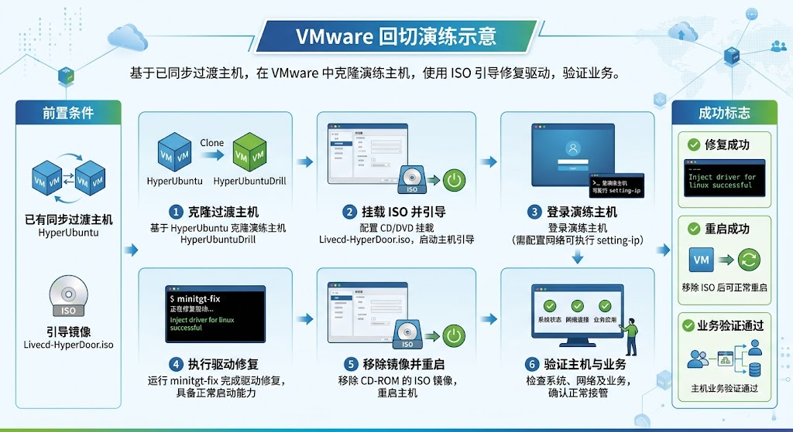
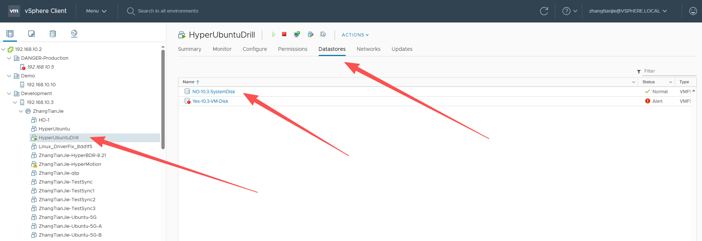
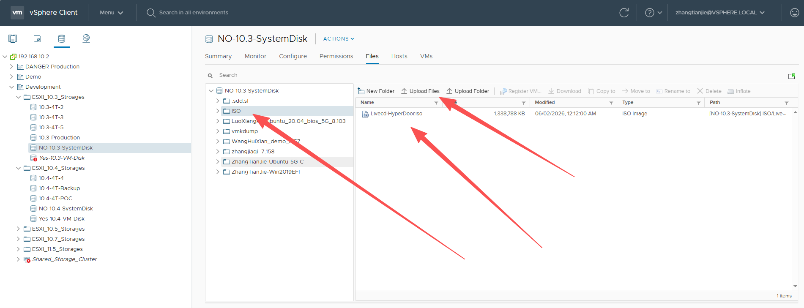
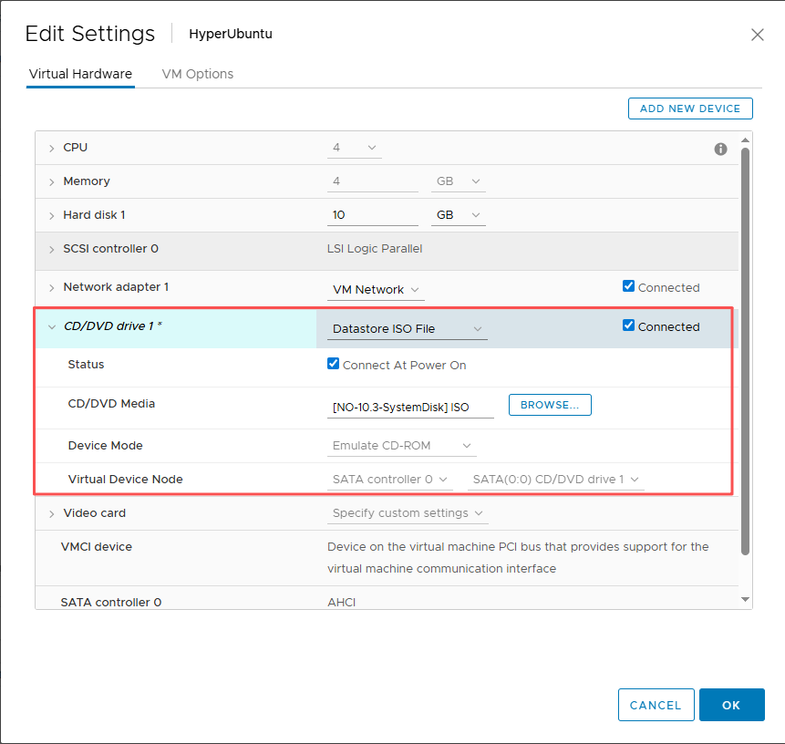
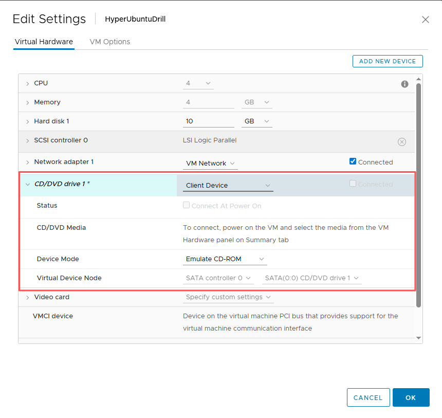

# VMware 参考文档

## 前置准备

- 同步完成的过渡主机：HyperUbuntu

- 下载的过渡主机镜像：Livecd\-HyperDoor\.iso

## VMware 演练概览



## 将镜像上传到 VMware

找到 HyperUbuntu 所在的 Datastores；



点击进去，新建一个 ISO 文件夹；


点击新建的 ISO 文件夹，进入后点击 Upload Files 上传 Livecd\-HyperDoor\.iso 到 ISO 文件夹；



此时 Livecd\-HyperDoor\.iso 已成功上传至云平台。

## 克隆同步完成的过渡主机

找到同步完成的过渡主机，使用平台的主机克隆能力，克隆出一台新的主机备用。

找到 HyperUbuntu，点击 ACTIONS，移动到 Clone，点击 Clone to Virtual Machine\.\.\.


输入新主机的名称，这里输入 HyperUbuntuDrill，并选择计算资源和存储位置等完成主机克隆。


## 引导克隆完成的过渡主机

编辑完成克隆的主机 HyperUbuntuDrill，设置过渡主机镜像 Livecd\-HyperDoor\.iso。

找到 HyperUbuntuDrill，点击 ACTIONS，点击 Edit Settings\.\.\.\.\.\.。


然后在 CD/DVD 设备中选中 Datastore ISO File，点击 BROWSE\.\.\. 按钮，选中刚刚上传的 ISO 镜像。



保存后启动主机，并在完成引导后登录，用户名 root，密码 Acb@132\.Inst。

如果没有 DHCP，建议执行 setting\-ip 设置 IP 地址，示例：

```Plain Text
# setting-ip <ip> <netmask> <gateway> <dns>
setting-ip 192.168.8.35 255.255.240.0 192.168.0.1 114.114.114.114
```


## 在克隆的主机上执行驱动修复

通过控制台或者 SSH 登录刚刚完成引导的 HyperUbuntuDrill 主机，执行 minitgt\-fix 完成驱动修复；

如果需要 UEFI 转 BIOS 请参考文档：xxx。

如果需要 WinPE 修复请参考文档：xxx。


最终输出 `Inject driver for linux successful.`表示驱动修复成功。

## 验证克隆的主机

编辑 HyperUbuntuDrill 主机，移除 CD\-ROM 镜像，重启虚拟机，主机完成启动后，验证主机业务是否正常。

